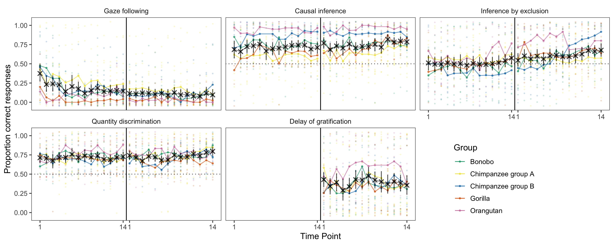

```{r, include = FALSE}
library("papaja")
library(png)
library(tidyverse)


```

# Introduction

In their quest for understanding the evolution of the human mind, psychologists and cognitive scientists face one major obstacle: cognition does not fossilize. Instead of directly studying the cognitive abilities of our extinct ancestors, we have to rely on backward inferences. We can study fossilized skulls and crania to approximate brain size and structure and use this information to infer cognitive abilities [@coqueugniot2004early; @gunz2020australopithecus]. We can study the material culture left behind by our ancestors and try to infer its cognitive complexity experimentally [@coolidge2016introduction; @currie2019things; @haslam2017primate]. Yet, the archaeological record is sparse and only goes back so far in time. Thus, one of the most fruitful approaches to cognitive evolution is the comparative method. By studying extant species of primates, we make backward inferences about the last common ancestor. If species A and B both show cognitive ability X, the last common ancestor of A and B most likely also had ability X [@martins1996phylogenies; @maclean2012does]. To make inferences about the most recent events in human cognitive evolution, we have to study and compare humans and the great apes. Such approach has been highly productive and was the basis for numerous theories about human uniqueness [@laland2021understanding; @heyes2018cognitive; @tomasello2019becoming; @penn2008darwin].

However, using the comparative method in this way requires a strong great ape baseline. That is, it takes a solid and robust way of describing the great ape mind in order to map out how it differs from that of humans. What kind of empirical evidence is required to infer such a baseline? First, group-level results should be stable. Our inferences about the cognitive abilities that great apes -- as a group -- do or do not have do based on the data we collect today should not change if we repeat the study tomorrow. Second, individual differences in cognitive abilities should be reliable. That is, methods and procedures should also reliably measure cognitive abilities on an individual level. This is a prerequisite for investigating the relations between different tasks in order to map out the internal structure of great ape cognition [@volter2018comparative; @shaw2017cognitive; @thornton2012individual]. Finally, individual differences should be predictable. Understanding great ape cognition means that we can point to external variables that describe individual characteristics or aspects of everyday experience that induce variation in cognitive performance and development. 

The prototypical study in comparative research still involves only a handful of individuals from a single species tested with in one cognitive task [see @primates2019collaborative for a review]. Recently, a number of concerns have been voiced, questioning whether this way of conducting comparative research is suited to provide the empirical basis for inferring the great ape baseline [@farrar2019illusion; @stevens2017replicability; @schubiger2020validity; @primates2019collaborative]. A key point in this criticism is that most research simply assumes that the three requirements outlined above are met without testing them empirically. The project reported here directly addresses this fundamental problem. 

 There are, however, several notable exceptions that undertook great effort to provide a more comprehensive picture of the nature and structure of great ape cognition [@wobber2014differences; @beran2018self; @hopkins2014chimpanzee; @maclean2014evolution]. Herrmann and colleagues [@herrmann2007humans] tested a large sample of great apes (chimpanzees and orangutans) and human children in a range of tasks from different cognitive domains. The results indicated pronounced group-level differences between great apes and humans in the social, but not the physical domain. Furthermore, relations between the tasks pointed to a different internal structure of cognition, with a distinct social cognition factor for humans but not great apes [@herrmann2010structure]. Völter and colleagues [] focused on the structure of executive functions. Based on a multi-trait multi-method approach they developed a new test battery to assess memory updating, inhibition, and attention shifting in chimpanzees and human children. Overall, they found low correlations between tasks and thus no clear support for any of the structures put forward by theoretical models built around adult human data. 

Despite their seminal contributions to the field, these studies suffer from the same three shortcomings outlined above. First, it is unclear if the results are stable. That is, if the same individuals were tested again, would we see the same results and arrive at the same conclusions about absolute differences between species. Second, the psychometric properties of the tasks are unknown and it is thus unclear if, for example, low correlations between tasks reflect a genuine lack of shared cognitive processes or simply measurement imprecision. Finally, it remains unclear what causes individual differences -- which individual characteristics and experiences predict cognitive performance and development. 

```{r}
# read in data files
data_task <- read.csv("../../data/laac_data_task.csv")%>%
  mutate(task = recode(task,
    gaze_following = "Gaze following",
    causality = "Causal inference",
    inference = "Inference by exclusion",
    delay_of_gratification = "Delay of gratification",
    quantity = "Quantity discrimination",
    switching = "Strategy switching"
  ))

data_trial <- read.csv("../../data/laac_data_trial.csv") %>%
  mutate(task = recode(task,
    gaze_following = "Gaze following",
    causality = "Causal inference",
    inference = "Inference by exclusion",
    delay_of_gratification = "Delay of gratification",
    quantity = "Quantity discrimination",
    switching = "Strategy switching"
  ))
```

The studies reported below seek to solidify the empirical grounds of the great ape baseline. For one-and-a-half years, every two weeks we administered a set of five cognitive tasks (see Figure \@ref(fig:setup))) to the same population of great apes (*N* = `r length(unique(data_task$subject))`). The tasks spanned across cognitive domains (social cognition, causal cognition, numerical reasoning, executive functions) and were based on published procedures widely used in the field of comparative psychology. In addition to the cognitive data, we continuously collected data for more than a dozen variables that capture stable and variable aspects of our participants' life and used this to predict inter- and intra-individual variation cognitive performance. Data collection was split into two phases. After Phase 1 (14 data collection time points), we analysed the data and registered the results (https://osf.io/7qyd8). Phase 2 lasted for another 14 time points and served to replicate and extend Phase 1. this approach allowed us to test a) how stable group level results are, b) how reliable individual differences are, c) how individual differences are structured and d) what predicts cognitive performance.  

# Results

```{r setup, include = T, fig.cap = "Setup used for the six tasks. A) Gaze following: the experimenter looked to the ceiling. We coded if the ape followed gaze. B) Causal reasoning: food was hidden in one of two cup, the baited cup was shaken (food produced a sound) and apes had to choose the shaken cup to get food. Inference by exclusion: food was hidden in one of two cups. The empty cup was shaken (no sound) so apes had to choose the non-shaken cup to get food. C) Quantity discrimination: Small pieces of food were presented on two plates (5 vs. 7 items); we coded if subjects chose the larger amount. D) Delay of gratification (only Phase 2): to receive a larger reward, the subject had to wait and forgo a smaller, immediately accesible, reward. E) Order of task presentation and trial numbers", out.width="100%"}
knitr::include_graphics("./figures/setup.png") 
```

## Stability of group-level performance

Group-level performance was largely stable or followed clear temporal patterns (see Figure \@ref(fig:perfplot)). The causal inference and quantity discrimination tasks were the most robust: in both cases performance was clearly different from chance across both phases with no apparent change over time. The rate of gaze following declined in the beginning of Phase 1 but then settled on a low but stable level until the end of Phase 2. This pattern was expected given that following the experimenters gaze was never rewarded -- neither explicitly with food or by bringing something interesting to the subject's attention. The inference by exclusion task showed an inverse pattern with group-level performance being at chance-level for most of Phase 1, followed by a small, but steady, increase throughout Phase 2. These temporal patterns most likely reflect training (or habituation) effects that are a *consequence* of the repeated testing. Performance in the delay of gratification task (Phase 2 only) was slightly variable, but within the same general range. In sum, performance was very robust in that time points generally licensed the same group-level conclusions. The tasks appeared well suited to study group-level performance. In the supplementary material, we report additional analysis -- latent state structural equation models -- that corroborate this interpretation.  

```{r perfplot, fig.cap = "Results from the five cognitive tasks across time points. Black crosses show mean performance at each time point across species (with 95\\% CI). Colored dots show mean performance by species. Dashed line shows the chance level whenever applicable. The vertical back line marks the transition between phase 1 and 2.", out.width="100%"}
 
```

## Reliability of individual differences

Stable group-level performance does not imply stable individual differences. In fact, a well-known paradox in human  psychology states that some of the most robust -- on a group level -- cognitive tasks do not produce reliable individual differences [@hedge2018reliability]. In a second step, we therefore assessed the reliability of our five tasks. For that, we correlated the performance at the different time points in each task. Figure \@ref(fig:relplot) visualizes these raw re-test correlations. Correlations were generally high -- exceptionally high for animal cognition standards [@cauchoix2018repeatability] -- with higher values for time points closer together [@uher2011individual]. The quantity discrimination was less reliable compared to the other tasks.

What stands out in this is that *stability does not imply reliability* - and vice versa. The quantity discrimination task showed robust group-level performance above chance but relatively poor re-test reliability. Group-level performance in the inference by exclusion and gaze following tasks changed over time but was highly reliable on an individual level. Taken together, the majority of tasks was well suited to study individual differences. 

```{r relplot, fig.cap = "Top: Distribution of re-test correlation coefficients between time points for each task. Bottom: Correlations between re-test reliability coefficients and temporal distance between the testing time points.", out.width="100%"}
knitr::include_graphics("./figures/reliability.png") 
```

## Structure of individual differences

Next, we investigated the structure of these individual differences. First, we asked to what extent individual differences reflect stable differences in cognitive abilities. We used structural equation modelling -- in particular latent state-trait models (LSTM) -- to partition the variance in performance into latent traits (*Consistency*) and states (*Occasion specificity*) [@steyer1992states; @steyer2015theory; @geiser2020longitudinal]. In the present context, one can think of a latent trait as a stable cognitive ability (e.g. ability to make causal inferences) and states as time-specific, variable psychological conditions (e.g. variations in performance due to being attentive or inattentive). These latent variables are measurement-error free because they are estimated taking into account the reliability of the task. In the LSTM context, reliability is the correlation between task and occasion specific test-halves. We report additional models in the supplementary material

Individual differences were largely explained by stable differences in cognitive abilities. Across tasks, more than 75% of variance was accounted for by latent trait differences and less than 25% by state differences (Figure \@ref(fig:lstmplot)A). The high reliability estimates show that these latent variables accounted for most of the variance in raw test scores -- with the quantity discrimination task being, once again, an exception. The estimates for consistency and occasion specificity were also remarkably similar for the two phases. 

For inference by exclusion, we could not fit an LST model to the data from Phase 2. Instead, we had to divide Phase 2 in two parts (time point 1-8 and 9-14) and estimate a separate trait for each part. The estimates for the proportion of variance explained by states and traits were similar for both parts (Figure \@ref(fig:lstmplot)A) and the two traits were highly correlated (*r* = .82). Together with additional latent sate models which we report in the supplementary material, this suggests that the increase in group-level performance in Phase 2 was driven by a relatively sudden improvement of a few individuals, mostly from the chimpanzee B group (see Figure \@ref(fig:perfplot)). These individuals "rose through the ranks" half-way through Phase 2 and then retained this position for the rest of the study. Some of the orangutans changed in the opposite direction -- though to a lesser extend. 

As the second step, we investigated the relations between latent traits. That is, we asked whether individuals with high abilities in one domain also have higher abilities in another. We fit pairwise LST models that modeled the correlation between latent traits between two tasks (two models for inference by exclusion in Phase 2). In Phase 1, the only correlation that was reliably different from zero was that between quantity discrimination and inference by exclusion. In Phase 2, this finding was replicated and, in addition, four more correlations turned out to be substantial (see Figure \@ref(fig:lstmplot)B). One reason for this increase was the inclusion of the delay of gratification task. Across phases, correlations involving the gaze following task were the closest to zero, with quantity discrimination in Phase 2 being an exception. Taken together, the overall pattern of results suggests substantial shared variance between tasks -- except for gaze following. 

```{r lstmplot, fig.cap = "A. Estimates from latent state-trait model for Phase 1 and 2. Consistency: proportion of (measurement-error free) variance in performance explained by stable trait differences. Occasion specificity: variance explained by variable states. Reliability: proportion of variance in raw scores explained by the trait and the state. For inference by exclusion: different shapes show estimates for different parts of Phase 2 (see main text for details). B. Correlations between latent traits based on pairwise LST models between tasks with 95\\% Credible Interval. Bold correlations are reliably different from zero. Inference by exclusion has one value per part in Phase 2. The models for quantity discrimination and causal inference showed a poor fit and are not reported here (see supplementary material for details).", out.width="100%"}
knitr::include_graphics("./figures/lstm.png") 
```

## Predictability of individual differences

The results thus far suggest that individual differences originate from stable differences in cognitive abilities that might be shared between tasks. In the last set of analysis, we sought to explain the origins of these differences. That is, we analysed whether inter- or intra-individual variation in performance in the tasks could be predicted by variables that capture a) stable differences between individuals (group, age, sex, rearing history, time spent in research), b) differences that vary within and between individuals (rank, sickness, sociality), c) differences that vary with group membership (time spent outdoors, disturbances, life events), and d) differences in testing arrangements (presence of observers, study participation on the same day and since the last time point). We collected these predictor variables using a combination of directed observations and keeper questionnaires. This large set of potentially relevant predictors poses a variable selection problem. That is, we sought to find the minimal set of predictors that allowed us to accurately predict performance in the cognitive tasks. We chose the projection predictive inference approach because it provides and excellent trade-off between model complexity and accuracy [@piironen2017comparison; @pavone2020using; @piironen2018projective]. The outcome of this analysis is a ranking of the different predictors in terms of how important they are to predict performance in a given task. Furthermore, for each predictor, we get a qualitative assessment of whether it makes a substantial contribution to predicting performance in the task or not.

... but models also included a random intercept term, capturing variance specific to individuals not explained by the predictors. 

```{r ppiplot, fig.cap = "A.  B. with 95\\% Credible Interval.", out.width="100%", fig.align='center'}
knitr::include_graphics("./figures/ppi3_i3.png") 
```

# Discussion
Summary

Individual differences are mostly stable across time. This matches well with the PPI results selecting stable individual differences as the most important predictors. Group not species because A and B chimps not always align and few individual per group. But also the case that a large chunk of the variance remained unexplained. Most likely this reflects differential developmental effects.

performance in these tasks largely explained by stable traits - nothing that responds to daily fluctuations and small scale changes. alsoe reflected in selected predictors

Learned something about development. we saw change over time - but this change was slow, steady and not uniform. the hypothetical argument that looms large in studies of great ape cognition fearing associative learning effects that might account for findings is simply not supported by the data. The study presented ideal conditions for associative learning to happen (same tasks, with exact same order dozens of times), yet the change we saw was slow, steady - and not the same for everyone. No doubt apes can do pure associative learning -- it is just very very slow. 

Systematic relations between tasks. Where do they come from? same methods (cite christoph) or same cognitive mechanisms?  larger samples needed to do this systematically and not just for 2 tasks at a time. collaboration (cite MP). Also Task based cognitive modelling would be good (cite RSApes, pragBat?)? 


# Methods

A detailed description of the methods and results can be found in the supplementary material available online. 

## Participants

## Material

## Procedure

## Data analysis

\newpage

# References

\begingroup
\setlength{\parindent}{-0.5in}
\setlength{\leftskip}{0.5in}

<div id="refs" custom-style="Bibliography"></div>
\endgroup
