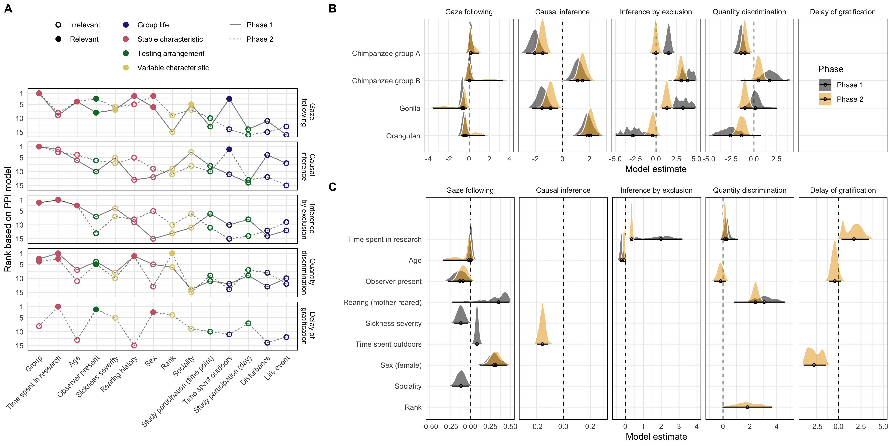

```{r, include = FALSE}
library("papaja")
library(png)
library(tidyverse)
```

# Introduction

In their quest to understand the evolution of cognition, anthropologists, psychologists, and cognitive scientists face a major obstacle: cognition does not fossilize. Instead of directly studying the cognitive abilities of, e.g., extinct early hominins, we have to rely on inferences. We can, for example, study fossilized skulls and crania to approximate brain size and structure and use this information to infer cognitive abilities [@coqueugniot2004early; @gunz2020australopithecus]. We can study the material culture left behind by now-extinct species and try to infer its cognitive complexity [@coolidge2016introduction; @currie2019things; @haslam2017primate]. Yet, the archaeological record is sparse and only goes back so far. Thus, additionally, we rely on backward inference about a last common ancestor based on the phylogenetically informed comparison of extant species. The so-called comparative method is one of the most fruitful approaches to investigating cognitive evolution. If species A and B both show cognitive ability X, the last common ancestor of A and B most likely also had ability X [@martins1996phylogenies; @maclean2012does; @burkart2017evolution; @shettleworth2009cognition]. In this way, similarities and differences between species are used to make inferences about points of divergence in the evolutionary tree as well as about external drivers of this divergence.  Following this approach, comparing humans to non-human great apes has been highly productive and provides the empirical basis for numerous theories about human cognitive evolution [@laland2021understanding; @heyes2018cognitive; @tomasello2019becoming; @penn2008darwin; @dunbar2017there; @dean2012identification].

Recently, several concerns have been voiced, questioning whether the current way of conducting comparative cognitive studies is suited to provide the empirical basis for studying cognitive evolution [@farrar2019illusion; @stevens2017replicability; @schubiger2020validity; @primates2019collaborative; @boogert2018measuring]. This criticism has largely focused on methodological shortcomings such as small sample sizes and researchers’ degrees of freedom in coding and reporting the data. A more fundamental problem is that most research rests on assumptions that are rarely tested. 

The use of cross-species comparisons to make backward inferences about (human) cognitive evolution relies on a particular view of the nature and structure of great ape cognition. Cognition is seen as structured in the form of cognitive abilities that account for stable differences between individuals and which evolve and develop in response to enduring social and environmental conditions. Such differences in cognitive abilities are involved in generating variation in behavior which is the basic material on which selection can act [@call2017apa]. Without a stable cognitive basis that is systematically linked to behavior, cognitive evolution is not possible – at least not in the way it is commonly theorized about. These basic assumptions are rarely put to an empirical test; in this study, we seek to provide empirical answers to a series of questions asking whether this view on great ape cognition holds. Since cognitive abilities cannot directly be observed, asking these questions inevitably comes with asking questions about the measurement tools – experimental tasks – that are used to measure cognitive abilities. 

The first question is whether studies on great ape cognition produce robust results: inferences about the cognitive abilities of great apes – as a clade, species, group or individual – should remain the same across repeated studies with different individuals or follow predictable patterns in studies with the same individuals. This is a critical requirement to build theories around the results of cross-species comparisons. In practice, the robustness of aggregated results is implicitly assumed but rarely tested [@uher2008three; @griffin2015cognition; @soha2019performance; @cauchoix2018repeatability].

The second question is whether there are stable differences between individuals and whether tasks commonly used in great ape cognition research are able to reliably measure them. This is a prerequisite to investigate the extent to which differences between individuals in one ability co-vary with differences in other abilities in order to map out the internal structure of great ape cognition [@volter2018comparative; @shaw2017cognitive; @thornton2012individual; @matzel2017individual]. Once again, in practice, this is simply assumed to be the case but rarely tested empirically.

Finally, we ask which social and environmental conditions influence cognition. That is, we look for individual characteristics or everyday experiences that predict performance in our measures of cognitive ability. On the one hand, such predictive relationships inform us about the nature of cognitive performance: is it heavily influenced by transient and situational factors or malleable to long-term experiences? On the other hand, they inform us about the contexts in which cognitive abilities emerge and are the cornerstone for theorising about the ontogeny and phylogeny of cognitive abilities [@horn2022beyond; @damerius2017orientation]. To summarise, to date we know too little about the structure of great ape cognition to judge the validity of the comparative method  as a way to study the origins of  of human cognition.

There are several studies that undertook notable effort to provide a more comprehensive picture of one or more aspects of the nature and structure of great ape cognition [@wobber2014differences; @beran2018self; @hopkins2014chimpanzee; @maclean2014evolution; @shaw2017cognitive; @kaufman2019structure]. Herrmann and colleagues [@herrmann2007humans] tested more than one hundred great apes (chimpanzees and orangutans) and human children in various tasks covering numerical, spatial, and social cognition. The results indicated pronounced group-level differences between great apes and humans in the social but not the spatial or numerical domain. Furthermore, relationships between the tasks pointed to a different internal structure of cognition, with a distinct social cognition factor for humans but not great apes [@herrmann2010structure;  @schmitt2012old]. Völter and colleagues [@volter2022structure] focused on the structure of executive functions. Based on a multi-trait multi-method approach, they developed a new test battery to assess memory updating, inhibition, and attention shifting in chimpanzees and human children. Overall, they found low correlations between tasks and, thus, no clear support for structures put forward by theoretical models built around adult human data.

Beyond great-apes, there have been numerous attempts to investigate the structure of cognition in other animals [@shaw2017cognitive]. In many cases, test batteries have been used in order to find evidence for a 'general cognitive ability', i.e., a correlation of individual performance across tasks [@anderson1993evidence; @matzel2003individual; @light2010working; @keagy2011complex; @isden2013performance]. Such studies found consistent individual differences across two or more tasks in various species (e.g., insects [@chandra2000heritable; @raine2012no], rodents [@kolata2005variations;  @wass2012covariation; @galsworthy2005assessing], birds [@boogert2011song; @bouchard2007social]). Some even correlated these differences with individual characteristics such as sex or relatedness [@chandra2000heritable; @galsworthy2005assessing; @raine2012no]. 

Despite their seminal contributions to understanding the nature and structure of animal and great ape cognition, these studies suffer from one or more of the shortcomings outlined above: It is unclear if the results are robust. If the same individuals were tested again, would the results license the same conclusions about absolute differences between species? Furthermore, the psychometric properties of the tasks are unknown and it is thus unclear if, for example, low correlations between tasks reflect a genuine lack of shared cognitive processes or simply measurement imprecision. Most importantly, which characteristics and experiences predict cognitive performance remains unclear. Establishing such a link is essential if we want to understand the nature of cognitive abilities and the driving forces behind their emergence and development.

```{r}
# read in data files
data_task <- read.csv("../../data/laac_data_task.csv")%>%
  mutate(task = recode(task,
    gaze_following = "Gaze following",
    causality = "Causal inference",
    inference = "Inference by exclusion",
    delay_of_gratification = "Delay of gratification",
    quantity = "Quantity discrimination",
    switching = "Strategy switching"
  ))

data_trial <- read.csv("../../data/laac_data_trial.csv") %>%
  mutate(task = recode(task,
    gaze_following = "Gaze following",
    causality = "Causal inference",
    inference = "Inference by exclusion",
    delay_of_gratification = "Delay of gratification",
    quantity = "Quantity discrimination",
    switching = "Strategy switching"
  ))
```

The studies reported here directly address the shortcomings outlined above and seek to solidify the empirical grounds for investigating the evolution of human cognition via the comparative method. For one-and-a-half years, every two weeks, we administered a set of five cognitive tasks (see Figure \@ref(fig:setup)) to the same population of great apes (N = `r length(unique(data_task$subject))`). The tasks spanned across cognitive domains and were based on published procedures widely used in comparative psychology. As a test of social cognition, we included a gaze following task [@brauer2005all]. To assess causal reasoning abilities, we had a direct causal inference and an inference by exclusion task [@call2004inferences]. Numerical cognition was tested using a quantity discrimination task [@hanus2007discrete]. Finally, as a test of executive functions, we included a delay of gratification task (Phase 2 only) [@rosati2007evolutionary]. In Phase 1, we included a different measure of executive functions (rule-switching task) that failed to produce meaningful results and which we describe in more detail in the supplementary material [@haun2006evolutionary].

In addition to the cognitive data, we continuously collected 14 variables that capture stable and variable aspects of our participants and their lives and used this to predict inter- and intra-individual variation in cognitive performance. These predictors included a) stable differences between individuals (group, age, sex, rearing history, experience with research), b) differences that varied within and between individuals (rank, sickness, sociality), c) differences that varied with group membership (time spent outdoors, disturbances, life events), and d) differences in testing arrangements (presence of observers, study participation on the same day and since the last time point).  

Data collection was split into two phases; after Phase 1 (14 data collection time points), we analyzed the data and registered the results (https://osf.io/7qyd8). Phase 2 lasted for another 14 time points and served to replicate and extend Phase 1. This approach allowed us to test a) how robust task-level results are, b) how reliable individual differences are measured and how stable they are over time, c) how individual differences are structured and d) what predicts cognitive performance.

# Results

```{r setup, include = T, fig.cap = "Setup used for the five tasks. A) Gaze following: the experimenter looked to the ceiling. We coded if the ape followed gaze. B) Direct causal inference: food was hidden in one of two cups, the baited cup was shaken (food produced a sound) and apes had to choose the shaken cup to get food. Inference by exclusion: food was hidden in one of two cups. The empty cup was shaken (no sound), so apes had to choose the non-shaken cup to get food. C) Quantity discrimination: Small pieces of food were presented on two plates (5 vs. 7 items); we coded if subjects chose the larger amount. D) Delay of gratification (only Phase 2): to receive a larger reward, the subject had to wait and forgo a smaller, immediately accessible reward. E) Order of task presentation, trial numbers and organisation of tasks into sessions. In both phases, we ran the two sessions on two separate days.", out.width="100%"}
knitr::include_graphics("./figures/setup.png") 
```

## Robustness of task-level performance

As a first step, we asked whether the average performance of a given sample at a time can be expected to be replicated at other time points, that is, whether we could assume to find a similar average performance for a given sample of individuals if we repeated the task assessment. We assessed robustness in two ways: First, whenever there was a level of performance expected by chance (i.e. 50% correct), we checked if the 95% Confidence Interval (CI) for the mean overlapped with chance. Second, we assessed temporal robustness using Structural Equation Modeling, in particular, Latent State models (see method section and supplementary material for details). These models partition the observed performance variable at a given time point into a latent state variable (time-specific true score variable)  and a measurement error variable. The mean of the latent state variable for the first time point of each phase was fixed at zero and we assessed average change across time by asking whether the 95% Credible Intervals (CrI) for the latent state means of subsequent time points overlapped with zero (i.e. the mean of the first time point).    

```{r perfplot, fig.cap = "Results from the five cognitive tasks across time points. Black crosses show mean performance at each time point across all individuals in the sample (with 95\\% CI). Colored dots show mean performance by species. Light dots show individual means per time point. Dashed lines show chance level whenever applicable. The vertical black line marks the transition between phases 1 and 2.", out.width="100%"}
knitr::include_graphics("./figures/performance.png") 
```

Task-level performance was largely robust or followed clear temporal patterns. Figure \@ref(fig:perfplot) visualizes the proportion of correct responses for each task; Figure \@ref(fig:lsmplot)A shows the latent state means for each task and phase. The direct causal inference and quantity discrimination tasks were the most robust: in both cases was performance different from chance across both phases with no apparent change over time. The rate of gaze following declined at the beginning of Phase 1 but then settled on a low but stable level until the end of Phase 2. This pattern was expected given that following the experimenter’s gaze was never rewarded – neither explicitly with food nor by bringing something interesting to the participant’s attention. The inference by exclusion task showed an inverse pattern with task-level performance being at chance-level for most of Phase 1, followed by a small but steady increase throughout Phase 2 so that from time point 6 in Phase 2 onwards, performance was significantly different from the first time point of that Phase. These temporal patterns most likely reflect training (or habituation) effects that are a consequence of repeated testing. Performance in the delay of gratification task (Phase 2 only) was more variable but within the same general range for the whole testing period. In sum, despite these exceptions, performance was very robust in that time points generally licensed the same task-level conclusions. For example, Figure 2 shows that performance in the direct causal inference task was clearly above chance at all time points and, on a descriptive level, consistently higher compared to the inference by exclusion task. Thus, the tasks appeared well suited to study task-level performance. 


```{r lsmplot, fig.cap = "A) Latent state means for each time point by task and phase estimated via Latent State models. Color shows the phase and the shape denotes whether the 95\\% CrI included zero. B) Corresponding reliability estimates.", out.width="100%"}
knitr::include_graphics("./figures/latent_states_reliability.png") 
```

## Reliability of individual-level measurements

The reliability of a measure is defined as the proportion of true score variance to its observed variance. That is, a reliable measure captures inter-individual differences with precision (i.e., perfect reliability corresponds to  measurement without measurement error) and is expected to (theoretically) produce similar results if repeated under identical conditions. Cognitive tasks that yield robust aggregate results often do not assess individual differences in a reliable way. In fact, there may be a trade-off between these two measurement goals -- an observation that has been coined the ‘reliability paradox’ [@hedge2018reliability]. As a first step towards investigating individual differences, we inspected re-test correlations of our five tasks. For that, we correlated the performance at the different time points in each task. Figure \@ref(fig:relplot) visualizes these re-test correlations. Correlations were generally high -- some even exceptionally high for animal cognition standards [@cauchoix2018repeatability]. As expected, values were higher for more proximate time points [@uher2011individual]. The quantity discrimination task had lower correlations compared to the other tasks. 

However, based on re-test correlations alone, we cannot say whether lower correlations reflect higher measurement error (low reliability) or inter-individual differences in (true) change of performance across time (low stability). To tease these two components apart, we turned again to the LS models mentioned above. For each time point, we estimated a latent state variable (time-specific true score variable) using two test halves as indicators, which were constructed by splitting the trials of each task per time point into two parallel subgroups. Thereby, the models allow us to estimate the reliability of the respective test halves (see method section and supplemental material for details). We interpreted reliability estimates in the following way: acceptable = .7, good = .8 and high = .9. Please note that these estimates are for test-halves; the reliability of the full would be higher.

Figure \@ref(fig:lsmplot)B shows that reliability was generally good (~.75) for all tasks at all time points, except for the quantity discrimination task which had reliability estimates fluctuating around .5. Thus, the lower re-test correlations for quantity discrimination most likely reflect low reliability  instead of individual changes in cognitive performance across time. We will return to this point again in the next section. Taken together, these results suggest that the majority of tasks reliably measured differences between individuals.

As a final note, it stands out that *task-level robustness does not imply individual-level stability* -- and vice versa. The quantity discrimination task showed robust task-level performance above chance (Figure \@ref(fig:perfplot)) but relatively poor reliability (Figure \@ref(fig:lsmplot)B). In other words, even though task-level performance was similar at all time points, differences between  individuals were measured with low precision. In contrast, task-level performance in the inference by exclusion and gaze following tasks changed over time, with satisfactory measurement precision and moderate to high stability of true inter-individual differences (see next section).

```{r relplot, fig.cap = "Re-test correlation coefficients are plotted against the temporal distance between the testing time points. Color shows the phase. Side: Distribution of re-test Pearson correlation coefficients.", out.width="100%"}
 
```

## Structure and stability of inter-individual differences

Next, we investigated the structure of individual differences. Importantly – and in contrast to earlier work [@herrmann2010structure] -- with 'structure' we do not exclusively mean the relationship between different cognitive tasks. As mentioned in the introduction, we start with a more basic question: do individual differences in a given task reflect differences in cognitive ability (e.g. ability to make causal inferences) that persist over time or rather differences in transient factors (e.g., motivation or attentiveness) that vary from time point to time point. The former would imply that individuals (true scores) are ranked similarly across time points, while the latter would predict fluctuations. Importantly, the distinction here is not between task-specific and domain-general processes; as long as both are stable (or variable) and both are relevant to solving a task, we would not be able to tease them apart. 

To quantify to what extent stable or variable differences between individuals explain performance, we used Latent State-Trait (LST) models which partitioned the observed performance score into a latent trait variable, a latent state residual variable, and measurement error [@steyer1992states; @steyer2015theory; @geiser2020longitudinal]. We assume stable latent traits, such that one can think of a latent trait as a stable cognitive ability (e.g., the ability to make causal inferences) and latent state residuals as variables capturing the effect of occasion-specific, variable situational and psychological conditions (e.g., being more or less attentive or motivated). The sum of the latent trait and the latent state residual variable corresponds to the true score of cognitive performance at a specific time point (latent state variable). We report additional models that account for the temporal structure of the data in the supplementary material.

True individual differences were largely stable across time. Across tasks, more than 75% of the reliable variance (true inter-individual differences) was accounted for by latent *trait* differences and less than 25% by *occasion-specific* variation between individuals (Figure \@ref(fig:lstmplot)A). The good reliability estimates (> .75 for most tasks; Figure \@ref(fig:lstmplot)A) show that these latent variables accounted for most of the variance in raw test scores -- with the quantity discrimination task being an exception (reliability = .47). Reflecting back on the results  reported above, we can now say that the -- relatively speaking -- lower correlations between time points in the quantity discrimination task indicate a higher degree of measurement error rather than variable individual differences. In fact, once measurement error is accounted for, consistency estimates for the quantity discrimination task were close to 1, reflecting highly stable true differences between individuals.

Next, we compared the estimates for the two phases of data collection. We found estimates for consistency (proportion of true score variance due to latent trait variance) and occasion specificity (proportion of true score variance due to state residual variance) to be remarkably similar for the two phases. For inference by exclusion, the LST model did not fit the data from Phase 2 well (see supplementary material for details). Therefore, we divided Phase 2 into two parts (time points 1-8 and 9-14) and estimated a separate trait for each part. All estimates were similar for both parts (Figure \@ref(fig:lstmplot)A), and the two traits were highly correlated (*r* = .82). Together with the LS model results reported in the robustness section, this suggests that the increase in group-level performance in Phase 2 was probably driven by a relatively sudden improvement of a few individuals, mostly from the chimpanzee B group (see Figure \@ref(fig:perfplot)). These individuals quickly improved in performance halfway through Phase 2 and retained this level for the rest of the study. Some of the orangutans changed in the opposite direction -- though their absolute change in performance was, descriptively speaking, smaller compared to the individuals from the chimpanzee B group.

Finally, we investigated the relationship between latent traits. We asked whether individuals with high abilities in one domain also have higher abilities in another. We fit pairwise LST models that modeled the correlation between latent traits for two tasks (two models for inference by exclusion in Phase 2). In Phase 1, the only correlation with Credible Intervals not overlapping zero was between quantity discrimination and inference by exclusion. In Phase 2, this finding was replicated, and, in addition, four more correlations turned out to be substantial, that is, coefficients indicated medium to large effects [@cohen1992power] and their 95% CrI did not include zero (see Figure \@ref(fig:lstmplot)B). One reason for this increase was the inclusion of the delay of gratification task. Across phases, correlations involving the gaze following task were the closest to zero, with quantity discrimination in Phase 2 being an exception. Taken together, the overall pattern of results suggests substantial shared variance between tasks -- except for gaze following.

```{r lstmplot, fig.cap = "A) Estimates from Latent State-Trait models for Phase 1 and 2 with 95\\% CrI. Consistency: proportion of (measurement-error-free) variance in performance explained by stable trait differences. Occasion specificity: proportion of true variance explained by variable state residuals. Reliability: proportion of true score variance to variance in raw scores. For inference by exclusion: different shapes show estimates for different parts of Phase 2 (see main text for details). B) Correlations between latent traits based on pairwise LST models between tasks with 95\\% CrI. Bold correlations have CrI not overlapping with zero. Inference by exclusion has one value per part in Phase 2. The models for quantity discrimination and direct causal inference showed a poor fit and are not reported here (see supplementary material for details).", out.width="100%"}
 
```

## Predictability of individual differences

The results thus far suggest that individual differences originate from stable differences between individuals in cognitive abilities that persist across time points. Differences in ability outweigh fluctuations due to transient, occasion-specific factors such as attentiveness or motivation. An alternative pattern would arise when time point-specific variation in e.g., attentiveness or motivation would be responsible for differences in performance between individuals. Of course, there can be stable differences between individuals in attentiveness and motivation, in which case they would be part of the cognitive ability itself. The distinction we want to make here is between transient and stable factors influencing cognitive performance.

In the last set of analyses, we sought to explain the origins of individual differences. That is, we analyzed whether inter- and intra-individual variation in cognitive performance in the tasks could be predicted by non-cognitive variables that captured a) stable differences between individuals (group, age, sex, rearing history, experience with research), b) differences that varied within and between individuals (rank, sickness, sociality), c) differences that varied with group membership (time spent outdoors, disturbances, life events), and d) differences in testing arrangements (presence of observers, study participation on the same day and since the last time point). We collected these predictor variables using a combination of directed observations and caretaker questionnaires.

This large set of potentially relevant predictors poses a variable selection problem. Thus, in our analysis, we sought to find the smallest number of predictors (main effects only) that allowed us to accurately predict performance in the cognitive tasks. We chose the projection predictive inference approach because it provides an excellent trade-off between model complexity and accuracy [@piironen2017comparison; @pavone2020using; @piironen2018projective]. The outcome of this analysis is a ranking of the different predictors in terms of how important they are to predicting performance in a given task. Furthermore, for each predictor, we get a qualitative assessment of whether it makes a substantial contribution to predicting performance in the task or not.

Predictors capturing stable individual characteristics were ranked highest and selected as relevant most often (Figure \@ref(fig:ppiplot)A). The three highest-ranked predictors belonged to this category. This result fits well with the LST model results reported above, in which we saw that most of the variance in performance could be traced back to stable trait differences between individuals. Here we saw that performance was best predicted by variables that reflect stable characteristics of individuals. This suggests that stable characteristics partially cause selective development that leads to differences in cognitive abilities. The tasks with the highest occasion-specific variance (gaze following and delay of gratification, see Figure \@ref(fig:lstmplot)A) were also those for which the most time point-specific predictors were selected. The quantity discrimination task did not fit this pattern in Phase 2; even though the LST model suggested that only a very small portion of the variance in performance was occasion-specific, four time-point-specific variables were selected to be relevant.

The most important predictor was group. Interestingly, differences between groups were not systematic in that one group consistently outperformed the others across tasks. Furthermore, group differences could not be collapsed into species differences as the two chimpanzee groups varied largely independently of one another (Figure \@ref(fig:ppiplot)B). Predictors that were selected more than once influenced performance in variable ways. The presence of observers always had a negative effect on performance. The more time an individual had been involved in research during their lifetime, the better performance was. On the other hand, while the rate of gaze following increased with age in Phase 1, performance in the inference by exclusion task decreased. Females were more likely to follow gaze than males, but males were more likely to wait for the larger reward in the delay of gratification task. Finally, time spent outdoors had a positive effect on gaze following but a negative effect on direct causal inference (Figure \@ref(fig:ppiplot)B).

In sum, of the predictors we recorded, those capturing stable individual characteristics were most predictive of cognitive performance. In most cases, these predictors were also selected as relevant in both phases. The influence of time-point-specific predictors was less consistent: except for the presence of an observer in the gaze following task, none of the variable predictors was selected as relevant in both phases. To avoid misinterpretation, this suggests that cognitive performance was influenced by temporal variation in group life, testing arrangements, and variable characteristics; however, the way this influence exerts itself was either less consistent or less pronounced (or both) compared to the influence of stable characteristics.

It is important to note, however, that in terms of absolute variance explained, the largest portion was accounted for by a random intercept term in the model (not shown in Figure 5) that simply captured the identity of the individual (see supplementary material for details). This suggests that idiosyncratic developmental processes and/or genetic pre-dispositions, which operate on a much longer time scale than what we captured in the present study, were responsible for most of the variation in cognitive performance.

```{r ppiplot, fig.cap = "A. Ranking of predictors based on the projection predictive inference model for the five tasks in the two phases. Order (left to right) is based on average rank across phases. Solid points indicate predictors selected as relevant. Color of the points shows the category of the predictor. Line type denotes the phase. B. Posterior model estimates for the selected predictors for each task. Points show means with 95\\% Credible Interval. Color denotes phase. For categorical predictors, the estimate gives the difference compared to the reference level (Bonobo for group, no observer for observer, hand-reared for rearing, male for sex).", out.width="100%", fig.align='center'}
 
```

# Discussion

This study aimed to test the assumptions of robustness, stability, reliability, and predictability that underlie much of comparative research and theorizing about cognitive evolution. We repeatedly tested a large sample of great apes in five tasks covering a range of different cognitive domains. We found task-level performance to be robust for most tasks so that conclusions drawn based on one testing occasion mirrored those on other occasions. Most of the tasks measured differences between individuals in a reliable and stable way -- making them suitable to study individual differences. Using structural equation models, we found that individual differences in performance were largely explained by traits -- that is, stable differences in cognitive abilities between individuals. Furthermore, we found systematic relationships between cognitive abilities. When predicting variation in cognitive performance, we found stable individual characteristics (e.g., group or time spent in research) to be the most important. Variable predictors were also found to be influential at times but less systematically.

At first glance, the results send a reassuring message: most of the tasks we used produced robust task-level results and captured individual differences in a reliable and stable way. However, this did not apply to all tasks. As noted above, in the supplementary material, we report on a rule-switching task [@haun2006evolutionary] that produced neither stable nor reliable results. The quantity discrimination task was robust on a task level but did not measure individual differences reliably. We draw two conclusions based on this pattern. First, replicating studies – even if it is with the same animals – should be an integral part of primate cognition research [@primates2019collaborative; @stevens2017replicability; @farrar2020replicomp]. Second, for individual differences research, it is crucial to assess the psychometric properties (e.g., reliability) of the measures involved [@fried2018measurement]. If this step is omitted, it is difficult to interpret studies, especially when they produce null results. It is important to note that the sample size in the current study was large compared to other comparative studies (median sample size across studies = 7) [@primates2019collaborative]. With smaller sample sizes, task-level estimates are likely more variable and thus more likely to produce false-positive or false-negative conclusions [@oakes2017sample; @forstmeier2017detecting]. Small samples in comparative research usually reflect the resource limitations of individual labs. Pooling resources in large-scale collaborative projects like *ManyPrimates* [@many2019establishing; @primates2021evolution] will thus be vital to corroborate findings. Some research questions -- for example, the distinction between group- vs. species-level explanations of primate cognitive performance [@van2018population] -- cannot even be sufficienty addressed with a single group of primates.

Continuing on this theme, the data reported here would be exciting to explore for species differences. For example, the descriptive results shown in Figure \@ref(fig:perfplot) suggest that orangutans performed best in the nonsocial tasks but worse in the social task. However, we are hesitant to interpret such findings because of the small sample sizes per species and the substantial differences in sample size between species. Consequently, it is impossible to distinguish individual-level from species-level variation.  

Given their good psychometric properties, our tasks offer insights into the structure of great ape cognition. We used structural equation modeling to partition reliable variance in performance into stable (trait) and variable (state residual) differences between individuals. We found traits to explain more than 75% of the reliable variance across tasks. This suggests that the patterns in performance we observed mainly originate from stable differences in cognitive abilities . This finding does not mean there cannot be  developmental change over longer time periods. In fact, for the inference by exclusion task, we saw a relatively abrupt change in performance for some individuals, which stabilized on an elevated level, suggesting a sustained change in cognitive ability. 

We found systematic relationships between traits estimated via LST models for the different tasks. Correlations tended to be higher among the non-social tasks compared to when the gaze-following task was involved, which could be taken to indicate shared cognitive processes.  However, we feel such a conclusion would be premature and require additional evidence from more tasks and larger sample sizes [@herrmann2010structure]. One possibility is that stable, domain-general psychological processes -- such as attentiveness or motivation -- are responsible for the shared variance. Furthermore, cognitive modeling could be used to explicate the processes involved in each task. Shared processes could be probed by comparing models that make different assumptions [@bohn2021great; @devaine2017reading]. For example, a model in which direct causal inference is a sub-process of inference by exclusion could be compared to a model assuming distinct reasoning processes for the two tasks.

The finding that stable differences in cognitive abilities explained most of the variation between individuals was also corroborated by the analyses focused on the predictability of performance. We found that predictors that captured stable individual characteristics (e.g., group, time spent in research, age, rearing history) were more likely to be selected as relevant predictors. Aspects of everyday experience or testing arrangements that would influence performance on particular time points and thus increase the proportion of occasion-specific variation (e.g., life events, disturbances, participating in other tests) were ranked as less important. Despite this general pattern, there was variation across tasks in which individual characteristics were selected to be relevant. For example, rearing history was an important predictor for quantity discrimination and gaze following but less so for the other three tasks (Figure \@ref(fig:ppiplot)A). Group – the overall most important predictor – exerted its influence differently across tasks. Orangutans, for example, outperformed the other groups in direct causal inference but were the least likely to follow gaze. Together with the finding that the random intercept term explained the largest proportion of variance in performance  across tasks, this pattern suggests that the cognitive abilities underlying performance in the different tasks respond to different – though sometimes overlapping – external conditions that together shape the individual’s developmental environment.

Our results also address a very general issue. Comparative psychologists often worry – or are told they should worry – that their results can be explained by mechanistically simpler associative learning processes  [@hanus2016causal]. Oftentimes such explanations are theoretically plausible and rarely  disproved empirically [@heyes2012simple]. The present study speaks to this issue in so far as we created  the conditions for such associative learning processes to potentially unfold. Great apes were tested by the same experimenter in the same tasks, using differential reinforcement and the same counterbalancing for hundreds of trials. However, a  steady increase in performance – uniform over individuals – did not show. Instead, when we saw change over time, performance either decreased (gaze following) or increased late for only a few individuals (inference by exclusion). This does not take away the theoretical possibility that associative learning accounts for improved performance over time on isolated tasks. In fact, we are agnostic as to whether or not a particular learning account might explain our results (or parts of them) and invite others to further analyze the data provided here. 

## Conclusion

The present study put the implicit assumptions underlying much of comparative research on cognitive evolution involving great apes to an empirical test. While we found reassuring results in terms of group-level stability and reliability of the measurement of individual differences, we also pointed out the importance of explicitly questioning and testing these assumptions, ideally in large-scale collaborative projects. Our results paint a picture of great ape cognition in which variation between individuals is predicted and explained by stable individual characteristics that respond to different – though sometimes overlapping – developmental conditions. Hence, an ontogenetic perspective is not auxiliary but fundamental to studying cognitive diversity across species. We hope these results contribute to a more solid and comprehensive understanding of the nature and origins of great ape and human cognition as well as provide useful methodological guidance for future comparative research.

# Methods

A detailed description of the methods and results can be found in the supplementary material available online. All data and analysis scripts can be found in the associated online repository (https://github.com/ccp-eva/laac).

## Participants

```{r}
participants <- data_trial%>%
  mutate(group = as.character(group), 
         species = ifelse(grepl("chimp",group),"chimpanzee", group), 
         species = factor(species))%>%
  group_by(species)%>%
  mutate(minage = round(min(age),1),
         maxage = round(max(age),1))%>%
  group_by(species, sex, minage,maxage)%>%
  summarise(n = length(unique(subject)))
  
  
 tpn <- data_trial%>%
  mutate(group = as.character(group), 
         species = ifelse(grepl("chimp",group),"chimpanzee", group), 
         species = factor(species))%>%
  group_by(time_point)%>%
  summarise(n = length(unique(subject)))
 
   
```

A total of `r sum(participants$n)` great apes participated at least once in one of the tasks. This included `r participants%>%filter(species == "bonobo")%>%pull(n)%>%sum()` Bonobos (`r participants%>%filter(species == "bonobo", sex == "f")%>%pull(n)` females, age `r participants%>%filter(species == "bonobo", sex == "f")%>%pull(minage)` to `r participants%>%filter(species == "bonobo", sex == "f")%>%pull(maxage)`), `r participants%>%filter(species == "chimpanzee")%>%pull(n)%>%sum()` Chimpanzees (`r participants%>%filter(species == "chimpanzee", sex == "f")%>%pull(n)` females, age `r participants%>%filter(species == "chimpanzee", sex == "f")%>%pull(minage)` to `r participants%>%filter(species == "chimpanzee", sex == "f")%>%pull(maxage)`), `r participants%>%filter(species == "gorilla")%>%pull(n)%>%sum()` Gorillas (`r participants%>%filter(species == "gorilla", sex == "f")%>%pull(n)` females, age `r participants%>%filter(species == "gorilla", sex == "f")%>%pull(minage)` to `r participants%>%filter(species == "gorilla", sex == "f")%>%pull(maxage)`), and `r participants%>%filter(species == "orangutan")%>%pull(n)%>%sum()` Orangutans (`r participants%>%filter(species == "orangutan", sex == "f")%>%pull(n)` females, age `r participants%>%filter(species == "orangutan", sex == "f")%>%pull(minage)` to `r participants%>%filter(species == "orangutan", sex == "f")%>%pull(maxage)`). The overall sample size at the different time points ranged from `r min(tpn$n)` to `r max(tpn$n)` for the different species.

Apes were housed at the Wolfgang Köhler Primate Research Center located in Zoo Leipzig, Germany. They lived in groups, with one group per species and two chimpanzee groups (groups A and B). Studies were noninvasive and strictly adhered to the legal requirements in Germany. Animal husbandry and research complied with the European Association of Zoos and Aquaria Minimum Standards for the Accommodation and Care of Animals in Zoos and Aquaria as well as the World Association of Zoos and Aquariums Ethical Guidelines for the Conduct of Research on Animals by Zoos and Aquariums. Participation was voluntary, all food was given in addition to the daily diet, and water was available ad libitum throughout the study. The study was approved by an internal ethics committee at the Max Planck Institute for Evolutionary Anthropology.

## Material

Apes were tested in familiar sleeping or test rooms by a single experimenter. Whenever possible, they were tested individually. The basic setup comprised a sliding table positioned in front of a clear Plexiglas panel with three holes in it. The experimenter sat on a small stool and used an occluder to cover the sliding table (see Figure \@ref(fig:setup)).

## Procedure

The tasks we selected are based on published procedures and are commonly used in the field of comparative psychology. Example videos for each task can be found in the associated online repository (https://github.com/ccp-eva/laac/tree/master/videos).

### Gaze Following

The gaze following task was modeled after a study by Bräuer and colleagues [@brauer2005all]. The experimenter sat opposite the ape and handed over food at a constant pace. That is, the experimenter picked up a piece of food, briefly held it out in front of her face and then handed it over to the participant. After a predetermined (but varying) number of food items had been handed over, the experimenter again picked up a food item, held it in front of her face and then looked up (i.e., moving her head up -- see Figure \@ref(fig:setup)A). The experimenter looked to the ceiling; no object of particular interest was placed there. After 10s, the experimenter looked down again, handed over the food and the trial ended. We coded whether the participant looked up during the 10s interval. Apes received eight gaze-following trials. We assume that participants look up because they assume that the experimenter’s attention is focused on a potentially noteworthy object.

### Direct causal inference

The direct causal inference task was modeled after a study by Call [@call2004inferences]. Two identical cups, each with a lid, were placed left and right on the table (Figure \@ref(fig:setup)B). The experimenter covered the table with the occluder, retrieved a piece of food, showed it to the ape, and hid it in one of the cups outside the participant’s view. Next, the experimenter removed the occluder, picked up the baited cup and shook it three times, which produced a rattling sound. Next, the cup was put back in place, the sliding table pushed forwards, and the participant made a choice by pointing to one of the cups. If they picked the baited cup, their choice was coded as correct, and they received the reward. If they chose the empty cup, they did not. Participants received 12 trials. The location of the food was counterbalanced; six times in the right cup and six times in the left. Direct causal inference trials were intermixed with inference by exclusion trials (see below). We assume that apes locate the food by reasoning that the food – a solid object – causes the rattling sound and, therefore, must be in the shaken cup.

### Inference by exclusion

Inference by exclusion trials were also modeled after the study by Call [@call2004inferences] and followed a very similar procedure compared to direct causal inference trials. After covering the two cups with the occluder, the experimenter placed the food in one of the cups and covered both with the lid. Next, they removed the occluder, picked up the empty cup and shook it three times. In contrast to the direct causal inference trials, this did not produce any sound. The experimenter then pushed the sliding table forward and the participant made a choice by pointing to one of the cups. Correct choice was coded when the baited (non-shaken) cup was chosen. If correct, the food was given to the ape. There were 12 inference by exclusion trials intermixed with direct causal inference trials. The order was counterbalanced: six times the left cup was baited, six times the right. We assume that apes reason that the absence of a sound suggests that the shaken cup is empty. Because they saw a piece of food being hidden, they exclude the empty cup and infer that the food is more likely to be in the non-shaken cup.

### Quantity discrimination

For this task, we followed the general procedure of Hanus and colleagues [@hanus2007discrete]. Two small plates were presented left and right on the table (see Figure \@ref(fig:setup)C). The experimenter covered the plates with the occluder and placed five small food pieces on one plate and seven on the other. Then they pushed the sliding table forwards, and the participant made a choice. We coded as correct when the subject chose the plate with the larger quantity. Participants always received the food from the plate they chose. There were 12 trials, six with the larger quantity on the right and six on the left (order counterbalanced). We assume that apes identify the larger of the two food amounts based on discrete quantity estimation.

### Delay of gratification

This task replaced the switching task in Phase 2. The procedure was adapted from Rosati and colleagues [@rosati2007evolutionary]. Two small plates, including one and two pieces of pellet, were presented left and right on the table. The experimenter moved the plate with the smaller reward forward, allowing the subject to choose immediately, while the plate with the larger reward was moved forward after a delay of 20 seconds. We coded whether the subject selected the larger delayed reward (correct choice) or the smaller immediate reward (incorrect choice) as well as the waiting time in cases where the immediate reward was chosen. Subjects received 12 trials, with the side on which the immediate reward was presented counterbalanced. We assume that, in order to choose the larger reward, apes inhibit choosing the immediate smaller reward.

### Interrater reliability

A second coder unfamiliar to the purpose of the study coded 15% of all time points (four out of 28) for all tasks. Reliability was good to excellent. Gaze following: 92% agreement ($\kappa$ = .64), direct causal inference 99% agreement ($\kappa$ = .98), inference by exclusion: 99% agreement ($\kappa$ = .99), quantity discrimination: 99% agreement ($\kappa$ = .97), delay of gratification: 98% agreement ($\kappa$ = .97).

## Data collection

We collected data in two phases. Phase 1 started on August 1st, 2020, lasted until March 5th, 2021, and included 14 time points. Phase 2 started on May 26th, 2021, and lasted until December 4th, 2021, and also had 14 time points. Phase 1 also included a strategy switching task. However, because it did not produce meaningful results, we replaced it with the delay of gratification task. Details and results can be found in the supplementary material available online.

One time point meant running all tasks with all participants. Within each time point, the tasks were organized in two sessions (see Figure \@ref(fig:setup)E). Session 1 started with two gaze following trials. Next was a pseudo-randomized mix of direct causal inference and inference by exclusion trials with 12 trials per task but no more than two trials of the same task in a row. At the end of Session 1, there were again two gaze following trials. Session 2 also started with two gaze following trials, followed by quantity discrimination and strategy switching (Phase 1) or delay of gratification (Phase 2). Finally, there were again two gaze following trials. The order of tasks was the same for all subjects. So was the positioning of food items within each task. The two sessions were usually spread out across two adjacent days. The interval between two time points was planned to be two weeks. However, it was not always possible to follow this schedule, so some intervals were longer or shorter. Figure S1 in the supplementary material shows the timing and spacing of the time points.

In addition to the data from the cognitive tasks, we collected data for a range of predictor variables. Predictors could either vary with the individual (stable individual characteristics: group, age, sex, rearing history, time spent in research), vary with individual and time point (variable individual characteristics: rank, sickness, sociality), vary with group membership (group life: e.g., time spent outdoors, disturbances, life events) or vary with the testing arrangements and thus with individual, time point and session (testing arrangements: presence of observers, study participation on the same day and since the last time point). Most predictors were collected via a diary that the animal caretakers filled out on a daily basis. Here, the caretakers were asked a range of questions about the presence of a predictor and its severity. Other predictors were based on direct observations. A detailed description of the predictors and how they were collected can be found in the supplementary material available online.

## Analysis

In the following, we provide an overview of the analytical procedures we used. We encourage the reader to consult the supplementary material available online for additional details and results. We had two overarching questions. On the one hand, we were interested in the cognitive measures and the relationships between them. That is, we asked how robust performance was on a task-level, how stable individual differences were, and how reliable the measures were. We also investigated relationships between the different tasks. We used Structural Equation Modeling (SEM) [@bollen1989structural; @hoyle2012handbook] to address these questions.

Our second question was, which predictors explained variability in cognitive performance. Here we wanted to see which of the predictors we recorded were most important to predict performance over time. This is a variable selection problem (selecting a subset of variables from a larger pool) and we used *Projection Predictive Inference* for this [@piironen2018projective].

### Structural equation modeling

We used SEM [@bollen1989structural; @hoyle2012handbook] to address the reliability and stability of each task, as well as relationships between tasks. SEMs allowed us to partition the variance in performance into latent variable (true-score) variance and measurement error variance. Latent variables are estimated using multiple observed indicators (here: two test halves, see below). Longitudinal data for each task was modeled with a latent state (LS) and a latent state-trait (LST) model [@steyer1992states; @steyer2015theory; @geiser2020longitudinal].  All of the models were estimated as normal-ogive graded response models [@samejima1969estimation; @samejima1996graded] due to the ordinal nature of the indicators. For each task and time point we split the trials in two test halves, which served as indicators for a common latent construct. Due to only few different observed values and skewed distributions of the sum score for each test half, indicators were modeled as ordered categorical variables, using a probit link function. That is, the models assume a continuous latent ability underlying the discrete responses, with an increasing probability of more correctly solved trials with increasing ability.

Formally speaking, the observed categorical variables $Y_{it}$ for test half $i$ at time point $t$ result from a categorization of unobserved continuous latent variables $Y^*_{it}$ which underlie the observed categorical variables. In the LS models, $Y^*_{it}$ is decomposed into into a latent state variable $S_t$ and a measurement error variable $\epsilon_{it}$ [@eid2014statistical]. At each time point $t$, the two latent variables $Y^*_{1t}$ and $Y^*_{2t}$ are assumed to capture a common latent state variable $S_t$. To test for possible mean changes of ability across time, the means of the latent state variables were freely estimated (assuming invariance of the threshold parameters $\kappa_{sit}$ across time).

As an estimate of reliability, we computed the proportion of true score variance relative to the total variance of the continuous latent variables $Y^*_{it}$:

```{=tex}
\begin{equation}
Rel(Y^*_{it})=\frac{Var(S_t)}{Var(S_t)+Var(\epsilon_{it})}=\frac{Var(S_t)}{Var(S_t)+1}
\end{equation}
```

For the LST model, the continuous latent variable $Y^*_{it}$ was decomposed into a latent trait variable $T_{it}$, a latent state residual variable $\zeta_{it}$, and a measurement error variable. The latent trait variables $T_{it}$ are time-specific dispositions, that is, they capture the expected value of the latent state (i.e., true score) variable for an individual at time t across all possible situations the individual might experience at time $t$ [@eid2017definition; @steyer2015theory].  The state residual variables $\zeta_{it}$ capture the deviation of a momentary state from the time-specific disposition $T_{it}$.. We assumed that latent traits were stable across time. In addition, we assumed common latent trait and state residual variables across the two test halves, which leads to the following measurement equation for parcel $i$ at time point $t$:

```{=tex}
\begin{equation}
Y^*_{it}= T + \zeta_t + \epsilon_{it}
\end{equation}
```

Here, $T$ is a stable (time-invariant) latent trait variable, capturing stable inter-individual differences. The state residual variable $\zeta_t$ captures time-specific deviations of the respective true score from the trait variable at time $t$, and thereby captures deviations from the trait due to situation or person-situation interaction effects. $\epsilon_{it}$ denotes a measurement error variable, with $\epsilon_{it} \sim N(0,1)$ $\forall~ i,t$. This allowed us to compute the following variance components.

Consistency: Proportion of true variance (i.e., measurement-error-free variance) that is due to true inter-individual stable trait differences.

```{=tex}
\begin{equation}
Con(Y^*_{it})=\frac{Var(T)}{Var(T)+Var(\zeta_t)}
\end{equation}
```

Occasion specificity: Proportion of true variance (i.e., measurement-error-free variance) that is due to true inter-individual differences in the state residual variables (i.e., occasion-specific variation not explained by the trait).

```{=tex}
\begin{equation}
OS(Y^*_{it})=1-Con(Y^*_{it}) = \frac{Var(\zeta_t)}{Var(T)+Var(\zeta_t)}
\end{equation}
```

As state residual variances $Var(\zeta_t)$ were set equal across time, $OS(Y^*_{it})$ is constant across time (as well as across item parcels  $i$).

To investigate associations between cognitive performance in different tasks, the LST models were extended to multi-trait models. Due to the small sample size, we could not combine all tasks in a single, structured model. Instead, we assessed relationships between tasks in pairs.

We used Bayesian estimation techniques to estimate the models. In the supplementary material available online, we report the prior settings used for estimation as well as the restrictions we imposed on the model parameters. We justify these settings via simulation studies also included in the supplementary material.

### Projection predictive inference

The selection of relevant predictor variables constitutes a variable selection problem, for which a range of different methods are available e.g., shrinkage priors [@van2019shrinkage]. We chose to use *Projection Predictive Inference* (PPI) because it provides an excellent trade-off between model complexity and accuracy [@piironen2017comparison; @piironen2018projective], especially when the goal is to identify a minimal subset of predictors that yield a good predictive model [@pavone2020using].

The PPI approach can be viewed as a two-step process: The first step consists of building the best predictive model possible, called the reference model. In the context of this work, the reference model is a Bayesian multilevel regression model with repeated measurements nested in apes, fit using the package `brms` [@R-brms_a], including all 14 predictors and a random intercept term for the individual (`R` notation: `DV ~ predictors + (1 | subject)`). Note that this reference model only included main effects and no interactions between predictors. Including interactions would have increased the number of predictors to consider exponentially.

In the second step, the goal is to replace the posterior distribution of the reference model with a simpler distribution. This is achieved via a forward step-wise addition of predictors that decrease the Kullback-Leibler (KL) divergence from the reference model to the projected model.

The result of the projection is a list containing the best model for each number of predictors from which the final model is selected by inspecting the mean log-predictive density (`elpd`) and root-mean-squared error (`rmse`). The projected model with the smallest number of predictors is chosen, which shows similar predictive performance as the reference model.

We built separate reference models for each phase and task and ran them through the above-described projection predictive inference approach. The dependent variable for each task was the cognitive performance of the apes, that is, the number of correctly solved trials per time point and task. The model for the delay of gratification task was only estimated once (Phase 2).

We used the R package `projpred` [@projpred202], which implements the aforementioned projection predictive inference technique. The predictor relevance ranking is measured by the Leave-One-Out (LOO) cross-validated mean log-predictive density and root-mean-squared error. To find the optimal submodel size, we inspected summaries and the plotted trajectories of the calculated `elpd` and `rmse`.

The order of relevance for the predictors and the random intercept (together called terms) is created by performing forward search. The term that decreases the KL divergence between the reference model’s predictions and the projection’s predictions the most goes into the ranking first. Forward search is then repeated $N$ times to get a more robust selection. We chose the final model by inspecting the predictive utility of each projection. To be precise, we chose the model with $p$ terms where $p$ depicts the number of terms at the cutoff between the term that increases the `elpd` and the term that does not increase the `elpd` by any significant amount. In order to get a useful predictor ranking, we manually delayed the random intercept (and random slope for time point for gaze following) term to the last position in the predictor selection process. The random intercept delay is needed because if the random intercept were not delayed, it would soak up almost all of the variance of the dependent variable before the predictors are allowed to explain some amount of the variance themselves.

\newpage

# References

\begingroup
\setlength{\parindent}{-0.5in}
\setlength{\leftskip}{0.5in}

<div id="refs" custom-style="Bibliography"></div>
\endgroup

\newpage

# Competing interest

The authors declare that no competing interests exist.

