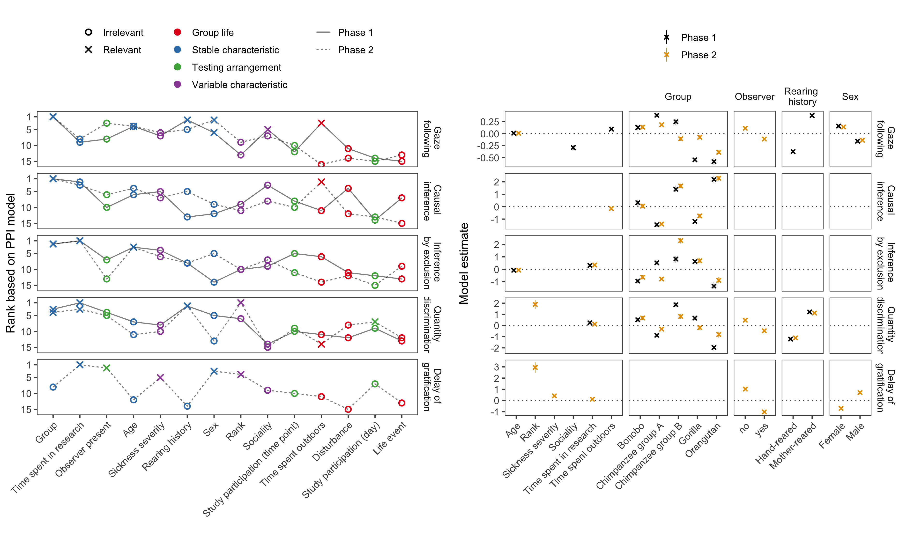

```{r, include = FALSE}
library("papaja")
library(png)
library(tidyverse)


```

# Introduction

In their quest for understanding the evolution of the human mind, psychologists and cognitive scientists face one major obstacle: cognition does not fossilize. Instead of directly studying the cognitive abilities of our extinct ancestors, we have to rely on backward inferences. We can study fossilized skulls and crania to approximate brain size and structure and use this information to infer cognitive abilities []. We can study the material culture left behind by our ancestors and try to infer its cognitive complexity experimentally []. Yet, the archeological record is sparse and only goes back so far in time []. Thus, the most fruitful approach is the comparative method []. By studying extant species of primates, we make backward inferences about the last common ancestor. If species A and B both show cognitive ability X, the last common ancestor of A and B most likely also had ability X []. To make inferences about the most recent events in human cognitive evolution, we have to study the great apes. 

Using the comparative method in this way requires a strong great ape baseline. That is, we need a robust understanding of the great ape mind in order to map out how it differs from that of humans. What does a strong baseline entail? First, group-level results should be relatively stable so that the conclusions we draw -- and the abilities we ascribe to great apes -- do not change over time. Second,  T Recently, a number of concerns have been voiced, questioning the solidity of our understanding of the great ape baseline []. It is unclear if the conventional methods that are being used in comparative research measure stable properties of great ape cognition [farrar, ljerka, stevens ..].

a comprehensive understanding entails: stable group level results, stable individual differences and an understanding of what causes them. Group level stability asks how representative the results of one experiment are. Discussed and studied in the context of replications. 

research into originator the human mind needs a strong great ape baseline. the assumption is that great apes are representative of the lca. without this baseline, our inferences are flawed. To understand means to know the structure of the mind and what predicts that structure - the causes of individual differences. (cite christoph phil trans paper, Martin (Cognitive test batteries in animal cognition research: evaluating the past, present and future of comparative psychometrics)). Völter and colleagues convincingly argued that knowing what differs is the basis to understanding what evolves

check:
Thornton A, Lukas D (2012) Individual variation in cognitive performance: developmental and evolutionary perspectives. Philos Trans R Soc Lond B Biol Sci 367:2773–2783.

Banerjee K, Chabris CF, Johnson VE et al (2009) General intelligence in another primate: individual differences across cognitive task performance in a New World monkey (Saguinus oedipus). PLoS ONE 4:e5883. doi:10.1371/journal.pone.0005883

Linking cognition with fitness in a wild
primate: fitness correlates of problem solving performance and spatial learning
ability

Esther: are there geniuses among the apes

Heroic efforst in individual differences research in primate cognition. Esther, Christoph, Beran "Self-Control in Chimpanzees Relates to General Intelligence", Hopkins (Chimpanzee intelligence is heritable). Despite their enormous contribution to the field, these studies suffer from three shortcomings. First, it is unclear if the results are stable. that is if the same individuals were tested again, would be get the same results. Realtedly, it is unclear if individual differences are stable, that is, if we were to test the same individuals again, would they be ranked in the same way. Finally, and most importantly, it is unclear where the individual differences that were observed come from. What causes them and thus, what is responsible for the structure of the great ape mind as we observe it. Schubinger and colleagues (Validity of Cognitive Tests for Non-human Animals: Pitfalls and Prospects) recently reviewed the animal cognition literature and suggest that oftentime

Here we provide strong evidence fot this baseline. Furthermore, we identify what predicts the structure we observe

# Results

```{r}
# read in data files
data_task <- read.csv("../../data/laac_data_task.csv")%>%
  mutate(task = recode(task,
    gaze_following = "Gaze following",
    causality = "Causal inference",
    inference = "Inference by exclusion",
    delay_of_gratification = "Delay of gratification",
    quantity = "Quantity discrimination",
    switching = "Strategy switching"
  ))

data_trial <- read.csv("../../data/laac_data_trial.csv") %>%
  mutate(task = recode(task,
    gaze_following = "Gaze following",
    causality = "Causal inference",
    inference = "Inference by exclusion",
    delay_of_gratification = "Delay of gratification",
    quantity = "Quantity discrimination",
    switching = "Strategy switching"
  ))
```

For one-and-a-half years, every two weeks we administered a set of five cognitive tasks (see Figure \@ref(fig:setup))) to the same population of great apes (*N* = `r length(unique(data_task$subject))`). The tasks spanned across cognitive domains (social cognition, causal cognition, numerical reasoning, executive functions) and were based on published procedures widely used in the field of comparative psychology. Data collection was split into two phases. After Phase 1 (14 data collection time points), we analysed the data and registered the results (OSF link). Phase 2 lasted for another 14 time points and served to replicate and extend Phase 1. A detailed description of the methods and results can be found in the supplementary material available online.  

```{r setup, include = T, fig.cap = "Setup used for the six tasks. A) Gaze following: the experimenter looked to the ceiling. We coded if the ape followed gaze. B) Causal reasoning: food was hidden in one of two cup, the baited cup was shaken (food produced a sound) and apes had to choose the shaken cup to get food. Inference by exclusion: food was hidden in one of two cups. The empty cup was shaken (no sound) so apes had to choose the non-shaken cup to get food. C) Quantity discrimination: Small pieces of food were presented on two plates (5 vs. 7 items); we coded if subjects chose the larger amount. D) Delay of gratification (only Phase 2): to receive a larger reward, the subject had to wait and forgo a smaller, immediately accesible, reward. E) Order of task presentation and trial numbers", out.width="100%"}
knitr::include_graphics("./figures/setup.png") 
```
## Stability of group-level performance

Group-level performance was largely stable or followed clear temporal patterns (see Figure \@ref(fig:perfplot)). The causal inference and quantity discrimination tasks were the most robust: in both cases performance was clearly different from chance across both phases with no apparent change over time. The rate of gaze following declined in the beginning of Phase 1 but then settled on a low but stable level until the end of Phase 2. This pattern was expected given that following the experimenters gaze was never rewarded -- neither explicitly with food or by bringing something interesting to the subject's attention. The inference by exclusion task showed an inverse pattern with group-level performance being at chance-level for most of Phase 1, followed by a small, but steady, increase throughout Phase 2. These temporal patterns most likely reflect training (or habituation) effects that are a *consequence* of the repeated testing. Performance in the delay of gratification task (Phase 2 only) was slightly variable, but within the same general range. In sum, performance was very robust in that time points generally licensed the same group-level conclusions. The tasks appeared well suited to study group-level performance. 

```{r perfplot, fig.cap = "Results from the five cognitive tasks across time points. Black crosses show mean performance at each time point across species (with 95\\% CI). Colored dots show mean performance by species. Dashed line shows the chance level whenever applicable. The vertical back line marks the transition between phase 1 and 2.", out.width="100%"}
knitr::include_graphics("./figures/performance.png") 
```

## Reliability of individual differences

Stable group-level performance does not imply stable individual differences. In fact, a well-known paradox in human psychology states that some of the most robust -- on a group level -- cognitive tasks doe not produce reliable individual differences [@hedge2018reliability]. In a second step, we therefore assessed the reliability of our five tasks. For that, we correlated the performance at the different time points in each task. Figure \@ref(fig:relplot) visualizes these raw re-test correlations. Correlations were generally high -- exceptionally high for animal cognition standards [@cauchoix2018repeatability] -- with higher values for time points closer together [@uher2011individual]. The quantity discrimination was less reliable compared to the other tasks.

What stands out in this is that *stability does not imply reliability* - and vice versa. The quantity discrimination task showed robust group-level performance above chance but relatively poor re-test reliability. Group-level performance in the inference by exclusion and gaze following tasks changed over time but was highly reliable on an individual level. Taken together, the majority of tasks is well suited to study individual differences. 

```{r relplot, fig.cap = "Top: Distribution of re-test correlation coefficients between time points for each task. Bottom: Correlations between re-test reliability coefficients and temporal distance between the testing time points.", out.width="100%"}
knitr::include_graphics("./figures/reliability.png") 
```

## Structure of individual differences

Next, we investigated the structure of these individual differences. First, we asked to what extent individual differences reflect stable differences in cognitive abilities. We used structural equation modelling -- in particular latent state-trait models (LSTM) -- to partition the variance in performance into latent traits and states [@steyer1992states; @steyer2015theory; @geiser2020longitudinal]. In the present context, one can think of a latent trait as a stable cognitive ability (e.g. ability to make causal inferences) and states as time-specific, variable psychological conditions (e.g. variations in performance due to being attentive or inattentive). These latent variables are measurement-error free because they are estimated taking into account the reliability of the task. In the LSTM context, reliability is the correlation between task and occasion specific test-halves. We report additional models in the supplementary material

Individual differences were largely explained by stable differences in cognitive abilities. Across tasks and phases, more than 75% of variance was accounted for by latent trait differences and less than 25% by state differences (Figure \@ref(fig:lstmplot)A). The high reliability estimates show that these latent variables accounted for most of the variance in raw test scores -- with the quantity discrimination task being, once again, an exception. 

As the second step, we investigated the relations between latent traits. That is, we asked whether individuals with high abilities in one domain also have higher abilities in another. We fit pairwise LST models that modeled the correlation between latent traits between two tasks. In Phase 1, the only correlation that was reliably different from zero was that between quantity discrimination and inference by exclusion. In Phase 2, this finding was replicated and, in addition, four more correlations turned out to be substantial (see Figure \@ref(fig:lstmplot)B). ONe reason for this increase was the inclusion of the delay of gratification task. Across phases, correlations involving the gaze following task were the closest to zero, with quantity discrimination in Phase 2 being an exception. Taken together, the overall pattern of results suggests substantial shared variance between tasks -- except for gaze following.   


```{r lstmplot, fig.cap = "A. Latent state-trait model estimates for Phase 1 and 2. Consistency: proportion of (measurement-error free) variance in performance explained by stable trait differences. Occasion specificity: variance explained by variable states. Reliability: proportion of variance in raw scores explained by the trait and the state. B. Correlations between latent traits based on pairwise LST models between tasks with 95\\% Credible Interval. Bold correlations are reliably different from zero. The models for quantity discrimination and causal inference showed a poor fit and are not reported here (see supplementary material for details).", out.width="100%"}
 
```

## Predictability of individual differences

The results thus far suggest that individual differences originate from stable differences in cognitive abilities that might be shared between tasks. In the last set of analysis, we sought to explain the origins of these differences. That is, we analysed whether inter- or intra-individual variation in performance in the tasks could be predicted by variables that capture a) stable differences between individuals (group, age, sex, rearing history, time spent in research), b) differences that vary within and between individuals (rank, sickness, sociality), c) differences that vary with group membership (time spent outdoors, disturbances, life events), and d) differences in testing arrangements (presence of observers, study participation on the same day and since the last time point). We collected these predictor variables using a combination of directed observations and keeper questionnaires. This large set of potentially relevant predictors poses a variable selection problem. That is, we sought to find the minimal set of predictors that allowed us to accurately predict performance in the cognitive tasks. We chose the projection predictive inference approach because it provides and excellent trade-off between model complexity and accuracy [@piironen2017comparison; @pavone2020using; @piironen2018projective]. The outcome of this analysis is a ranking of the different predictors in terms of how important they are to predict performance in a given task. Furthermore, for each predictor, we get a qualitative assessment of whether it makes a substantial contribution to predicting performance in the task or not.

```{r ppiplot, fig.cap = "A. Latent state-trait model estimates for Phase 1 and 2. Consistency: proportion of (measurement-error free) variance in performance explained by stable trait differences. Occasion specificity: variance explained by variable states. Reliability: proportion of variance in raw scores explained by the trait and the state. B. Correlations between latent traits based on pairwise LST models between tasks with 95\\% Credible Interval. Bold correlations are reliably different from zero. The models for quantity discrimination and causal inference showed a poor fit and are not reported here (see supplementary material for details).", out.width="50%", fig.align='center'}
 
```

# Discussion

# Methods

## Participants

## Material

## Procedure

## Data analysis

\newpage

# References

\begingroup
\setlength{\parindent}{-0.5in}
\setlength{\leftskip}{0.5in}

<div id="refs" custom-style="Bibliography"></div>
\endgroup
