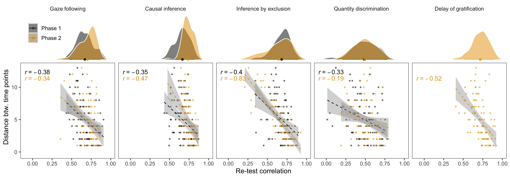
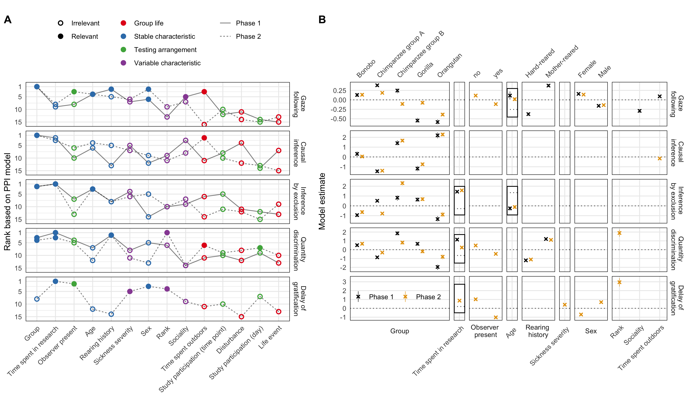

```{r, include = FALSE}
library("papaja")
library(png)
library(tidyverse)
```

# Introduction

In their quest for understanding the evolution of the human mind, psychologists and cognitive scientists face one major obstacle: cognition does not fossilize. Instead of directly studying the cognitive abilities of our extinct ancestors, we have to rely on backward inferences. We can study fossilized skulls and crania to approximate brain size and structure and use this information to infer cognitive abilities [@coqueugniot2004early; @gunz2020australopithecus]. We can study the material culture left behind by our ancestors and try to infer its cognitive complexity experimentally [@coolidge2016introduction; @currie2019things; @haslam2017primate]. Yet, the archaeological record is sparse and only goes back so far in time. Thus, one of the most fruitful approaches to cognitive evolution is the comparative method. By studying extant species of primates, we can make backward inferences about the last common ancestor. If species A and B both show cognitive ability X, the last common ancestor of A and B most likely also had ability X [@martins1996phylogenies; @maclean2012does; @burkart2017evolution]. To make inferences about the most recent events in human cognitive evolution, we have to study and compare humans and the non-human great apes. Such an approach has been highly productive and provides the empirical basis for numerous theories about human cognitive uniqueness [@laland2021understanding; @heyes2018cognitive; @tomasello2019becoming; @penn2008darwin; @dunbar2017there; @dean2012identification].

However, using the comparative method in this way requires a strong great ape baseline. That is, it takes a solid and robust way of describing the great ape mind in order to map out how it differs from that of humans. What kind of empirical evidence is required to define such a baseline? First, group-level results should be stable. Our inferences about the cognitive abilities that great apes -- as a group or species -- do or do not have based on the data we collect today should not change if we repeat the study tomorrow. Second, individual differences in cognitive abilities should be reliable. That is, methods and procedures should also reliably measure cognitive abilities on an individual level. This is a prerequisite for investigating the relations between different tasks in order to map out the internal structure of great ape cognition [@volter2018comparative; @shaw2017cognitive; @thornton2012individual; @matzel2017individual]. Finally, individual differences should be predictable. Understanding great ape cognition means that we can point to variables that describe individual characteristics or aspects of everyday experience that induce variation in cognitive performance and development. 

Recently, a number of concerns have been voiced, questioning whether the prototypical way of conducting comparative research is suited to provide the empirical basis for inferring the great ape baseline [@farrar2019illusion; @stevens2017replicability; @schubiger2020validity; @primates2019collaborative]. A key point in this criticism is that most research simply assumes that the three requirements outlined above are met without testing them empirically. The work reported here directly addresses this fundamental problem. 

There are, however, several notable exceptions that undertook great effort to provide a more comprehensive picture of one or more aspects of the nature and structure of great ape cognition [@wobber2014differences; @beran2018self; @hopkins2014chimpanzee; @maclean2014evolution]. Herrmann and colleagues [@herrmann2007humans] tested a large sample of great apes (chimpanzees and orangutans) and human children in a range of tasks from different cognitive domains. The results indicated pronounced group-level differences between great apes and humans in the social, but not the physical domain. Furthermore, relations between the tasks pointed to a different internal structure of cognition, with a distinct social cognition factor for humans but not great apes [@herrmann2010structure]. Völter and colleagues [@volter2022structure] focused on the structure of executive functions. Based on a multi-trait multi-method approach they developed a new test battery to assess memory updating, inhibition, and attention shifting in chimpanzees and human children. Overall, they found low correlations between tasks and thus no clear support for any of the structures put forward by theoretical models built around adult human data. 

Despite their seminal contributions to the field, these studies suffer from one or more of the three shortcomings outlined above. It is unclear if the results are stable. That is, if the same individuals were tested again, would we see the same results and arrive at the same conclusions about absolute differences between species. Furthermore, the psychometric properties of the tasks are unknown and it is thus unclear if, for example, low correlations between tasks reflect a genuine lack of shared cognitive processes or simply measurement imprecision. Finally, it remains unclear what causes individual differences -- which individual characteristics and experiences predict cognitive performance and development. 

```{r}
# read in data files
data_task <- read.csv("../../data/laac_data_task.csv")%>%
  mutate(task = recode(task,
    gaze_following = "Gaze following",
    causality = "Causal inference",
    inference = "Inference by exclusion",
    delay_of_gratification = "Delay of gratification",
    quantity = "Quantity discrimination",
    switching = "Strategy switching"
  ))

data_trial <- read.csv("../../data/laac_data_trial.csv") %>%
  mutate(task = recode(task,
    gaze_following = "Gaze following",
    causality = "Causal inference",
    inference = "Inference by exclusion",
    delay_of_gratification = "Delay of gratification",
    quantity = "Quantity discrimination",
    switching = "Strategy switching"
  ))
```

The studies reported below seek to solidify the empirical grounds of the great ape baseline. For one-and-a-half years, every two weeks we administered a set of five cognitive tasks (see Figure \@ref(fig:setup))) to the same population of great apes (*N* = `r length(unique(data_task$subject))`). The tasks spanned across cognitive domains and were based on published procedures widely used in the field of comparative psychology. As a test of social cognition, we included a gaze following task [@brauer2005all]. To assess reasoning abilities, we included a causal reasoning and an inference by exclusion task [@call2004inferences]. Numerical cognition was tested using a quantity discrimination task [@hanus2007discrete]. Finally, as a test of executive functions, we included a delay of gratification task [@rosati2007evolutionary].

In addition to the cognitive data, we continuously collected 14 variables that capture stable and variable aspects of our participants' life and used this to predict inter- and intra-individual variation in cognitive performance. Data collection was split into two phases. After Phase 1 (14 data collection time points), we analysed the data and registered the results (https://osf.io/7qyd8). Phase 2 lasted for another 14 time points and served to replicate and extend Phase 1. This approach allowed us to test a) how stable group level results are, b) how reliable individual differences are, c) how individual differences are structured and d) what predicts cognitive performance.  

# Results

```{r setup, include = T, fig.cap = "Setup used for the six tasks. A) Gaze following: the experimenter looked to the ceiling. We coded if the ape followed gaze. B) Causal reasoning: food was hidden in one of two cup, the baited cup was shaken (food produced a sound) and apes had to choose the shaken cup to get food. Inference by exclusion: food was hidden in one of two cups. The empty cup was shaken (no sound) so apes had to choose the non-shaken cup to get food. C) Quantity discrimination: Small pieces of food were presented on two plates (5 vs. 7 items); we coded if subjects chose the larger amount. D) Delay of gratification (only Phase 2): to receive a larger reward, the subject had to wait and forgo a smaller, immediately accesible, reward. E) Order of task presentation and trial numbers", out.width="100%"}
knitr::include_graphics("./figures/setup.png") 
```

## Stability of group-level performance

Group-level performance was largely stable or followed clear temporal patterns (see Figure \@ref(fig:perfplot)). The causal inference and quantity discrimination tasks were the most robust: in both cases performance was clearly different from chance across both phases with no apparent change over time. The rate of gaze following declined in the beginning of Phase 1 but then settled on a low but stable level until the end of Phase 2. This pattern was expected given that following the experimenters gaze was never rewarded -- neither explicitly with food or by bringing something interesting to the participant's attention. The inference by exclusion task showed an inverse pattern with group-level performance being at chance-level for most of Phase 1, followed by a small, but steady, increase throughout Phase 2. These temporal patterns most likely reflect training (or habituation) effects that are a *consequence* of the repeated testing. Performance in the delay of gratification task (Phase 2 only) was more variable, but within the same general range for the whole testing period. In sum, performance was very robust in that time points generally licensed the same group-level conclusions. The tasks appeared well suited to study group-level performance. In the supplementary material, we report additional analysis -- latent state structural equation models -- that corroborate this interpretation.  

```{r perfplot, fig.cap = "Results from the five cognitive tasks across time points. Black crosses show mean performance at each time point across species (with 95\\% CI). Colored dots show mean performance by species, light dots show individual means per time point. Dashed line shows chance level whenever applicable. The vertical back line marks the transition between phase 1 and 2.", out.width="100%"}
knitr::include_graphics("./figures/performance.png") 
```

## Reliability of individual differences

Stable group-level performance does not imply stable individual differences. In fact, a well-known paradox in human cognitive psychology states that some of the most robust -- on a group level -- cognitive tasks do not produce reliable individual differences [@hedge2018reliability]. In a second step, we therefore assessed the re-test reliability of our five tasks. For that, we correlated the performance at the different time points in each task. Figure \@ref(fig:relplot) visualizes these raw re-test correlations. Correlations were generally high -- exceptionally high for animal cognition standards [@cauchoix2018repeatability]. As expected, values were also higher for time points closer in time [@uher2011individual]. The quantity discrimination task was less reliable compared to the other tasks.

What stands out in this is that *stability does not imply reliability* - and vice versa. The quantity discrimination task showed robust group-level performance above chance but relatively poor re-test reliability. Group-level performance in the inference by exclusion and gaze following tasks changed over time but were highly reliable on an individual level. Taken together, the majority of tasks were well suited to study individual differences. 

```{r relplot, fig.cap = "Top: Distribution of re-test correlation coefficients between time points for each task. Bottom: Correlations between re-test reliability coefficients and temporal distance between the testing time points.", out.width="100%"}
 
```

## Structure of individual differences

Next, we investigated the structure of these individual differences. First, we asked to what extent individual differences reflect stable differences in cognitive abilities. We used structural equation modelling -- in particular latent state-trait models (LSTM) -- to partition the variance in performance into latent traits (*Consistency*) and states (*Occasion specificity*) [@steyer1992states; @steyer2015theory; @geiser2020longitudinal]. In the present context, one can think of a latent trait as a stable cognitive ability (e.g. ability to make causal inferences) and states as time-specific, variable psychological conditions (e.g. variations in performance due to being more or less attentive or motivated). These latent variables are measurement-error free because they are estimated taking into account the reliability of the task. In the LSTM context, reliability is the correlation between task and occasion specific test-halves. We report additional models that account for the temporal structure of the data in the supplementary material.

Individual differences were largely explained by stable differences in cognitive abilities. Across tasks, more than 75% of variance was accounted for by latent trait differences and less than 25% by state differences (Figure \@ref(fig:lstmplot)A). The high reliability estimates show that these latent variables accounted for most of the variance in raw test scores -- with the quantity discrimination task being, once again, an exception. The estimates for consistency and occasion specificity were also remarkably similar for the two phases. 

For inference by exclusion, we could not fit an LST model to the data from Phase 2. Instead, we had to divide Phase 2 in two parts (time point 1-8 and 9-14) and estimate a separate trait for each part. The estimates for the proportion of variance explained by states and traits were similar for both parts (Figure \@ref(fig:lstmplot)A) and the two traits were highly correlated (*r* = .82). Together with additional latent sate models which we report in the supplementary material, this suggests that the increase in group-level performance in Phase 2 was driven by a relatively sudden improvement of a few individuals, mostly from the chimpanzee B group (see Figure \@ref(fig:perfplot)). These individuals "rose through the ranks" half-way through Phase 2 and then retained this position for the rest of the study. Some of the orangutans changed in the opposite direction -- though to a lesser extend. 

As the second step, we investigated the relations between latent traits. That is, we asked whether individuals with high abilities in one domain also have higher abilities in another. We fit pairwise LST models that modeled the correlation between latent traits for two tasks (two models for inference by exclusion in Phase 2). In Phase 1, the only correlation that was reliably different from zero was the one between quantity discrimination and inference by exclusion. In Phase 2, this finding was replicated and, in addition, four more correlations turned out to be substantial (see Figure \@ref(fig:lstmplot)B). One reason for this increase was the inclusion of the delay of gratification task. Across phases, correlations involving the gaze following task were the closest to zero, with quantity discrimination in Phase 2 being an exception. Taken together, the overall pattern of results suggests substantial shared variance between tasks -- except for gaze following. 

```{r lstmplot, fig.cap = "A. Estimates from latent state-trait model for Phase 1 and 2. Consistency: proportion of (measurement-error free) variance in performance explained by stable trait differences. Occasion specificity: variance explained by variable states. Reliability: proportion of variance in raw scores explained by the trait and the state. For inference by exclusion: different shapes show estimates for different parts of Phase 2 (see main text for details). B. Correlations between latent traits based on pairwise LST models between tasks with 95\\% Credible Interval. Bold correlations are reliably different from zero. Inference by exclusion has one value per part in Phase 2. The models for quantity discrimination and causal inference showed a poor fit and are not reported here (see supplementary material for details).", out.width="100%"}
knitr::include_graphics("./figures/lstm.png") 
```

## Predictability of individual differences

The results thus far suggest that individual differences originate from stable differences in cognitive abilities. In the last set of analysis, we sought to explain the origins of these differences. That is, we analysed whether inter- or intra-individual variation in cognitive performance in the tasks could be predicted by non-cognitive variables that capture a) stable differences between individuals (group, age, sex, rearing history, time spent in research), b) differences that vary within and between individuals (rank, sickness, sociality), c) differences that vary with group membership (time spent outdoors, disturbances, life events), and d) differences in testing arrangements (presence of observers, study participation on the same day and since the last time point). We collected these predictor variables using a combination of directed observations and caretaker questionnaires. 

This large set of potentially relevant predictors poses a variable selection problem. In our analysis we sought to find the minimal set of predictors that allowed us to accurately predict performance in the cognitive tasks. We chose the projection predictive inference approach because it provides and excellent trade-off between model complexity and accuracy [@piironen2017comparison; @pavone2020using; @piironen2018projective]. The outcome of this analysis is a ranking of the different predictors in terms of how important they are to predict performance in a given task. Furthermore, for each predictor, we get a qualitative assessment of whether it makes a substantial contribution to predicting performance in the task or not.

Predictors capturing stable individual characteristics were ranked highest and selected as relevant most often (Figure \@ref(fig:ppiplot)). Of the five highest-ranked predictors, four belonged to this category. This result aligned well with the SEM results reported above, in which we saw that most of the variance in performance could be traced back to stable trait differences between individuals. The tasks with the highest occasion specific variance (gaze following and delay of gratification, see Figure \@ref(fig:lstmplot)) were also those for which the most time point specific predictors were selected. The quantity discrimination task did not fit this pattern in Phase 2; even though the LSTM suggested that only a very small portion of the variance in performance was occasion specific, three time point specific variables were selected to be relevant.

The most important predictor was group. Interestingly, differences between groups were not systematic in that one group would consistently outperform the others across tasks. Furthermore, group differences could not be collapsed into species differences as the two chimpanzee groups varied largely independent of one another. The way in which the predictors that were selected more than once influenced performance was largely coherent. The presence of observers always had a negative effect on performance. The more time an individual had been involved in research, the better performance was. Higher-ranking individuals outperformed lower-ranking ones. Exceptions were age and sex: while the rate of gaze following increased with age, performance in the inference by exclusion task decreased. Females were more likely to follow gaze than males, but males were more likely to wait for the larger reward in the delay of gratification task (Figure \@ref(fig:ppiplot)B).

In sum, of the predictors we recorded, those capturing stable individual characteristics were most predictive of cognitive performance. However, the  the largest portion of the variance in cognitive performance was accounted for by a random intercept term in the model (not shown in Figure \@ref(fig:ppiplot)) that simply captured the identity of the individual (see supplementary material for details). This suggests that idiosyncratic developmental processes or genetic pre-dispositions, which operate on a much longer time-scale than what we captured in the present study, were responsible for most of the variation in cognitive performance.  

```{r ppiplot, fig.cap = "A. Ranking of predictors based on the projection predictive inference model for the five tasks in the two phases. Order (left to right) is based on average rank across phases. Solid points indicate predictors selected as relevant. Color of the points shows the category of the predictor. Line type denotes the phase. B. Posterior model estimates for the selected predictors for each task. Crosses show the mean of the posterior distribution and error bars the 95\\% Credible Interval. Color denotes phase. Black rectangels zoom in on the perdictors that are numerically small to show whether they have a positive or negative influence on performance.", out.width="100%", fig.align='center'}
 
```

# Discussion

The goal of this study was to test the assumptions underlying much of comparative research and theorizing about human cognitive evolution. We repeatedly tested a large sample of great apes in five tasks covering a range of different cognitive domains. We found group-level performance to be relatively stable so that conclusions drawn based on one testing occasion mirrored those on other occasions. Most of the tasks showed good re-test reliability and were thus suited to study individual differences. Using structural equation models, we found that individual differences in performance was largely explained by stable differences in cognitive abilities between individuals. Furthermore, we found systematic relations between cognitive abilities. When predicting cognitive performance by variables capturing individual characteristics or aspects of everyday experience, we found stable individual characteristics (e.g., group) to be the most important. However, most of the variance in performance remained unexplained. 

At first glance, the results send a reassuring message to the field: most of the tasks that we used produced stable group-level results and captured individual differences in a reliable way. However, this did not apply to all tasks. In the supplementary material, we report on a rule-switching task [@haun2006evolutionary] that produced neither stable nor reliable results. The quantity discrimination task was stable on a group level but less reliable. We draw two conclusions based on this pattern. First, replicating studies -- even if it is with the same animals -- should be an integral part of primate cognition research [@primates2019collaborative; @stevens2017replicability; @farrar2020replicomp]. Second, for individual differences research, it is crucial to assess the reliability of the measures involved [@fried2018measurement]. If this step is skipped, it is difficult to interpret studies, especially when they produce null-results. It is important to note that the sample size in the current study was large compared to other comparative studies [@primates2019collaborative]. With smaller sample sizes, group-level and reliability estimates are more likely to be more variable and thus more likely to produce false-positive or false-negative conclusions [@oakes2017sample; @forstmeier2017detecting]. Small samples in comparative research usually reflect resource limitations of individual labs. Pooling resources in large-scale collaborative projects like *ManyPrimates* [@many2019establishing; @primates2021evolution] will thus be vital to corroborate findings. Some research questions -- for example the distinction between group- vs. species-level explanations of primate cognitive performance [@van2018population] we hinted at -- cannot even be addressed by a single lab. 

Given their good psychometric properties, our tasks offer insights into the structure of great ape cognition. We used structural equation modelling to partition variance in performance into stable (trait) and variable (state) differences between individuals. We found traits to explain more than 75% of the variance across tasks. This suggests that stable differences in cognitive abilities and not variable differences in e.g. attention and motivation are responsible for the patterns we observed. This finding does not mean that there is no developmental change over time. In fact, for the inference by exclusion task we saw a relatively abrupt change in performance for some individuals which stabilized on an elevated level, suggesting sustained change in cognitive abilities. With respect to structure, we found systematic relations between traits estimated via LSTMs for the different tasks. Correlations tended to be higher for the non-social tasks compared to when gaze following was involved which could be taken to hint at shared cognitive processes. However, we feel such a conclusion would be premature and would require additional evidence from more tasks and larger sample sizes [@herrmann2010structure]. Furthermore, cognitive modeling could be used to explicate the processes involved in each task. Shared processes could be probed by comparing models that make different assumptions about overlapping processes [@bohn2021great; @devaine2017reading].

The finding that stable differences in cognitive abilities explained most of the variation between individuals was also corroborated by the analyses focused on the predictability of performance. We found that predictors that captured stable individual characteristics (e.g. group, time spent in research, age, rearing history) were more likely to improve model fit. Aspects of everyday experience or testing arrangements that would influence performance on particular time points and thus increase the proportion of occasion specific variation (e.g. life events, disturbances, participating in other tests) were ranked as less important. Despite this general pattern, there was, however, variation across tasks in which individual characteristics were selected to be relevant. For example, rearing history turned out to be an important predictor for quantity discrimination and gaze following but less so for the other three tasks (Figure \@ref(fig:ppiplot)A). Group -- the overall most important predictor -- exerted its influence differently across tasks. Orangutans, for example, outperformed the other groups in causal inference but were the least likely to follow gaze. Together with the finding that the random intercept term improved model fit the most across tasks, this pattern suggests that the cognitive abilities underlying performance in the different tasks respond to different -- though sometimes overlapping -- developmental conditions.   

Our results also speak to very general issue. Comparative psychologists often worry -- or are told they should worry -- that their results can be explained by rapid associative learning processes [@hanus2016causal]. Oftentimes such explanations are theoretically plausible and hard to disprove. The present study speaks to this issue in so far as we created optimal conditions for such associative learning processes to happen. Great apes were tested by the same experimenter, in the same tasks, using differential reinforcement and the same counterbalancing for hundreds of trials. The fast and steady increase in performance -- uniform for all individuals -- that an associative learning account would predict did not show. Instead, when we saw change over time, performance either decreased (gaze following) or increased at a late point in time for only a few individuals (inference by exclusion). This does not take away they the theoretical possibility of associative learning accounts, it just makes them less useful given that their predictions do not bear out. 

## Conclusion

Uncovering what makes human cognition unique requires a solid understanding of great ape cognition. The present study puts the assumptions underlying much of comparative research to an empirical test. While we found reassuring results in terms of group-level stability and reliability of results, we also pointed out the importance of explicitly questioning and testing these assumptions, ideally in large-scale collaborative projects. Our results paint a picture of great ape cognition in which variation between individuals is predicted and explained by stable individual characteristics that respond to different -- though sometimes overlapping -- developmental conditions. We hope these results contribute to a more solid and comprehensive understanding of the nature and origins of great ape and human cognition. 

# Methods

A detailed description of the methods and results can be found in the supplementary material available online. All data and analysis scripts can be found in the associated online repository (https://github.com/ccp-eva/laac).

## Participants

```{r}
participants <- data_trial%>%
  mutate(group = as.character(group), 
         species = ifelse(grepl("chimp",group),"chimpanzee", group), 
         species = factor(species))%>%
  group_by(species)%>%
  mutate(minage = round(min(age),1),
         maxage = round(max(age),1))%>%
  group_by(species, sex, minage,maxage)%>%
  summarise(n = length(unique(subject)))
  
  
 tpn <- data_trial%>%
     mutate(group = as.character(group), 
         species = ifelse(grepl("chimp",group),"chimpanzee", group), 
         species = factor(species))%>%
   group_by(time_point)%>%
   mutate(min_date = min(date))%>%
   group_by(time_point,group,.drop=FALSE)%>%
  summarise(n = length(unique(subject)),
            date = min(min_date))%>%
  group_by(time_point)%>%
  mutate(total_n = sum(n),
         date = as.Date(as.character(min(date)), "%Y%m%d"))%>%
   group_by(group)%>%
   mutate(end = date, 
          start = lag(as.character(end)))%>%
   mutate(start = ifelse(is.na(start),"2020-08-01",start),
          start = as.Date(start, format = "%Y-%m-%d"))%>%
   group_by(time_point)%>%
   mutate(shade = time_point %% 2 == 0)
 
   
```

A total of `r sum(participants$n)` great apes participated at least once in one of the tasks. This included `r participants%>%filter(species == "bonobo")%>%pull(n)%>%sum()` Bonobos (`r participants%>%filter(species == "bonobo", sex == "f")%>%pull(n)` females, age `r participants%>%filter(species == "bonobo", sex == "f")%>%pull(minage)` to `r participants%>%filter(species == "bonobo", sex == "f")%>%pull(maxage)`), `r participants%>%filter(species == "chimpanzee")%>%pull(n)%>%sum()` Chimpanzees (`r participants%>%filter(species == "chimpanzee", sex == "f")%>%pull(n)` females, age `r participants%>%filter(species == "chimpanzee", sex == "f")%>%pull(minage)` to `r participants%>%filter(species == "chimpanzee", sex == "f")%>%pull(maxage)`), `r participants%>%filter(species == "gorilla")%>%pull(n)%>%sum()` Gorillas (`r participants%>%filter(species == "gorilla", sex == "f")%>%pull(n)` females, age `r participants%>%filter(species == "gorilla", sex == "f")%>%pull(minage)` to `r participants%>%filter(species == "gorilla", sex == "f")%>%pull(maxage)`), and `r participants%>%filter(species == "gorilla")%>%pull(n)%>%sum()` Orangutans (`r participants%>%filter(species == "orangutan", sex == "f")%>%pull(n)` females, age `r participants%>%filter(species == "orangutan", sex == "f")%>%pull(minage)` to `r participants%>%filter(species == "orangutan", sex == "f")%>%pull(maxage)`). The sample size at the different time points ranged from `r min(tpn$n)` to `r max(tpn$n)` for the different species.

Apes were housed at the Wolfgang Köhler Primate Research Center located in Zoo Leipzig, Germany. They lived in groups, with one group per species and two chimpanzee groups (group A and B). Research was noninvasive and strictly adhered to the legal requirements in Germany. Animal husbandry and research complied with the European Association of Zoos and Aquaria Minimum Standards for the Accommodation and Care of Animals in Zoos and Aquaria as well as the World Association of Zoos and Aquariums Ethical Guidelines for the Conduct of Research on Animals by Zoos and Aquariums. Participation was voluntary, all food was given in addition to the daily diet, and water was available ad libitum throughout the study. The study was approved by an internal ethics committee at the Max Planck Institute for Evolutionary Anthropology.

## Material

Apes were tested in familiar sleeping or observation rooms by a single experimenter. Whenever possible, they were tested individually. The basic setup comprised a sliding table positioned in front of a clear Plexiglas panel with three holes in it. The experimenter sat on a small stool and used an occluder to cover the sliding table (see Figure \@ref(fig:setup)).

## Procedure

The tasks we selected are based on published procedures and are commonly used in the field of comparative psychology. Example videos for each task can be found in the associated online repository. 

### Gaze Following

The gaze following task was modeled after @brauer2005all. The experimenter sat opposite the ape and handed over food at a constant pace. That is, the experimenter picked up a piece of food, briefly held it out in front of her face and then handed it over to the participant. After a predetermined (but varying) number of food items had been handed over, the experimenter again picked up a food item, held it in front of her face and then looked up (i.e., moving her head up - see Figure \@ref(fig:setup)A). The experimenter looked to the ceiling, no object of particular interest was placed there. After 10s, the experimenter looked down again, handed over the food and the trial ended. We coded whether the participant looked up during the 10s interval. Apes received eight gaze following trials. We assume that participants look up because they assume that the experimenter's attention is focused on a potentially noteworthy object.

### Causal inference

The causal inference task was modeled after @call2004inferences. Two identical cups with a lid were placed left and right on the table (Figure \@ref(fig:setup)B). The experimenter covered the table with the occluder, retrieved a piece of food, showed it to the ape, and hid it in one the cups outside the participant's view. Next, the experimenter removed the occluder, picked up the baited cup and shook it three times, which produced a rattling sound. Next, the cup was put back in place, the sliding table pushed forwards, and the participant made a choice by pointing to one of the cups. If they picked the baited cup, their choice was coded as correct, and they received the reward. If they chose the empty cup, they did not. Participants received 12 trials. The location of the food was counterbalanced; six times in the right cup and six times in the left. Causal inference trials were intermixed with inference by exclusion trials (see below). We assume that apes locate the food by reasoning that the food -- a solid object -- causes the rattling sound and therefore must be in the shaken cup.

### Inference by exclusion

Inference by exclusion trials were also modeled after @call2004inferences and followed a very similar procedure compared to causal inference trials. After covering the two cups with the occluder, the experimenter placed the food in one of the cups and covered both with the lid. Next, they removed the occluder, picked up the empty cup and shook it three times. In contrast to the causal inference trials, this did not produce any sound. The experimenter then pushed the sliding table forward and the participant made a choice by pointing to one of the cups. Correct choice was coded when the baited (non-shaken) cup was chosen. If correct, the food was given to the ape. There were 12 inference by exclusion trials, intermixed with causal inference trials. The order was counterbalanced: six times the left cup was baited, six times the right. We assume that apes reason that the absence of a sound suggests that the shaken cup is empty. Because they saw a piece of food being hidden, they exclude the empty cup and infer that the food is more likely to be in the non-shaken cup.

### Quantity discrimination

For this task, we followed the general procedure of @hanus2007discrete. Two small plates were presented left and right on the table (see Figure \@ref(fig:setup)C). The experimenter covered the plates with the occluder and placed five small food pieces on one plate and seven on the other. Then they pushed the sliding table forwards, and the participant made a choice. We coded as correct when the subject chose the plate with the larger quantity. Participants always received the food from the plate they chose. There were 12 trials, six with the larger quantity on the right and six on the left (order counterbalanced). We assume that apes identify the larger of the two food amounts based on discrete quantity estimation.

### Delay of gratification

This task replaced the switching task in Phase 2. The procedure was adapted from @rosati2007evolutionary. Two small plates including one and two pieces of pellet were presented left and right on the table. E moved the plate with the smaller reward forward allowing the subject to choose immediately, while the plate with the larger reward was moved forward after a delay of 20 seconds. We coded whether the subject selected the larger delayed reward (correct choice) or the smaller immediate reward (incorrect choice) as well as the waiting time in cases where the immediate reward was chosen. Subjects received 12 trials, with the side on which the immediate reward was presented counterbalanced. We assume that, in order to choose the larger reward, apes inhibit choosing the immediate smaller reward.

We collected data in two phases. Phase 1 started on August 1st, 2020, lasted until March 5th, 2021 and included 14 time points. Phase 2 started on May 26th, 2021 and lasted until December 4th, 2021 and also had 14 time points. Phase 1 also included a strategy switching task. However, because it did not produce meaningful results, we replaced it with the delay of gratification task. Details and results can be found in the supplementary material available online. 

One time point meant running all tasks with all participants. Within each time point, the tasks were organized in two sessions (see Figure \@ref(fig:setup)E). Session 1 started with two gaze following trials. Next was a pseudo randomized mix of causal inference and inference by exclusion trials with 12 trials per task, but no more than two trials of the same task in a row. At the end of Session 1, there were again two gaze following trials. Session 2 also started with two gaze following trials, followed by quantity discrimination and strategy switching (Phase 1) or delay of gratification (Phase 2). Finally, there were again two gaze following trials. The order of tasks was the same for all subjects. So was the positioning of food items within each task. The two sessions were usually spread out across two adjacent days. The interval between two time points was planned to be two weeks. However, it was not always possible to follow this schedule so that some intervals were longer or shorter. Figure S1 in the supplementary material shows the timing and spacing of the time points.

## Analysis

In the following, we provide an overview of the analytical procedures we used. We encourage the reader to consult the supplementary material available online for additional details and results.

We had two overarching questions. On the one hand, we were interested in the cognitive measures and the relations between them. That is, we asked how stable performance in a given task was on a group-level, how stable individual differences were, how reliable the measures were. We also investigated relations between the different tasks. We used *Structural Equation Modeling* (SEM) [@bollen1989structural; @hoyle2012handbook] to address these questions. 

Our second question was, which predictors explain variability in cognitive performance. Here we wanted to see which of the predictors we recorded were most important to predict performance over time. This is a variable selection problem (selecting a subset of variables from a larger pool) and we used *Projection Prediction Inference* for this [@piironen2018projective].

### Structural equation modelling

We used Structural Equation Modeling (SEM) [@bollen1989structural; @hoyle2012handbook] to address the stability and structure of each task as well as relations between tasks. SEMs allowed us to partition the variance in performance into latent traits (stable over time), latent states (time varying) and measurement error. Because the latent variables are estimated on multiple indicators (here: test halves), they are assumed to be measurement-error free [@steyer1992states; @steyer2015theory; @geiser2020longitudinal]. In the present context, one can think of a trait as a stable psychological ability (e.g. ability to make causal inferences) and states as time-specific, variable psychological conditions (e.g. variations in performance due to being attentive or inattentive). 

We used Bayesian estimation techniques to fit the models. In the supplementary material available online we report the prior settings for our models as well as the structural restrictions we imposed on the model and the parameter estimation process. We justify these settings and restrictions via simulations studies also included in the supplementary material.

In our focal Latent Trait-State (LST) model, the observed categorical variables $Y_{it}$ for test half $i$ at time point $t$ result from a categorization of unobserved continuous latent variables $Y^*_{it}$ which underlie the observed categorical variables [graded response model,  see @samejima1969estimation; @samejima1996graded]. This continuous latent variable $Y^*_{it}$ is then decomposed into a latent trait variable $T_{it}$ and a latent state residual variable $\zeta_{it}$. The latent trait variables $T_{it}$ are time-specific dispositions, that is, trait scores capture the expected value of the latent state (i.e., true score) variable for an individual at time $t$ across all possible situations the individual might experience at time $t$ [@eid2017definition; @steyer2015theory]. The state residual variables $\zeta_{it}$ captured the deviation of a momentary state from the time-specific disposition $T_{it}$. We assumed that latent traits were stable across time. In addition, we assumed common latent trait and state residual variables across the two test halves, which leads to the following measurement equation for parcel $i$ at time point $t$:

```{=tex}
\begin{equation}
Y^*_{it}= T + \zeta_t + \epsilon_{it}
\end{equation}
```
Here, $T$ is a stable (time-invariant) latent trait variable, capturing stable interindividual differences. The state residual variable $\zeta_t$ captures time-specific deviations of the respective true score from the trait variable at time $t$, and thereby captures deviations from the trait due to situation or person-situation interaction effects. $\epsilon_{it}$ denotes a measurement error variable, with $\epsilon_{it} \sim N(0,1)$ $\forall~ i,t$. This allowed us to computed the following variance components.

Consistency: Proportion of true variance (i.e., measurement-error free variance) that is due to true inter-individual stable trait differences.

```{=tex}
\begin{equation}
Con(Y^*_{it})=\frac{Var(T)}{Var(T)+Var(\zeta_t)}
\end{equation}
```
Occasion specificity: Proportion of true variance (i.e., measurement-error free variance) that is due to true inter-individual differences in the state residual variables (i.e., occasion-specific variation not explained by the trait).

```{=tex}
\begin{equation}
OS(Y^*_{it})=1-Con(Y^*_{it}) = \frac{Var(\zeta_t)}{Var(T)+Var(\zeta_t)}
\end{equation}
```

As state residual variances $Var(\zeta_t)$ were set equal across time, $OS(Y^*_{it})$ is constant across time (as well as across item parcels $i$).

To investigate associations between cognitive performance in different tasks, the LSTMs were extended to multitrait models. Due to the small sample size, we could not combine all tasks in a single, structured model. Instead, we assessed relations between tasks in pairs.

### Projection predictive inference

The selection of relevant predictor variables constitutes a variable selection problem, for which a range of different methods are available (e.g., shrinkage priors). We chose to use *Projection Prediction Inference* because it is a state-of-the-art variable selection procedure that provides an excellent trade-off between model complexity and accuracy [@piironen2017comparison; @piironen2018projective], especially when the goal is to identify a minimal subset of predictors that yield a good predictive model [@pavone2020using].

The projection prediction approach can be viewed as a two-step process: The first step consists of building the best predictive model possible, called the reference model. In the context of this work, the reference model is a Bayesian multilevel regression model (repeated measurements nested in apes), including all available predictors.

In the second step, the goal is to replace the posterior distribution of the reference model with a simpler distribution. This is achieved via a forward step-wise addition of predictors that decrease the Kullback-Leibler (KL) divergence from the reference model to the projected model.

The result of the projection is a list containing the best model for each number of predictors from which the final model is selected by inspecting the mean log-predictive density (`elpd`) and root-mean-squared error (`rmse`). The projected model with the smallest number of predictors is chosen, which shows similar predictive performance as the reference model.

We built separate [Bayesian multilevel regression using the package `brms` @R-brms_a] reference models for each phase and task and ran them through the above-described projection prediction approach. The dependent variable for each task was the cognitive performance of the apes, that is, the number of correctly solved trials per time point and task. The model for the delay of gratification task was only estimated once (Phase 2).

Following step two, we performed projection prediction for each reference model separately, thus resulting in different rankings for the relevant predictors for each task and phase. We used the R package `projpred` [@projpred202], which implements the aforementioned projection prediction technique. The predictor relevance ranking is measured by the LOO cross-validated mean log-predictive density and root-mean-squared error. To find the optimal submodel size, we inspected -- in line with the authors' recommendations -- summaries and the plotted trajectories of the calculated `elpd` and `rmse`.

The order of relevance for the predictors and the random intercept (together called terms) is created by performing forward search. The term that decreases the KL divergence between the reference model's predictions and the projection's predictions the most goes into the ranking first. Forward search is then repeated $N$ times to get a more robust selection. We chose the final model by inspecting the predictive utility of each projection. To be precise, we chose the model with $p$ terms where $p$ depicts the number of terms at the cutoff between the term that increases the `elpd` and the term that does not increase the `elpd` by any significant amount. In order to get a useful predictor ranking, we manually delayed the random intercept term to the last position in the predictor selection process. The random intercept delay is needed because if the random intercept were not delayed, it would soak up almost all of the variance of the dependent variable before the predictors are allowed to explain some amount of the variance themselves. One could have used the function `suggest_size` as a heuristic decision rule to find the optimal submodel as an alternative to a graphical inspection. However, this is not yet possible due to the delay of the random intercept term.


\newpage

# References

\begingroup
\setlength{\parindent}{-0.5in}
\setlength{\leftskip}{0.5in}

<div id="refs" custom-style="Bibliography"></div>
\endgroup
