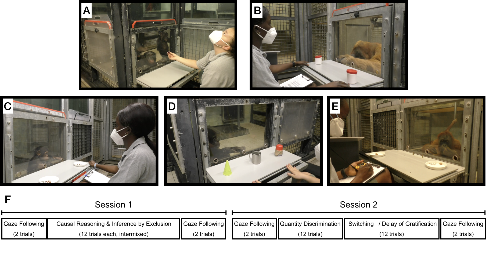

```{r, include = F}
knitr::opts_chunk$set(echo=F, warning=FALSE, message=FALSE, size="small")

opts <- options(knitr.kable.NA = "")
```


```{r, cache = F, include = F}
library(png)
library(grid)
library(xtable)
library(tidyverse)
library(tidybayes)
library(ggridges)
library(glue)
library(brms)
library(stringr)
library(forcats)
library(ggthemes)
library(ggpubr)
library(reshape)
library(ggExtra)
library(tidyboot)
library(MplusAutomation)
library(kableExtra)
library(knitr)
#library(magick)
#library(pdftools)
library(projpred)
library(bayesplot)
library(loo)

source("../../utils/custom_facet.R")

cor_func <- function(x) {
  x %>%
    corrr::correlate()%>%
    gather(time_point, cor, -term)%>%
    mutate(cor = replace(cor, duplicated(cor), NA))%>%
    drop_na(cor)
}

library(coda)

estimate_mode <- function(s) {
  d <- density(s)
  return(d$x[which.max(d$y)])
}

hdi_upper<- function(s){
  m <- HPDinterval(mcmc(s))
  return(m["var1","upper"])
}

hdi_lower<- function(s){
  m <- HPDinterval(mcmc(s))
  return(m["var1","lower"])
}
```

```{r}
# read in data files
data_task <- read.csv("../../data/laac_data_task.csv") 
data_trial <- read.csv("../../data/laac_data_trial.csv") 

```

# Overview

... Next we describe the different [tasks](#tasks) we sused ...

tasks - stability, reliability

predictors - predictability 

# Methods

## Participants

```{r}
participants <- data_trial%>%
  mutate(group = as.character(group), 
         species = ifelse(grepl("chimp",group),"chimpanzee", group), 
         species = factor(species))%>%
  group_by(species)%>%
  mutate(minage = round(min(age),1),
         maxage = round(max(age),1))%>%
  group_by(species, sex, minage,maxage)%>%
  summarise(n = length(unique(subject)))
  
  
 tpn <- data_trial%>%
     mutate(group = as.character(group), 
         species = ifelse(grepl("chimp",group),"chimpanzee", group), 
         species = factor(species))%>%
   group_by(time_point)%>%
   mutate(min_date = min(date))%>%
   group_by(time_point,species,.drop=FALSE)%>%
  summarise(n = length(unique(subject)),
            date = min(min_date))%>%
  group_by(time_point)%>%
  mutate(total_n = sum(n),
         date = as.Date(as.character(min(date)), "%Y%m%d"))%>%
   group_by(species)%>%
   mutate(end = date, 
          start = lag(as.character(end)))%>%
   mutate(start = ifelse(is.na(start),"2020-08-01",start),
          start = as.Date(start, format = "%Y-%m-%d"))%>%
   group_by(time_point)%>%
   mutate(shade = time_point %% 2 == 0)
   
```
A total of `r sum(participants$n)` great apes participated at least once in one of the tasks. This included `r participants%>%filter(species == "bonobo")%>%pull(n)%>%sum()` Bonobos (`r participants%>%filter(species == "bonobo", sex == "f")%>%pull(n)` females, age `r participants%>%filter(species == "bonobo", sex == "f")%>%pull(minage)` to `r participants%>%filter(species == "bonobo", sex == "f")%>%pull(maxage)`), `r participants%>%filter(species == "chimpanzee")%>%pull(n)%>%sum()` Chimpanzees (`r participants%>%filter(species == "chimpanzee", sex == "f")%>%pull(n)` females, age `r participants%>%filter(species == "chimpanzee", sex == "f")%>%pull(minage)` to `r participants%>%filter(species == "chimpanzee", sex == "f")%>%pull(maxage)`), `r participants%>%filter(species == "gorilla")%>%pull(n)%>%sum()` Gorillas (`r participants%>%filter(species == "gorilla", sex == "f")%>%pull(n)` females, age `r participants%>%filter(species == "gorilla", sex == "f")%>%pull(minage)` to `r participants%>%filter(species == "gorilla", sex == "f")%>%pull(maxage)`), and `r participants%>%filter(species == "gorilla")%>%pull(n)%>%sum()` Orangutans (`r participants%>%filter(species == "orangutan", sex == "f")%>%pull(n)` females, age `r participants%>%filter(species == "orangutan", sex == "f")%>%pull(minage)` to `r participants%>%filter(species == "orangutan", sex == "f")%>%pull(maxage)`). The sample size at the different time points ranged from `r min(tpn$n)` to `r max(tpn$n)`. Figure \@ref(fig:sample) visualizes the sample size across time points. We tried to test all apes at all time points but this was not always possible due to a lack of motivation or construction works. All apes participate in cognitive research on a regular basis. Many of them have ample experience with the very tasks we used in the current study.

Apes were housed at the Wolfgang Köhler Primate Research Center located in Zoo Leipzig, Germany. They lived in groups, with one group per species and two chimpanzee groups. Research was noninvasive and strictly adhered to the legal requirements in Germany. Animal husbandry and research complied with the European Association of Zoos and Aquaria Minimum Standards for the Accommodation and Care of Animals in Zoos and Aquaria as well as the World Association of Zoos and Aquariums Ethical Guidelines for the Conduct of Research on Animals by Zoos and Aquariums. Participation was voluntary, all food was given in addition to the daily diet, and water was available ad libitum throughout the study. The study was approved by an internal ethics committee at the Max Planck Institute for Evolutionary Anthropology.

```{r sample, out.width="100%", fig.height = 3, fig.cap = "Sample size by species across the different time points. Time point specific predictor variables were collected during the time between two time points (shaded regions) to predict the next."}

cols <- c(ptol_pal()(4),"black")

ggplot(tpn, aes(x = date, y = n, col = species))+
  geom_rect(aes(xmin = start, xmax = end, ymin = -Inf, ymax = Inf, fill= shade), col = NA, alpha =.1)+
  geom_rect(aes(xmin = as.Date("2020-08-01"), xmax = as.Date("2021-03-05"), ymin = 0, ymax = 44),fill = NA, col = "darkgrey")+
  geom_rect(aes(xmin = as.Date("2021-05-10"), xmax = max(date), ymin = 0, ymax = 44),fill = NA, col = "darkgrey")+
  annotate(geom="text", x=as.Date("2020-11-14"), y=46, label="Phase 1", color="black", size=4)+
  annotate(geom="text", x=as.Date("2021-06-01"), y=46, label="Phase 2", color="black", size=4)+
  geom_point(alpha = .6)+
  geom_line(alpha = .6)+
  geom_point(aes(y = total_n), col = "black", alpha = .6)+
  geom_line(aes(y = total_n), col = "black", alpha = .6)+
  theme_minimal()+
  ylim(0,48)+
  labs(y = "Sample Size", x = "")+
  scale_color_manual(name = "Species", 
                   limits = c("bonobo", "chimpanzee", "gorilla", "orangutan", "total"),
                   labels =c("bonobo", "chimpanzee", "gorilla", "orangutan", "total"),
                   values = cols)+
  scale_x_date(date_breaks = "1 month",
             date_labels = "%b")+
  scale_fill_manual(values = c("grey", NA))+
  guides(fill = F)
```
## Setup

Apes were tested in familiar sleeping or observation rooms by a single experimenter. Whenever possible, they were tested individually.  The basic setup comprised a sliding table positioned in front of a clear Plexiglas panel with three holes in it. The experimenter sat on a small stool and used an occluder to cover the sliding table (see Figure \@ref(fig:setup)).

```{r setup, include = T, fig.cap = "Setup used for the six tasks. A) Causal reasoning and inference by exclusion. B) Quantity discrimination. C) Gaze following. D) Switching. E) Delay of gratification.", out.width="100%"}

```

## Tasks

The tasks we selected are based on published procedures and are commonly used in the field of comparative psychology. The original publications often include control conditions to rule out alternative, non-cognitive explanations. We did not include such controls here and only ran the experimental conditions. For each task, we refer to the publication we used to model our procedure. We ask the reader to read these papers if they want to know more about control conditions and/or a detailed discussion of the nature of the underlying cognitive mechanisms.

Example videos for each task can be found in the associated online repository in [`videos/`](https://github.com/ccp-eva/laac/tree/master/videos).

### Causal inference

The causal inference task was modeled after @call2004inferences. Two identical cups with a lid were placed left and right on the table (Figure \@ref(fig:setup)A). The experimenter covered the table with the occluder, retrieved a piece of food, showed it to the ape, and hid it in one the cups outside the participant’s view. Next, the experimenter removed the occluder, picked up the baited cup and shook it three times, which produced a rattling sound. Next, the cup was put back in place, the sliding table pushed forwards, and the participant made a choice by pointing to one of the cups. If they picked the baited cup, their choice was coded as correct, and they received the reward. If they chose the empty cup, they did not. Participants received 12 trials. The location if the food was counterbalanced; 6 times in the right cup and 6 times in the left. Causal inference trials were intermixed with inference by exclusion trials.

We assume that apes locate the food by reasoning that the food -- a solid object -- caused the rattling sound and must thus be in the shaken cup. 

### Inference by exclusion

Inference by exclusion trials were also modeled after @call2004inferences and followed a very similar procedure compared to causal inference trials. After covering the two cups with the occluder, the experimenter placed the food in one of the cups and covered both with the lid. Next, they removed the occluder, picked up the empty cup and shook it three times. In contrast to the causal inference trials, this did not produce any sound. The experimenter then pushed the sliding table forward and the participant made a choice by pointing to one of the cups. Correct choice was coded when the baited (non-shaken) cup was chosen. If correct, the food was given to the ape. There were 12 inference by exclusion trials, intermixed with causal inference trials. The order was counterbalanced: 6 times the left cup was baited, 6 times the right. 

We assume that apes reason that the absence of a sound suggests that the shaken cup is empty. Because they saw a piece of food being hidden, they exclude the empty cup and infer that the food is more likely to be in the non-shaken cup. 

### Gaze Following

The gaze following task was modeled after @brauer2005all. The experimenter sat opposite the ape and handed over food at a constant pace. That is, the experimenter picked up a piece of food, briefly held it out in front of her face and then handed it over to the participant. After a predetermined (but varying) number of food items had been handed over, the experimenter again picked up a food item, held it in front of her face and then looked up (i.e., moving her head up - see Figure \@ref(fig:setup)C). The experimenter looked to the ceiling, no object of particular interest was placed there. After 10s, the experimenter looked down again, always handed over the food and the trial ended. We coded whether the participant looked up during the 10s interval.

We assume that participants look up in order to follow the experimenter's gaze to locate a potentially noteworthy object. 

### Quantity discrimination

For this task, we followed the general procedure of @hanus2007discrete. Two small plates were presented left and right on the table (see Figure \@ref(fig:setup)B). The experimenter covered the plates with the occluder and placed 5 small food pieces on one plate and 7 on the other. Then they pushed the sliding table forwards, and the participant made a choice. We coded as correct when the subject chose the plate with the larger quantity. Participants always received the food from the plate they chose. There were 12 trials, 6 with the larger quantity on the right and 6 on the left (order counterbalanced).

We assume that ??? 


### Switching

This task was modeled after @haun2006evolutionary. Three differently looking cups (metal cup with handle, red plastic ice cone, red cup without handle - Figure \@ref(fig:setup)D) were placed next to each other on the table. There were two conditions. In the place condition, the experimenter hid a piece of food under one of the cups in full view of the participant. Next, the cups were covered by the occluder and the experimenter switched the position of two cups, while the reward remained in the same location. Next, the experimenter removed the occluder and pushed the table forward. We coded as correct if the participant chose the location where the food was hidden. Participants received four trials in this condition. 

The place condition was run first. The feature condition followed the same procedure, but now the experimenter also moved the reward when switching the cups. The switch between conditions happened without informing the participant in any way. A correct choice in this condition meant choosing the location to which the cup plus the food were moved. Here, participants received eight trials. 

The dependent measure of interest for this task was calculated as: `[proportion correct place] - (1 - [proportion correct feature])`.  Positive values in this score mean that participants could quickly switch from choosing based on location to choosing based on feature. High negative values suggest that participants did not or hardly switch strategies.  

Based on the results of @haun2006evolutionary, we assume that apes have a tendency to expect the food to remain in the same location. When this strategy is no longer successful in the feature trials, they have to switch strategies and try a different one. 

### Delay of gratification

The procedure for this task was adapted from @rosati2007evolutionary. Two small plates including one and two pieces of pellet were presented left and right on the table. E moved the plate with the smaller reward forward allowing the subject to choose immediately, while the plate with the larger reward was moved forward after a delay of 20 seconds. We coded whether the subject selected the larger delayed reward (correct choice) or the smaller immediate reward (incorrect choice) as well as the waiting time in cases where the immediate reward was chosen. Subjects received 12 trials, with the side on which the immediate reward was presented counterbalanced. 


## Data collection

One time point meant running all tasks with all participants. Within each time point, the tasks were organized in two sessions (see Figure \@ref(fig:setup)F). Session 1 started with 2 gaze following trials. Next was a pseudo random mix of causal inference and inference by exclusion with 12 trials per task but no more than two trials of the same task in a row. At the end of session 1, there were again 2 gaze following trials. Sessions 2 also started with 2 gaze following trials, followed by quantity discrimination and switching. Finally, there were again 2 gaze following trials. B spreading out or mixing tasks we hoped to keep subjects more attentive and engaged. 

The order of tasks was the same for all subjects. So was the positioning of food items within each task. The counterbalancing can be found in the coding sheets in the online repository in `documentation/` [**to be added**]. This exact procedure was repeated at each time point so that the results would be comparable across participants. The two sessions were usually spread out across two adjacent days. For the larger chimpanzee group, they were sometimes spread out across 4 days. 

The interval between two time points was planned to be two weeks. However, it was not always possible to follow this schedule so that that some intervals are longer/shorter. Figure \@ref(fig:sample) visualizes the intervals between time points. 

We collected data in two phases. Phase 1 started on August 1st, 2020, lasted until March 5th, 2021 and included 14 time points (see Figure \@ref(fig:sample)). Phase 2 started on , lasted until and had time points.

## Predictors

In addition to the data from the cognitive tasks, we collected data for a range of predictor variables. The goal here was to find variables that are systematically related to inter- and/or intra-individual variation in cognitive performance. That is, we were interested to see which variables allow us to predict cognitive performance. The second part of the [analysis](#projection-predictive-inference) section, describes the method we used to determine the predictive value of each variable.    

Predictors could either vary with the individual (stable individual characteristics; e.g. sex or rearing history), vary with individual and time point (variable individual characteristics; e.g. sickness or sociality), vary with group membership (group life; e.g. time spent outdoors or disturbances) or vary with the testing arrangements (testing arrangements; e.g. presence of an observer or participation in other tests).

Most predictors were collected via a diary that the animal caretakers filled out on a daily basis. Here, the caretakers were asked a range of questions about the presence of a predictor and its severity. The diary (in German) can be found in `documentation/` in the associated online repository.

### Stable individual characteristics

These predictors are stable individual differences. As a source, we used the ape handbook at Zoo Leipzig. Figure \@ref(fig:demo) gives an overview of the distribution of the different characteristics in the sample. 

#### Age

Absolute age of the individual. For some older individuals, only the year of birth was known. In these cases we calculated age with January 1st of that year as the birthday.

#### Sex 

Participant's biological sex.

#### Rearing history

Here, we differentiated between, `mother-reared`, `hand-reared` and `unknown`. The last category was used only for three chimpanzees. In the analysis, we classified them as `hand-reared` to facilitate model fitting (i.e. it is very difficult to estimate a parameter for a factor level with so little data). We think this decision is justified because the individuals in question have spent most of their life in close contact to humans and not in a larger chimpanzee group. 

#### Time lived in Leipzig

Absolute time the individual has lived in Leipzig Zoo. All apes living in Leipzig are involved in behavioral research. Thus, we take this measure to be a rough proxy of how much experience an individual has had with cognitive research. 

```{r}
psex <- data_trial%>%
     mutate(group = as.character(group), 
         species = ifelse(grepl("chimp",group),"chimpanzee", group), 
         species = factor(species))%>%
  group_by(species, sex)%>%
  summarise(Frequency = length(unique(subject)))%>%
  ggplot(aes(x = species, y = Frequency, fill = sex))+
  geom_histogram(stat = "identity", position = position_dodge(), col = "black")+
  theme_minimal(base_size = 8)+
  scale_fill_grey(name = "Sex")+
  theme(legend.position = c(0.8,0.7), legend.key.size = unit(0.3, "cm"))+
  coord_flip()

prearing <- data_trial%>%
     mutate(group = as.character(group), 
         species = ifelse(grepl("chimp",group),"chimpanzee", group), 
         species = factor(species))%>%
  group_by(species, rearing,.drop=FALSE)%>%
  summarise(Frequency = length(unique(subject)))%>%
  ggplot(aes(x = species, y = Frequency, fill = rearing))+
  geom_histogram(stat = "identity", position = position_dodge(), col = "black")+
  theme_minimal(base_size = 8)+
  scale_fill_viridis_d(name = "Rearing history")+
  theme(legend.position = c(0.8,0.7), legend.key.size = unit(0.3, "cm"))+
  coord_flip()

page <- data_trial%>%
     mutate(group = as.character(group), 
         species = ifelse(grepl("chimp",group),"chimpanzee", group), 
         species = factor(species))%>%
  group_by(species, subject)%>%
  summarise(age = min(age))%>%
  ggplot(aes(x = age, y = species, fill = species))+
  geom_jitter(aes( col = species),alpha = .75, height = 0, width = .05, pch = "|", size = 5)+
  geom_density_ridges(col = "black", alpha = .5)+
  theme_minimal(base_size = 8)+
  scale_fill_ptol(name = "Species")+
  scale_color_ptol(name = "Species")+
  guides(fill = F, col = F)

pleipzig <- data_trial%>%
     mutate(group = as.character(group), 
         species = ifelse(grepl("chimp",group),"chimpanzee", group), 
         species = factor(species))%>%
  group_by(species, subject)%>%
  summarise(time_in_leipzig = min(time_in_leipzig))%>%
  ggplot(aes(x = time_in_leipzig, y = species, fill = species))+
  geom_jitter(aes( col = species),alpha = .75, height = 0, width = .05, pch = "|", size = 5)+
  geom_density_ridges(col = "black", alpha = .5)+
  theme_minimal(base_size = 8)+
  scale_fill_ptol(name = "Species")+
  scale_color_ptol(name = "Species")+
  guides(fill = F, col = F)
  
```

```{r demo, out.width="100%", fig.height = 4, fig.cap = "Stable individual characteristics. A) participant sex, B) age distribution by species, C) rearing history, D) time lived in leipzig by species."}

ggarrange(psex, page, prearing, pleipzig, nrow = 2, ncol= 2, widths = c(1,2), labels = c("A","B","C","D"))
```

### Variable individual characteristics

These predictors varied by participant and time point.

#### Rank

We asked caretakers to order individuals within a given group for their rank. Ties were allowed. This was done at each time point. An individual's rank was mostly stable (see Figure \@ref(fig:socrel)A) across time points, however, there was some variation. 

#### Sickness

As part of the caretakers' daily diary, we asked whether an individual was sick and if yes, how severe the sickness was on a scale from 1 to 7. For each time point, we used the mean of the daily sickness ratings as predictor.  

#### Sociality

```{r}
# ## get date ranges for each time point
# raw_data_date <- p1_data_trial %>%
#   mutate(date = ifelse(group == "b_chimp" & time_point == "13" & date == "20210203", "20210223", date))%>%
#   mutate(date = as.Date(as.character(date), format="%Y%m%d"))%>%
#   select(date, time_point,group)%>%
#   group_by(group,time_point)%>%
#   summarise(end_date = min(date))%>%
#   mutate(time_point = as.numeric(time_point))%>%
#   dplyr::arrange(group,-time_point)%>%
#   mutate(start_date = ifelse(time_point == 1, as.character(as.Date("2020-08-01", format="%Y-%m-%d")), as.character(end_date[-1])))%>%
#   #mutate(dif = time_length(interval(start_date, end_date), "days"))
#   mutate(end_date = as.Date(end_date-1, format = "%Y-%m-%d"),
#          start_date = as.Date(start_date, format = "%Y-%m-%d"),
#          time_point = factor(time_point))%>%
#   group_by(time_point, group)%>%
#   summarise(date = seq(start_date, end_date, by = "days"))%>%
#   dplyr::rename(species = group)%>%
#   mutate(species = paste(str_replace(species,"_","-"),"s",sep =""))
# 
# ## get a list of all possible dyady for all possible time points
# dyads <- list.files(path = "../../data/social_network_data",
#                        pattern = "*.csv",
#                        full.names = T)%>%
#   map_df(~read_csv(.))%>%
#   mutate(species = tolower(str_remove(`Configuration Name`, "LAAC ")),
#          session = SessionID,
#          date = as.Date(substr(as.character(DateTime),0,10),format="%Y-%m-%d"),
#          focal = `Focal Name`,
#          associates = `All Occurrence Behavior Social Modifier`)%>%
#   #filter(date2 != "2020-08-21")%>%
#   transform(associates = strsplit(associates,","))%>%
#   unnest(associates)%>%
#   select(species,focal,associates)%>%
#   gather(type, focal, -species)%>%
#   filter(!is.na(focal))%>%
#   distinct(species, focal)%>%
#   mutate(associates = focal)%>%
#   group_by(species)%>%
#   tidyr::expand(focal,associates,c(1:14))%>%
#   mutate(time_point = factor(`c(1:14)`))%>%
#   select(-`c(1:14)`)%>%
#   filter(focal != associates)
# 
# ## read in the data from the observational scans
# obs_data <- list.files(path = "../../data/social_network_data",
#                        pattern = "*.csv",
#                        full.names = T)%>%
#   map_df(~read_csv(.))%>%
#   mutate(species = tolower(str_remove(`Configuration Name`, "LAAC ")),
#          session = SessionID,
#          date = as.Date(substr(as.character(DateTime),0,10),format="%Y-%m-%d"),
#          focal = `Focal Name`,
#          associates = `All Occurrence Behavior Social Modifier`)%>%
#   #filter(date2 != "2020-08-21")%>%
#   transform(associates = strsplit(associates,","))%>%
#   unnest(associates)%>%
#   select(species,session,date, focal,associates)%>%
#   left_join(raw_data_date)%>%
#   group_by(species,time_point)%>%
#   mutate(n = length(unique(date)))%>% #compute the number of observations
#   group_by(species,focal, associates,time_point)%>%
#   summarise(count = n(), # count how often a combination of focal and associate occurred for a time point
#             n = max(n))%>%# include the number of observations for that time point
#   mutate(count = ifelse(is.na(associates),0,count))%>%
#   rowwise() %>%
#   filter(!is.na(associates))%>% # remove rows without associates
#   ungroup()
#   
# ## merge scan data with the dyads
# raw_srm_data <- dyads %>%
#   left_join(obs_data)%>%
#   group_by(species, time_point)%>%
#   mutate(n = max(n, na.rm = T))%>%
#   filter(n != "-Inf")%>%
#   mutate(count = ifelse(is.na(count),0,count))%>%
#   rowwise() %>%
#   mutate(dyad = paste(sort(c(focal, associates)), collapse = "_"))%>% # create ordered dyad column
#   ungroup()
# 
# ## prepare data for model run
# srm_model_data <- raw_srm_data%>%
#   group_by(time_point)%>%
#   distinct(dyad, .keep_all = T)%>% # remove duplicate dyads to avoid counting same dyad twice
#   ungroup()%>%
#   filter(!count > n) # remove rows with more counts than observations
# 
# ## run social relations model
# 
# ### specify priors
# prior <-  c(prior(normal(0,2), class = Intercept),
#             prior(normal(0,2), class = b),
#             prior(normal(0,1), class = sd)
#             )
# 
# ### run model 
# srm <-  brm(count | trials(n) ~ species + (0 + time_point | mm(focal, associates)) + ( 0 + time_point | dyad),
#            family = binomial(link = "logit"),
#            data = srm_model_data,
#            prior = prior,
#            #control = list(adapt_delta = 0.95, max_treedepth = 20),
#            iter = 5000, cores = 4, chains = 4)
# 
# ### save output 
# saveRDS(srm, "./saves/srm.rds")
# 
# ### load model results(too large to put on GitHub)
# srm <-  readRDS("./saves/srm.rds")
# 
# 
# ### get species infor for each subject
# subject_data <-  raw_srm_data%>%
#   ungroup()%>%
#   select(species, focal, associates)%>%
#   gather(role, subject,-species)%>%
#   distinct(subject, .keep_all = T)%>%
#   select(-role)%>%
#   arrange(species)%>%
#   mutate(subject = tolower(subject))%>%
#   mutate_at(.vars = vars(ends_with("s")),
#             .funs = funs(sub("s", "", .)))%>%
#   mutate(species = str_replace(species, "-", "_"))
# 
# ## extract model estimates for each subject 
# subject_draws <-  spread_draws(srm, r_mmfocalassociates[subject,time_point])%>% # extract posterior draws for each subject and time point
#   dplyr::rename(estimate = r_mmfocalassociates)%>%
#   mutate(subject = tolower(subject))%>% 
#   left_join(subject_data) # merge with subject information to get species in
# 
# ## summaries subject draws to put on GitHub
# subject_estimates <- subject_draws%>%
#   ungroup()%>%
#   mutate(time_point = as.numeric(str_remove(time_point, "time_point")))%>%
#   group_by(species, subject,time_point)%>%
#   summarise(mean = estimate_mode(estimate),
#             uci = hdi_upper(estimate),
#             lci = hdi_lower(estimate))
# 
# ## save subject draws to put on GitHub
# write_csv(subject_estimates, "./saves/srm_estimates.csv")

subject_estimates <- read_csv("./saves/srm_estimates.csv")

## generate plot
plot_est <-  subject_estimates%>%
  ungroup()%>%
  mutate(species_order = as.numeric(as.factor(species)),
         subject = factor(subject),
         subject = reorder(subject, species_order))


psrm <- plot_est%>%
  filter(#species == "gorilla" | 
           species == "orangutan")%>%
ggplot(.,aes(y = mean, x = factor(time_point), col = subject)) +
  geom_point(alpha = .5)+
  #geom_pointrange(aes(y = mean, ymin = lci, ymax = uci), alpha = .5, position = position_dodge(width = .5))+
  geom_line(aes(group = subject),alpha = .5)+
  facet_grid(~species)+
  theme_minimal()+
  scale_color_viridis_d(name ="Subject")+
  labs(x = "Time point", y = "Sociality")
```

We conducted proximity scans for all groups in the early afternoon on every workday (Monday to Friday). That is, we expect 10 scans for each time point. For each individual, we recorded which individuals are within arms reach. Research assistants used a tablet to record their observations. 

To derive individual specific estimates of sociality for each time point, we fit a variant of a Social Relations Model [@snijders1999social] to the proximity data. These models allow estimating an individual specific sociality index while accounting for the dyadic nature of social interaction. Social relations model usually deal with directed behaviors (e.g. individual *i* is grooming individual *j*). Because the behavior we observed was symmetric, we cannot differentiate between the actor and receiver. @Kajokaite2020.08.04.235788 suggested to speak of a Multiple Membership Relations Model [see also @leckie2019multiple] in such a context, which simply estimates how likely likely an individual is to be observed in proximity to another individual. 

In `brms` syntax, our model had the following structure: `count | trials(n) ~ group + (time_point | mm(focal, associates)) + (time_point | dyad)`. The dependent variable `count | trials(n)` is the number of times a dyad has been observed (`count`) at a time point relative to the number of scans taken for that time point (`trials(n)`). The fixed effect `group` estimates group difference in sociality. The random effect `(time_point | mm(focal, associates))` estimates the sociality for each individual. In that, the multi-membership grouping term `mm(focal, associates)` captures the fact that the assignment of the two roles (focal and associate) is arbitrary in the context of a symmetric behavior. The random slope `time_point` (treated as a factor) allowed us to estimate sociality for each time point. Finally, the random effect `(time_point | dyad)` accounts for dyad composition; in some cases a particular dyad composition (e.g. mother and infant) might be sufficient to explain high levels of sociality in an individual.

For each individual and time point, we extracted the sociality estimates and used them to predict cognitive performance in the different tasks for that time point. Figure \@ref(fig:socrel)B visualizes the sociality measures for one group across the different time points.     

```{r, out.width="100%", fig.height = 4, fig.cap = "Stable individual characteristics. A) participant sex, B) age distribution by species, C) rearing history, D) time lived in leipzig by species."}
prank <- data_trial%>%
     mutate(group = as.character(group), 
         species = ifelse(grepl("chimp",group),"chimpanzee", group), 
         species = factor(species))%>%
  group_by(subject, species)%>%
  summarise(sd = sd(rank, na.rm = T))%>%
  ggplot(aes(x = sd, y = species, fill = species))+
  geom_jitter(aes(col = species), height = 0, width = .05, pch = "|", size = 5)+
  geom_density_ridges(alpha = .5, col = "black")+
  labs(x ="Variability in rank (sd)")+
  theme_minimal()+
  scale_fill_ptol()+
  scale_colour_ptol()+
  scale_x_continuous(limits = c(0, 3), oob = scales::squish)+
  guides(col = F, pch = F, fill =F)
```

```{r socrel, out.width="100%", fig.height = 2, fig.cap = "Variable individual characteristics. A) variability in rank (caretaker ratings) for each subject and species, B) sociality estimates for orangutans based on Multiple Membership Relations Model."}
ggarrange(prank,psrm, labels = c("A","B"), widths = c(1,1.3))
```

### Group life

This set of predictors varied by time point and group, but were the same for all individuals in that group. They were recorded in the animal caretaker diary. Figure \@ref(fig:glife) visualizes the different variables across time points. 

#### Time outdoors

Each day, the animal caretakers noted in the diary how many hours each group spent in the outdoor enclosure. To compute the predictor, we averaged across these values for each time point and group. 

#### Disturbances

The animal caretakers also noted down if there were any unusual disturbances for a particular group. Example were construction works in the building, heavy weather conditions or green-keeping activities. In addition, the caretakers rated how disturbing they judged these events to be on a scale from 1 to 7. For each time point, we calculated the mean of these ratings.

#### Life events

This variable captured whether there were any notable events within the group. Examples were fights in the group or the temporal removal of some individuals for medical procedures. Again, we asked the caretakers to rate the severity of these events and averaged across them.  


```{r}
plife <- data_trial%>%
  group_by(time_point,group)%>%
  summarise(time_outdoors = mean(time_outdoors),
            disturbance = mean(dist_mean),
            life_event = mean(le_mean))%>%
  pivot_longer(names_to = "measure", values_to = "value", cols = c(-group, -time_point))%>%
  ggplot(aes(x = time_point, y = value, col = group))+
  geom_vline(xintercept = 14.5)+
  geom_point()+
  geom_line(aes(group = group))+
  facet_grid(measure~., scales = "free_y")+
  labs(x = "Time Point", y = "")+
  scale_color_ptol(name = "Group")+
  theme_minimal()
```

```{r glife, out.width="100%", fig.height = 3, fig.cap = "Variation in group life related measures across groups and time points."}
plife
```

### Testing arrangements

Testing arrangements varied between individuals, sessions and time points. The experimenter recorded them either based on their observations during testing or from the testing schedule which lists all studies along with their participants that take place on a particular day.  

#### Observer

We noted whether or not there was another animal in the same room or the room adjacent to the one the participant was in. 

#### Study on same day

This predictor recorded whether or not the participant had already participated in a different test on the same day. The experimenter took this information from the testing schedule. 

#### Studies since last time point

Here we counted in how many other studies the participant had taken part in since the last time they were tested in that particular task. The experimenter took this information from the testing schedule.  

# Analytical framework

We have two overarching questions. On the one hand, we are interested in the stability and the reliability of the individual tasks as as well as the relations between them. We used structural equation modeling [Jana: citation?] to address these questions. These models have been developed and are usually used with much larger sample sizes. Thus, we had to make a number of assumptions to be able to fit them to the kind of data that we have -- we lay out these assumptions in the text below. The Appendix includes simulations that show that these assumptions were justified. 

Our second question was, which predictors explain variability in cognitive performance. Here we wanted to see, which of the predictors we recorded were most important to predict performance over time. This is a variable selection problem (selecting a subset of important predictors from a larger pool) and we used Projection Prediction Inference for this [@piironen2018projective]. 

## Structural equation modelling

Structural equation models can be used to assess latent variables (constructs) using one or more observed variables. These latent variables can be combined in a structural model that imputes relations between them. We used the data from each time point as observed variables to estimate a latent construct for each task. Due to the small sample size, we could not combine latent variables in a structured model or use predictors to explain individual differences in these latent variables. Instead, we assessed relations between tasks by simply correlating latent variables with one another. 

We used SEM to estimate states (time varying) and traits (stable over time). In the present context, one can think of traits as a stable psychological ability (e.g. ability to make causal inferences) and states as variable psychological condition (e.g. being attentive). Variation in performance on a given time point can then be partitioned into variance explained by the trait and variance explained by the state. Next we describe the model construction process in more detail.

For each task, two parallel test halves were build, corresponding to sum scores of half of the trials of the same time point per task. Trials were alternately assigned to the first and the second test half. For tasks with 12 trials per time point this procedure resulted in two test halves assuming 7 possible values (0 to 6 correctly solved trials), for tasks with 8 trials per time point, test halves could maximally assume 5 possible values (0 to 4 correctly solved trials). Not all categories were observed at all time points and so sometimes categories had to be collapsed (see descriptions below). The two test halves served as indicators for a common latent construct per time point, assuming parallel test halves (i.e., factor loadings set to 1 and assuming equal reliabilities). Due to only few observed categories, indicators were modeled as ordered categorical, using a probit link function. The models thereby correspond to Graded Response Models [Jana: citation?]. For model parsimony, to improve estimation accuracy (see simulation studies) and in order to test for latent mean differences across time, we assume strict measurement invariance. That is, in each model (task), loading parameters are set to 1 at all time points, residual variances are equal to 1, threshold parameters (i.e. trait level necessary to respond above threshold with 0.50 probability) are set invariant across time points and variances of latent state residual factors are set invariant across time points. In other words, we assume that the indicators (test halves) measure the latent variable in an equivalent and stable manner over time.

### Models and coefficients

For each task, we constructed three different models which increased in complexity. We started with a Latent State Model (LSM), which estimates a latent state for each time point based on the two test halves. As such, it does not assume an underlying trait. Stability is only indirectly assessed via correlations between states. This model first and foremost served as a baseline to see if the data supports a SEM approach.

Second, we fit a Latent State Trait Model (LSTM). This model estimates time point specific states, but also a time-invariant trait. With this model, we can partition the variance in performance into stable (trait) and variable (state) components.  

Finally, we fit an LSTM with autoregressive effects (LST-AR). In addition to the LSTM architecture, this model assumes that the states variance at one time point can be used to predict the state variance in the next time point. Thereby it captures the idea that measurements that are closer in time are more likely to be more similar. This allows us to look at longitudinal trends in the state variance.  

#### Latent State models

Measurement equation for parcel $i$ at time point $t$ is:

\begin{equation}
Y_{it}= S_t + \epsilon_{it}
(\#eq:eq1)
\end{equation}

At each time point $t$, a latent state variable $S_t$, underlying the two observed indicators $Y_{1t}$ and $Y_{2t}$ is estimated. Latent state variables are allowed to freely correlate across time, with latent (measurement-error free) correlations serving as indirect indicators of stability across time. The model is depicted for 6 measurement time points in Figure \@ref(fig:lsgraph). 

```{r lsgraph, engine='tikz', fig.cap="Latent State model for two indicators and six measurement time points.", out.width="25%", fig.align='center'}

\usetikzlibrary{arrows} 
\usetikzlibrary{positioning} 
\usetikzlibrary{shapes} 
\usetikzlibrary{fit} 
\usetikzlibrary{backgrounds} 
\usetikzlibrary{calc}

\begin{tikzpicture}
        [manifest/.style={rectangle,draw=black!80,semithick,minimum width=1.5cm,inner sep=
4pt,text centered},
        latent/.style={ellipse,draw=black!80,thick,inner sep=2,text centered},
        on/.style={->,>=stealth',semithick},
        from/.style={<-,>=stealth',semithick},
        with1/.style={<->,>=stealth',semithick,bend left=30},
        with2/.style={<->,>=stealth',semithick,bend right=30},
        with3/.style={<->,>=stealth',semithick,bend left=50},]

% Latent Variables %
 \begin{scope}[node distance=1.5]
                \node[latent] (o1) at (0,0) {$S_{1}$};
                \node[latent] (o2) [below=of o1] {$S_{2}$};
                \node[latent] (o3) [below=of o2] {$S_{3}$};
                \node[latent] (o4) [below=of o3] {$S_{4}$};
                \node[latent] (o5) [below=of o4] {$S_{5}$};
                \node[latent] (o6) [below=of o5] {$S_{6}$};
\end{scope}
                                                             	                        
% Manifest % 
 \foreach \a in {1,...,6} {\node (y1\a) [right = 2 of o\a] (yhelp\a) {};}        
 \foreach \b in {1,...,6} {\node[manifest] [above = .05 of yhelp\b] (y1\b) {$Y_{1\b}$}
 	edge [from] node[above] {1} (o\b);}
 \foreach \c in {1,...,6} {\node[manifest] [below = .05 of yhelp\c] (y2\c) {$Y_{2\c}$}
 	edge [from] node[below] {$1$} (o\c);} 

% Fehler %
\foreach \a in {1,...,5} {\node (e1\a) [below right = .3 of y1\a] {}
	edge [on] (y1\a.south east);}
\foreach \b in {1,...,5} {\node (e2\b) [below right = .3 of y2\b] {}
	edge [on] (y2\b.south east);}

\node (e16) [below right = .3 of y16] {$\epsilon_{16}$}
	edge [on] (y16.south east);
\node (e26) [below right = .3 of y26] {$\epsilon_{26}$}
	edge [on] (y26.south east);

%correlations%
\foreach \a in {1,...,5} {
\draw[<->,>=stealth',semithick] (o\a) to [with2]
node[align=center,below,yshift= 0mm, pos=0.5] 
                      {}  (o6);}
\foreach \a in {1,...,4} {
\draw[<->,>=stealth',semithick] (o\a) to [with2]
node[align=center,below,yshift= 0mm, pos=0.5] 
                      {}  (o5);}
\foreach \a in {1,...,3} {
\draw[<->,>=stealth',semithick] (o\a) to [with2]
node[align=center,below,yshift= 0mm, pos=0.5] 
                      {}  (o4);}
\foreach \a in {1,...,2} {
\draw[<->,>=stealth',semithick] (o\a) to [with2]
node[align=center,below,yshift= 0mm, pos=0.5] 
                      {}  (o3);}      
\draw[<->,>=stealth',semithick] (o1) to [with2]
node[align=center,below,yshift= 0mm, pos=0.5] 
                      {}  (o2);                

\end{tikzpicture}

```

#### Latent State Trait (LST) models

Measurement equation for parcel $i$ at time point $t$:

\begin{equation}
Y_{it}= T+ S_t + \epsilon_{it}
(\#eq:eq2)
\end{equation}

where $T$ is a stable latent trait variable, $S_t$ captures time-specific deviations of the respective true score from the stable trait at time $t$, and $\epsilon_{it}$ is a measurement error variable, with $Var(\epsilon_{it})=1 ~~~\forall i,t$ (probit parameterization; Graded response model). The model is depicted for 6 measurement time points in Figure \@ref(fig:lstgraph).  

```{r lstgraph, engine='tikz', fig.cap="Latent State Trait model for two indicators and six measurement time points.", out.width="30%", fig.align='center'}

\usetikzlibrary{arrows} 
\usetikzlibrary{positioning} 
\usetikzlibrary{shapes} 
\usetikzlibrary{fit} 
\usetikzlibrary{backgrounds} 
\usetikzlibrary{calc}

\begin{tikzpicture}
        [manifest/.style={rectangle,draw=black!80,semithick,minimum width=1.5cm,inner sep=
4pt,text centered},
        latent/.style={ellipse,draw=black!80,thick,inner sep=2,text centered},
        on/.style={->,>=stealth',semithick},
        from/.style={<-,>=stealth',semithick},
        with1/.style={<->,>=stealth',semithick,bend left=30},
        with2/.style={<->,>=stealth',semithick,bend right=30},
        with3/.style={<->,>=stealth',semithick,bend left=50},]
        
% Latent Variables %
 \begin{scope}[node distance=1.5]
                \node[latent] (o1) at (0,0) {$S_{1}$};
                \node[latent] (o2) [below=of o1] {$S_{2}$};
                \node[latent] (o3) [below=of o2] {$S_{3}$};
                \node[latent] (o4) [below=of o3] {$S_{4}$};
                \node[latent] (o5) [below=of o4] {$S_{5}$};
                \node[latent] (o6) [below=of o5] {$S_{6}$};
\end{scope}
                     
% Trait % 
\node[latent,node distance=7] (t) [right=of  o4]  {$T_{}$};
                                             	                        
% Manifest % 
 \foreach \a in {1,...,6} {\node (y1\a) [right = 2 of o\a] (yhelp\a) {};}        
 \foreach \b in {1,...,6} {\node[manifest] [above = .05 of yhelp\b] (y1\b) {$Y_{1\b}$}
 	edge [from] node[above] {1} (o\b);}
 \foreach \c in {1,...,6} {\node[manifest] [below = .05 of yhelp\c] (y2\c) {$Y_{2\c}$}
 	edge [from] node[below] {$1$} (o\c);} 

% Fehler %
\foreach \a in {1,...,5} {\node (e1\a) [below right = .3 of y1\a] {}
	edge [on] (y1\a.south east);}
\foreach \b in {1,...,5} {\node (e2\b) [below right = .3 of y2\b] {}
	edge [on] (y2\b.south east);}

\node (e16) [below right = .3 of y16] {$\epsilon_{16}$}
	edge [on] (y16.south east);
\node (e26) [below right = .3 of y26] {$\epsilon_{26}$}
	edge [on] (y26.south east);

% Pfeile %
\foreach \a in {1,...,6}
	\path (y1\a.0) edge [from] (t);
\foreach \a in {1,...,6}	
	\path (y2\a.0) edge [from] (t);
\end{tikzpicture}

```

AS noted above, we assume strong measurement invariance. As a consequence, the specified LST model (without autoregressive effects) corresponds to a multilevel model with a latent trait factor at the between-level (person-level) and a latent state residual factor at the within-level (time-specific) level.

In order to test for possible mean changes across time, latent state models are estimated in a first step. LST models as single-level models are estimated to test whether measurement invariance assumptions across time can be reasonably assumed. Once measurement invariance can be established, the models can alternatively estimated as multilevel SEMs.

The following variance components can be computed for the presented LST model (without autoregressive effects).

##### Consistency

Proportion of true variance (i.e., measurement-error free variance) that is due to true inter-individual stable trait differences.

\begin{equation}
Con(Y_{it})=\frac{Var(T)}{Var(T)+Var(S_t)}
(\#eq:eq3)
\end{equation}

##### Occasion specificity

Proportion of true variance (i.e., measurement-error free variance) that is due to true inter-individual differences in the state residual variables (i.e. occasion-specific variation not explained by the trait).

\begin{equation}
OS(Y_{it})=1-Con(Y_{it})) = \frac{Var(S_t)}{Var(T)+Var(S_t)}
(\#eq:eq4)
\end{equation}

As strong measurement invariance is assumed and $Var(S_t)$ is set equal across time, $OS(Y_{it})$ is constant across time as well as across item parcels $i$. 

#### Latent State Trait models with autoregressive effects (LST-AR)

This model is described in more detail in @eid2017definition. The model is depicted for 6 measurement time points in Figure \@ref(fig:lstrgraph).

```{r lstrgraph, engine='tikz', fig.cap="Latent State Trait model with autoregressive effects for two indicators and six measurement time points.", out.width="35%", fig.align='center'}

\usetikzlibrary{arrows} 
\usetikzlibrary{positioning} 
\usetikzlibrary{shapes} 
\usetikzlibrary{fit} 
\usetikzlibrary{backgrounds} 
\usetikzlibrary{calc}

\begin{tikzpicture}
 [manifest/.style={rectangle,draw=black!80,semithick,minimum width=1.5cm,inner sep=
4pt,text centered},
        latent/.style={ellipse,draw=black!80,thick,inner sep=2,text centered},
        on/.style={->,>=stealth',semithick},
        from/.style={<-,>=stealth',semithick},
        with1/.style={<->,>=stealth',semithick,bend left=30},
        with2/.style={<->,>=stealth',semithick,bend right=30},
        with3/.style={<->,>=stealth',semithick,bend left=50},]


% Latent Variables %
 \begin{scope}[node distance=1.5]
                \node[latent] (o1) at (0,0) {$S_{1}$};
                \node[latent] (o2) [below=of o1] {$O_{2}$}
                edge [from] node[right] {$\beta$} (o1);
                \node[latent] (o3) [below=of o2] {$O_{3}$}
                edge [from] node[right] {$\beta$} (o2);
                \node[latent] (o4) [below=of o3] {$O_{4}$}
                edge [from] node[right] {$\beta$} (o3);
                \node[latent] (o5) [below=of o4] {$O_{5}$}
                edge [from] node[right] {$\beta$} (o4);
                \node[latent] (o6) [below=of o5] {$O_{6}$}
                edge [from] node[right] {$\beta$} (o5);
\end{scope}

\foreach \a in {2,...,6} {\node [below left = .4 of o\a] (zeta\a) {$S_{\a}$}
	edge [on] (o\a);}
                     
% Trait % 
\node[latent,node distance=7] (t) [right=of  o4]  {$T_{}$};
                                             	                        
% Manifest % 
 \foreach \a in {1,...,6} {\node (y1\a) [right = 2 of o\a] (yhelp\a) {};}        
 \foreach \b in {1,...,6} {\node[manifest] [above = .05 of yhelp\b] (y1\b) {$Y_{1\b}$}
 	edge [from] node[above] {1} (o\b);}
 \foreach \c in {1,...,6} {\node[manifest] [below = .05 of yhelp\c] (y2\c) {$Y_{2\c}$}
 	edge [from] node[below] {$1$} (o\c);} 

% Fehler %
\foreach \a in {1,...,5} {\node (e1\a) [below right = .3 of y1\a] {}
	edge [on] (y1\a.south east);}
\foreach \b in {1,...,5} {\node (e2\b) [below right = .3 of y2\b] {}
	edge [on] (y2\b.south east);}

\node (e16) [below right = .3 of y16] {$\epsilon_{16}$}
	edge [on] (y16.south east);
\node (e26) [below right = .3 of y26] {$\epsilon_{26}$}
	edge [on] (y26.south east);

% Pfeile %
\foreach \a in {1,...,6}
	\path (y1\a.0) edge [from] (t);
\foreach \a in {1,...,6}	
	\path (y2\a.0) edge [from] (t);
\end{tikzpicture}

```

Measurement equation for parcel $i$ at time point $t$:

\begin{equation}
Y_{it}= T+ O_t + \epsilon_{it}
(\#eq:eq5)
\end{equation}

where $T$ is a stable latent trait variable, $O_t$ captures time-specific deviations of the respective true score from the stable trait at time $t$, and $\epsilon_{it}$ is a measurement error variable,  with $Var(\epsilon_{it})=1 ~~~\forall i,t$ (probit parameterization; Graded response model). $O_t$ is assumed to follow an autoregressive process of order 1 across time (within subjects), that is:

\begin{align}
O_t  &= S_t ~~~~~~~~t = 1 \notag \\
O_t  &= \beta O_{(t-1)} + S_t~~~~~~~~t > 1 \notag
\end{align}

where the latent state residual variables $S_t$ capture true occasion-specific inter-individual differences that cannot be explained by states at previous measurement time points. We make the same assumptions about measurement invariance as in the LST model.  

The following variance coefficients can be computed.

##### Consistency

Proportion of true variance (i.e., measurement-error free variance) that is due to true inter-individual stable trait differences.

\begin{equation}
Con(Y_{it})=\frac{Var(T)}{Var(T)+\beta^2 Var(O_{(t-1)})+Var(S_t)}
(\#eq:eq6)
\end{equation}

##### Occasion specificity

Proportion of true variance (i.e., measurement-error free variance) that is due to true inter-individual differences in the state residual variables, that is occasion-specific variation that is not explained by the autoregressive process.

\begin{equation}
OS(Y_{it}) = \frac{Var(S_t)}{Var(T)+\beta^2 Var(O_{(t-1)})+Var(S_t)}
(\#eq:eq7)
\end{equation}

As the proportion of variance explained by the autoregressive process stabilizes over time, all coefficients have converged to a relatively stable value at $t=14$, indicating the long-term proportions of variance that are to be expected.

##### Predictability

Proportion of true variance that is explained by carry-over effects from previous measurement time points.

\begin{equation}
Pred(Y_{it}) = \frac{\beta^2 Var(O_{(t-1)}}{Var(T)+\beta^2 Var(O_{(t-1)})+Var(S_t)}
(\#eq:eq8)
\end{equation}

### Estimation

Models were estimated with MPlus version 8.4, using Bayesian Markov-Chain Monte-Carlo sampling, with the Mplus default priors (see simulation studies in the Appendix). Using inverse gamma priors [IG(0.001, 0.001); see simulation study] for LST models did not substantially change the parameter estimates. Therefore, only the results using the MPlus default priors are reported. We used two chains with a minimum of 10,000 iterations per chain, with a thinning of 10 (corresponds to a minimum of 100,000 drawn samples per chain of which every 10th is used for the construction of the posterior distribution). The first half of each chain is discarded as burn-in. Convergence was assumed and estimation stopped when the Potential Scale Reduction (PSR) factor was well below a threshold of 1.01 for the first time after the minimum number of iterations was reached.

Model fit was evaluated by computing Posterior Predicted P-values (PPP). The PPP is computed via the following steps: For a given set of parameters (MCMC iterations) a new data set is generated based on the model and those parameters. Then a discrepancy function (e.g. likelihood ratio chi-square test) is applied to the real data as well as the newly generated data set to compute a fit index. The indices for the data and the generated data are then compared in size. If the value for the data is larger, it is scored as 1 and if not, as 0. Averaging across these scores for the different iterations yields the PPP. Thus, values around .5 suggest a good model fit (no systematic difference between real and generated data) and very high and very low values suggest a poor model fit and / or model misspecification. In addition, we report the 95% CI of the difference between predicted and observed chi-square values, which should be centered around 0 for a good model fit [Jana: sind das die werte die via die discrepancy function berechnet werden? oder wie werden die berechnet?].

For each model, we also report the threshold parameters. The Graded Response Model assumes that the different categories of responses (i.e. the number of correct trials per test half) form an ordered scale. Which category and individual scores, depends om their latent ability. Because the latent variable is continuous but the response is discrete, there are thresholds on the latent ability that mark the transition between response categories. The threshold parameters correspond to the level of the latent ability necessary to respond above threshold with 0.50 probability. 

## Projection predictive inference

The goal of this analysis was to select the predictor variables that are important to predict performance in the different cognitive tasks over time. This constitutes a variable selection problem, for which a range of different methods are available. We chose to use projection predictive inference because it provides an excellent trade-off between model complexity and accuracy [@piironen2017comparison], especially when the goal is to identify **all relevant** predictors [@pavone2020using].  

The predictive projection approach developed by @piironen2018projective was used to select a minimal subset of predictors to find a predictive model for cognitive performance. Projective selection can be viewed as a two-step process. The first step revolves around building the best predictive model possible, called the reference model. The reference model is a Bayesian multilevel regression model (repeated measurements nested in apes), including all predictors recorded in this study. In the second step, the goal is to replace the posterior distribution of the reference model with a simpler distribution. This is achieved via a forward stepwise addition of predictors that decrease the Kullback-Leibler divergence from the reference model to the projected model. The result is a list containing the best model for each number of predictors The final model is selected by inspecting the mean log-predictive density and/or root-mean squared error. The projected model with the smallest number of predictors that shows similar predictive performance as the reference model is chosen.

Continuous predictors were centered when needed. We transformed the apes rank variable into a relative rank, where a rank with value one depicts a subject with the highest possible rank. For gaze following, we added the predictor `day2`, which simply indicated if the trials were from the second session. All reference models converged well, having no divergent transitions, Rhat values equal 1, and large ESSs for virtually all parameters. 

Next, we performed the predictor selection for each reference model separately, thus resulting in four different rankings for the relevant predictors. The predictor selection was executed with the R package `projpred` @projpred202, which implements the aforementioned predictive projection technique. The predictor relevance ranking is measured by the LOO cross-validated mean log-predictive density (`elpd`) and root-mean-squared error (`rmse`). To find the optimal submodel size, we inspected summaries and plots of the calculated `elpd` and `rmse`. The relevant predictors were chosen to "significantly" contribute to the predictive performance of the submodel. Specifically, this means predictors that increased the `elpd` or decrease the `rmse` are selected for the optimal submodel. In contrast, predictors that do not change these statistics meaningfully are left out of the submodel.

# Results

```{r, cache = T}
time_plot_1 <- data_task%>%
 filter(task != "switching_feature",
         task != "switching_place")%>%
  mutate(group = as.character(group), 
         species = ifelse(grepl("chimp",group),"chimpanzee", group), 
         species = factor(species))%>%
  drop_na(performance)%>%
  #mutate(time_point = factor(time_point))%>%
  group_by(task, time_point, species)%>%
  summarise(mean = mean(performance,na.rm = TRUE))

switch_data <- data_trial%>%
  filter(grepl("switch", task))%>%
  group_by(task, time_point)%>%
  tidyboot_mean(col = code, na.rm = TRUE)%>%
  mutate(phase = str_remove(task,"switching_"),
         task = "switching")

time_plot_2 <- data_task%>%
    filter(task != "switching_feature",
         task != "switching_place")%>%
  mutate(group = as.character(group), 
         species = ifelse(grepl("chimp",group),"chimpanzee", group), 
         species = factor(species))%>%
  drop_na(performance)%>%
  #mutate(time_point = factor(time_point))%>%
  group_by(task, time_point)%>%
  tidyboot_mean(col = performance, na.rm = TRUE)%>%
  mutate(n = n(),
         chance = ifelse(task == "switching", 1/3, ifelse(task == "gaze_following" | task == "delay_of_gratification", NA,0.5)))
```

```{r}
# perfcaus <- ggplot()+
#   geom_hline(data = time_plot_2%>%filter(task == "causality"),aes(yintercept = chance), lty = 2, col = "black", alpha = .75)+
#   geom_point(data = time_plot_1%>%filter(task == "causality"), aes(x = time_point, y = mean,  col = species), alpha = .6)+
#   geom_line(data = time_plot_1%>%filter(task == "causality"), aes(x = time_point, y = mean, col = species, group = species), alpha = .6)+
#   geom_pointrange(data = time_plot_2%>%filter(task == "causality"), aes(x = time_point, y = mean, ymin = ci_lower, ymax = ci_upper),pch = 4)+
#   geom_line(data = time_plot_2%>%filter(task == "causality"), aes(x = time_point, y = mean, group = task))+
#   theme_minimal()+
#     geom_pointrange(data = switch_data%>%filter(task == "causality"), aes(x = time_point, y = mean, ymin = ci_lower, ymax = ci_upper, pch = phase), alpha = .5)+
#   labs(x = "", y = "")+
#   geom_line(data = switch_data%>%filter(task == "causality"), aes(x = time_point, y = mean, group = phase), alpha = .5)+
#   theme_minimal()+
#   ylim(0,1)+
#   guides(size = F)+
#   scale_shape(name = "Switching Phase")+
#   scale_color_ptol(name = "Species")
# 
# perfinf <- ggplot()+
#   geom_hline(data = time_plot_2%>%filter(task == "inference"),aes(yintercept = chance), lty = 2, col = "black", alpha = .75)+
#   geom_point(data = time_plot_1%>%filter(task == "inference"), aes(x = time_point, y = mean,  col = species), alpha = .6)+
#   geom_line(data = time_plot_1%>%filter(task == "inference"), aes(x = time_point, y = mean, col = species, group = species), alpha = .6)+
#   geom_pointrange(data = time_plot_2%>%filter(task == "inference"), aes(x = time_point, y = mean, ymin = ci_lower, ymax = ci_upper),pch = 4)+
#   geom_line(data = time_plot_2%>%filter(task == "inference"), aes(x = time_point, y = mean, group = task))+
#   theme_minimal()+
#     geom_pointrange(data = switch_data%>%filter(task == "inference"), aes(x = time_point, y = mean, ymin = ci_lower, ymax = ci_upper, pch = phase), alpha = .5)+
#   labs(x = "", y = "Performance")+
#   geom_line(data = switch_data%>%filter(task == "inference"), aes(x = time_point, y = mean, group = phase), alpha = .5)+
#   theme_minimal()+
#   ylim(0,1)+
#   guides(size = F)+
#   scale_shape(name = "Switching Phase")+
#   scale_color_ptol(name = "Species")
# 
# perfquant <- ggplot()+
#   geom_hline(data = time_plot_2%>%filter(task == "quantity"),aes(yintercept = chance), lty = 2, col = "black", alpha = .75)+
#   geom_point(data = time_plot_1%>%filter(task == "quantity"), aes(x = time_point, y = mean,  col = species), alpha = .6)+
#   geom_line(data = time_plot_1%>%filter(task == "quantity"), aes(x = time_point, y = mean, col = species, group = species), alpha = .6)+
#   geom_pointrange(data = time_plot_2%>%filter(task == "quantity"), aes(x = time_point, y = mean, ymin = ci_lower, ymax = ci_upper),pch = 4)+
#   geom_line(data = time_plot_2%>%filter(task == "quantity"), aes(x = time_point, y = mean, group = task))+
#   theme_minimal()+
#     geom_pointrange(data = switch_data%>%filter(task == "quantity"), aes(x = time_point, y = mean, ymin = ci_lower, ymax = ci_upper, pch = phase), alpha = .5)+
#   labs(x = "", y = "")+
#   geom_line(data = switch_data%>%filter(task == "quantity"), aes(x = time_point, y = mean, group = phase), alpha = .5)+
#   theme_minimal()+
#   ylim(0,1)+
#   guides(size = F)+
#   scale_shape(name = "Switching Phase")+
#   scale_color_ptol(name = "Species")
# 
# perfgaze <- ggplot()+
#   geom_hline(data = time_plot_2%>%filter(task == "gaze_following"),aes(yintercept = chance), lty = 2, col = "black", alpha = .75)+
#   geom_point(data = time_plot_1%>%filter(task == "gaze_following"), aes(x = time_point, y = mean,  col = species), alpha = .6)+
#   geom_line(data = time_plot_1%>%filter(task == "gaze_following"), aes(x = time_point, y = mean, col = species, group = species), alpha = .6)+
#   geom_pointrange(data = time_plot_2%>%filter(task == "gaze_following"), aes(x = time_point, y = mean, ymin = ci_lower, ymax = ci_upper),pch = 4)+
#   geom_line(data = time_plot_2%>%filter(task == "gaze_following"), aes(x = time_point, y = mean, group = task))+
#   theme_minimal()+
#     geom_pointrange(data = switch_data%>%filter(task == "gaze_following"), aes(x = time_point, y = mean, ymin = ci_lower, ymax = ci_upper, pch = phase), alpha = .5)+
#   labs(x = "", y = "")+
#   geom_line(data = switch_data%>%filter(task == "gaze_following"), aes(x = time_point, y = mean, group = phase), alpha = .5)+
#   theme_minimal()+
#   ylim(0,1)+
#   guides(size = F)+
#   scale_shape(name = "Switching Phase")+
#   scale_color_ptol(name = "Species")
# 
# perfswitch <- ggplot()+
#   geom_hline(data = time_plot_2%>%filter(task == "switching"),aes(yintercept = chance), lty = 2, col = "black", alpha = .75)+
#   geom_point(data = time_plot_1%>%filter(task == "switching"), aes(x = time_point, y = mean,  col = species), alpha = .6)+
#   geom_line(data = time_plot_1%>%filter(task == "switching"), aes(x = time_point, y = mean, col = species, group = species), alpha = .6)+
#   geom_pointrange(data = time_plot_2%>%filter(task == "switching"), aes(x = time_point, y = mean, ymin = ci_lower, ymax = ci_upper),pch = 4)+
#   geom_line(data = time_plot_2%>%filter(task == "switching"), aes(x = time_point, y = mean, group = task))+
#   theme_minimal()+
#     geom_pointrange(data = switch_data, aes(x = time_point, y = mean, ymin = ci_lower, ymax = ci_upper, pch = phase), alpha = .5)+
#   labs(x = "Time Point", y = "")+
#   geom_line(data = switch_data, aes(x = time_point, y = mean, group = phase), alpha = .5)+
#   theme_minimal()+
#   ylim(-1,1)+
#   guides(size = F)+
#   scale_shape(name = "Switching Phase")+
#   scale_color_ptol(name = "Species")

perfplot <- ggplot()+
  facet_wrap_custom(task~., scales = "free_y", ncol = 2, scale_overrides = list(
    scale_override(1, scale_y_continuous(limits = c(0, 1))),
    scale_override(2, scale_y_continuous(limits = c(0, 1))),
    scale_override(3, scale_y_continuous(limits = c(0, 1))),
    scale_override(4, scale_y_continuous(limits = c(0, 1))),
    scale_override(5, scale_y_continuous(limits = c(0, 1))),
    scale_override(6, scale_y_continuous(limits = c(-1, 1)))
  ))+
  geom_vline(xintercept = 14.5)+
  geom_hline(data = time_plot_2,aes(yintercept = chance), lty = 2, col = "black", alpha = .75)+
  geom_point(data = time_plot_1, aes(x = time_point, y = mean,  col = species), alpha = .6)+
  geom_line(data = time_plot_1, aes(x = time_point, y = mean, col = species, group = species), alpha = .6)+
  geom_pointrange(data = time_plot_2, aes(x = time_point, y = mean, ymin = ci_lower, ymax = ci_upper),pch = 4)+
  geom_line(data = time_plot_2, aes(x = time_point, y = mean, group = task))+
  theme_minimal()+
  labs(x = "Time Point", y = "Performance")+
  theme_minimal()+
  guides(size = F)+
  scale_shape(name = "Switching Phase")+
  scale_color_ptol(name = "Species")+
  theme(legend.position = "bottom", legend.direction = "horizontal")
```

```{r perfplot, fig.height=6, fig.cap = "Results from the five cognitive tasks across time points. Black crosses show mean performance at each time point across species (with 95\\% CI). Colored dots show mean performance by species. Dashed line shows the chance level whenever applicable. The vertical back line marks the transition between phase 1 and 2.", out.width="100%"}
# ggarrange(perfcaus, perfinf, perfquant, perfgaze, perfswitch, common.legend = T, ncol= 1,  labels = c("A","B","C","D","E"), legend = "right")

perfplot
```

```{r}
cor_data <- bind_rows(
    data_task %>%
    filter(time_point < 15)%>%
  arrange(task)%>%
  drop_na(performance)%>%
  select(subject, task, time_point, performance)%>%
  pivot_wider(values_from = "performance", names_from = "time_point")%>%
  ungroup()%>%
  select(-subject)%>%
  group_by(task)%>%
  group_split(.keep = F)%>%
  setNames(data_task%>%filter(time_point < 15)%>%arrange(task)%>%distinct(task)%>%pull(task))%>%
  purrr::map(cor_func)%>%
  melt()%>%
  mutate(task = factor(L1))%>%
  filter(task != "switching_place",
         task != "switching_feature")%>%
  mutate(phase = "Phase 1"), 
  
data_task %>%
    filter(time_point > 14)%>%
  arrange(task)%>%
  drop_na(performance)%>%
  select(subject, task, time_point, performance)%>%
  pivot_wider(values_from = "performance", names_from = "time_point")%>%
  ungroup()%>%
  select(-subject)%>%
  group_by(task)%>%
  group_split(.keep = F)%>%
  setNames(data_task%>%filter(time_point > 15)%>%arrange(task)%>%distinct(task)%>%pull(task))%>%
  purrr::map(cor_func)%>%
  melt()%>%
  mutate(task = factor(L1))%>%
  mutate(phase = "Phase 2")
  
  )

cor_data_sum <- cor_data%>%
  filter(task != "switching_place",
         task != "switching_feature")%>%
  group_by(phase, task)%>%
  mean_hdci(value)
  
# ggplot(cor_data, aes(x = value, col = task, fill = task))+
#   #geom_histogram(col = "black", fill = "white")+
#   geom_density(alpha = .3)+
#   #xlim(-0.5,1)+
#   #facet_wrap(~task)+
#   labs(x = "Correlation Coefficient", y = "")+
#   theme_minimal()+
#   scale_color_colorblind(name = "Task")+
#   scale_fill_colorblind(name = "Task")


rel_plot <- ggplot(data = cor_data, aes(x = value , y = reorder(task, desc(task)) ,fill = task)) +
  geom_vline(xintercept = 0, color = "black", size = .5, lty = 2) +
  geom_density_ridges(rel_min_height = 0.01,col = "black", scale = 2,
                      alpha = 0.5) +
  geom_pointintervalh(data = cor_data_sum, size = 1)+
  labs(x = "Correlation Coefficient",
       y = element_blank()) +
  #geom_text(data = mutate_if(cor_data_sum, is.numeric, round, 2),
   # aes(label = glue("{value} [{.lower}, {.upper}]"), x= Inf), hjust = "inward")+
  theme_minimal()+
  facet_grid(~phase)+
  xlim(-0.5,1)+
  guides(fill = F)+
  scale_fill_colorblind()

rel_plot_dis <- cor_data%>%
  mutate(time_span = abs(as.numeric(term) - as.numeric(time_point)))%>%
  ggplot(aes(x = time_span, y = value, col = task))+
  geom_point(alpha = .5, size = 0.75)+
  geom_smooth(method = "lm", se = F, col = "black", lty = 2, size = .5)+
  stat_cor(method = "pearson", aes(x = time_span, y = value, label = paste(..r.label..)), inherit.aes = F,r.accuracy = 0.01, cor.coef.name = "r", label.x = 1, label.y = 0.99,)+
  ylim(0,1)+
  labs(y = "Correlation Coefficient",
     x = "Time Span") +
  facet_grid(phase~task)+
  theme_minimal()+
  guides (col = F)+
  scale_colour_colorblind()

```

```{r relplot, out.width="100%", fig.height=6, fig.align = "center", set.cap.width=T, num.cols.cap=2, fig.cap = "(A) Distribution of correlations between time points for each task. Dots represent the mean of the distribution with 95\\% HDI. Numbers denote mean and 95\\% HDI. (B) Correlations between re-test reliability and time span (in time points) between the testing time points."}
ggarrange(rel_plot, rel_plot_dis, heights = c(1,1.5), labels = c("A","B"), nrow = 2)
```

```{r, include=F}
# latent state models
lsc <- readModels("../../models and documentation Jana/Application/one task models/test_apes_data_LS_cau.out")
lsi <- readModels("../../models and documentation Jana/Application/one task models/test_apes_data_LS_inf.out")
lsq <- readModels("../../models and documentation Jana/Application/one task models/test_apes_data_LS_quant.out")
lsg <- readModels("../../models and documentation Jana/Application/one task models/test_apes_data_LS_gaze.out")

# latent state trait models
lstc <- readModels("../../models and documentation Jana/Application/one task models/test_apes_data_LST_cau_equSvar.out")
lsti <- readModels("../../models and documentation Jana/Application/one task models/test_apes_data_LST_inf_equSvar.out")
lstq <- readModels("../../models and documentation Jana/Application/one task models/test_apes_data_LST_quant_equSvar.out")
lstg <- readModels("../../models and documentation Jana/Application/one task models/test_apes_data_LST_gaze_equSvar.out")

# latent state trait models with auto regressive component
lstarc <- readModels("../../models and documentation Jana/Application/one task models/test_apes_data_LST_cau_equSvar_AR1.out")
lstari <- readModels("../../models and documentation Jana/Application/one task models/test_apes_data_LST_inf_equSvar_AR1.out")
lstarq <- readModels("../../models and documentation Jana/Application/one task models/test_apes_data_LST_quant_equSvar_AR1.out")
lstarg <- readModels("../../models and documentation Jana/Application/one task models/test_apes_data_LST_gaze_equSvar_AR1.out")
```

## Stability and Reliability

As mentioned above, we fit three different SEM to the data from each task. Each model offers a different perspective on how stable and reliable performance is. We report the results starting with the LS model, followed by the LST model and finally the LST-AR model.  

In the LS models, we can look at stability by comparing the latent means estimated for each time point to see if they differ substantially from one another. For reliability, we can look at the correlations between the latent state estimates for the different time points. 

For LST models, we can assess stability by looking at consistency and occasion specificity. A high level of consistency means that a large portion of the variation observed in performance at the different time points can be traced back to variation in the overarching trait. High levels of occasion specificity means the inverse, namely that large portions of the variation in performance is explained by variation in the (residual) state - that is, the variation not explained by the trait. We can quantify reliability as the extend to which our measure of performance is error free, which means, the extend to which performance is explained by variation in the trait and state combined.

LST-AR models use the same metrics as the LST models but in addition they allow us to quantify the temporal predictability of performance based on previous time points. This is captured in the term predictability and quantifies how much of the variation in performance can be explained by the variation in the state at the previous time point.

We ran the same models for the data from phase 1 and phase 2. We first report the results for each task separately for the two phases and then compare how they differ between phases. All models showed acceptable fit indices (see Table \@ref(tab:semt)). The threshold parameters for each model are shown in (see Table \@ref(tab:thresht)).

```{r}
mot <- bind_rows(
  tibble(
  Task = c("causality", "", ""),
  Model = c("LSM","LSTM","LSTM-AR"),
  PPP = c(lsc$summaries$PostPred_PValue,lstc$summaries$PostPred_PValue,lstarc$summaries$PostPred_PValue),
  `Chi 95% CI` = c(paste(lsc$summaries$ObsRepChiSqDiff_95CI_LB%>%round(2)%>%format(nsmall =2), lsc$summaries$ObsRepChiSqDiff_95CI_UB%>%round(2)%>%format(nsmall =2), sep = " ; "),
                           paste(lstc$summaries$ObsRepChiSqDiff_95CI_LB%>%round(2)%>%format(nsmall =2), lsc$summaries$ObsRepChiSqDiff_95CI_UB%>%round(2)%>%format(nsmall =2), sep = " ; "),
                           paste(lstarc$summaries$ObsRepChiSqDiff_95CI_LB%>%round(2)%>%format(nsmall =2), lstarc$summaries$ObsRepChiSqDiff_95CI_UB%>%round(2)%>%format(nsmall =2), sep = " ; "))),
  tibble(
  Task = c("inference", "", ""),
  Model = c("LSM","LSTM","LSTM-AR"),
  PPP = c(lsi$summaries$PostPred_PValue,lsti$summaries$PostPred_PValue,lstari$summaries$PostPred_PValue),
  `Chi 95% CI` = c(paste(lsi$summaries$ObsRepChiSqDiff_95CI_LB%>%round(2)%>%format(nsmall =2), lsi$summaries$ObsRepChiSqDiff_95CI_UB%>%round(2)%>%format(nsmall =2), sep = " ; "),
                           paste(lsti$summaries$ObsRepChiSqDiff_95CI_LB%>%round(2)%>%format(nsmall =2), lsi$summaries$ObsRepChiSqDiff_95CI_UB%>%round(2)%>%format(nsmall =2), sep = " ; "),
                           paste(lstari$summaries$ObsRepChiSqDiff_95CI_LB%>%round(2)%>%format(nsmall =2), lstari$summaries$ObsRepChiSqDiff_95CI_UB%>%round(2)%>%format(nsmall =2), sep = " ; "))),
  tibble(
  Task = c("gaze_following", "", ""),
  Model = c("LSM","LSTM","LSTM-AR"),
  PPP = c(lsg$summaries$PostPred_PValue,lstg$summaries$PostPred_PValue,lstarg$summaries$PostPred_PValue),
  `Chi 95% CI` = c(paste(lsg$summaries$ObsRepChiSqDiff_95CI_LB%>%round(2)%>%format(nsmall =2), lsg$summaries$ObsRepChiSqDiff_95CI_UB%>%round(2)%>%format(nsmall =2), sep = " ; "),
                           paste(lstg$summaries$ObsRepChiSqDiff_95CI_LB%>%round(2)%>%format(nsmall =2), lsg$summaries$ObsRepChiSqDiff_95CI_UB%>%round(2)%>%format(nsmall =2), sep = " ; "),
                           paste(lstarg$summaries$ObsRepChiSqDiff_95CI_LB%>%round(2)%>%format(nsmall =2), lstarg$summaries$ObsRepChiSqDiff_95CI_UB%>%round(2)%>%format(nsmall =2), sep = " ; "))),
  tibble(
  Task = c("quantitiy", "", ""),
  Model = c("LSM","LSTM","LSTM-AR"),
  PPP = c(lsq$summaries$PostPred_PValue,lstq$summaries$PostPred_PValue,lstarq$summaries$PostPred_PValue),
  `Chi 95% CI` = c(paste(lsq$summaries$ObsRepChiSqDiff_95CI_LB%>%round(2)%>%format(nsmall =2), lsq$summaries$ObsRepChiSqDiff_95CI_UB%>%round(2)%>%format(nsmall =2), sep = " ; "),
                           paste(lstq$summaries$ObsRepChiSqDiff_95CI_LB%>%round(2)%>%format(nsmall =2), lsq$summaries$ObsRepChiSqDiff_95CI_UB%>%round(2)%>%format(nsmall =2), sep = " ; "),
                           paste(lstarq$summaries$ObsRepChiSqDiff_95CI_LB%>%round(2)%>%format(nsmall =2), lstarq$summaries$ObsRepChiSqDiff_95CI_UB%>%round(2)%>%format(nsmall =2), sep = " ; ")))
)

```

```{r semt}
kable(mot, align = c("l", "l", "c", "c"), caption = "Model fit indices", booktabs=TRUE)%>%
kable_classic(full_width = F)%>%
      footnote(c("LSM = Latent state model", "LSTM = Latent state trait model", "LSTM-AR = LST model with autoregressive component", "PPP = Posterior predictive p-value", "Chi 95% CI = 95%CI of difference between predicted and observed chi-square values"))
```

```{r}
thresh <- bind_rows(
  bind_rows(
    lsc$parameters$unstandardized%>%mutate(Model = "LSM", Task = "causality"),
    lstc$parameters$unstandardized%>%mutate(Model = "LSTM", Task = ""),
    lstarc$parameters$unstandardized%>%mutate(Model = "LSTM-AR", Task = ""))%>%
    filter(paramHeader=="Thresholds")%>%
    select(Task, Model, param, est)%>%
    filter(grepl("P11\\$",param))%>%
    separate(param,into = c("tp","Threshold"), sep = "\\$")%>%
    mutate(Threshold = paste("T", Threshold, sep = ""))%>%
    select(-tp)%>%
    pivot_wider(names_from = Threshold, values_from = est),
  
    bind_rows(
    lsi$parameters$unstandardized%>%mutate(Model = "LSM", Task = "inference"),
    lsti$parameters$unstandardized%>%mutate(Model = "LSTM", Task = ""),
    lstari$parameters$unstandardized%>%mutate(Model = "LSTM-AR", Task = ""))%>%
    filter(paramHeader=="Thresholds")%>%
    select(Task, Model, param, est)%>%
    filter(grepl("P11\\$",param))%>%
    separate(param,into = c("tp","Threshold"), sep = "\\$")%>%
    mutate(Threshold = paste("T", Threshold, sep = ""))%>%
    select(-tp)%>%
    pivot_wider(names_from = Threshold, values_from = est),
  
    bind_rows(
    lsg$parameters$unstandardized%>%mutate(Model = "LSM", Task = "gaze_following"),
    lstg$parameters$unstandardized%>%mutate(Model = "LSTM", Task = ""),
    lstarg$parameters$unstandardized%>%mutate(Model = "LSTM-AR", Task = ""))%>%
    filter(paramHeader=="Thresholds")%>%
    select(Task, Model, param, est)%>%
    filter(grepl("P11\\$",param))%>%
    separate(param,into = c("tp","Threshold"), sep = "\\$")%>%
    mutate(Threshold = paste("T", Threshold, sep = ""))%>%
    select(-tp)%>%
    pivot_wider(names_from = Threshold, values_from = est),
  
    bind_rows(
    lsq$parameters$unstandardized%>%mutate(Model = "LSM", Task = "quantitiy"),
    lstq$parameters$unstandardized%>%mutate(Model = "LSTM", Task = ""),
    lstarq$parameters$unstandardized%>%mutate(Model = "LSTM-AR", Task = ""))%>%
    filter(paramHeader=="Thresholds")%>%
    select(Task, Model, param, est)%>%
    filter(grepl("P11\\$",param))%>%
    separate(param,into = c("tp","Threshold"), sep = "\\$")%>%
    mutate(Threshold = paste("T", Threshold, sep = ""))%>%
    select(-tp)%>%
    pivot_wider(names_from = Threshold, values_from = est)
)


```

```{r thresht}
kable(thresh, caption = "Threshold parameters", align = c("l", "l", "c", "c", "c", "c", "c", "c"), booktabs=TRUE)%>%
kable_classic(full_width = F)%>%
      footnote(c("LSM = Latent state model", "LSTM = Latent state trait model", "LSTM-AR = LST model with autoregressive component", "T1-6 = Threshold parameters for response categories"))
```

### Phase 1

To get an overview of the results, we first visualized he data. Figure \@ref(fig:perfplot) shows performance at the different time points. From a group level perspective, we can say that performance was consistently above chance (0.5) in the causal inference and quantity tasks. For gaze following, there is no meaningful chance level. We can note, however, that group level performance never went down to zero, which would be expected if apes did not pay attention to the experimenter's gaze. The performance score in the switching task was largely negative, suggesting no successful switching between the two phases. 

For an idea of the stability of individual differences, we correlated performance at the different time points for each task (all possible combinations of time points). Figure \@ref(fig:relplot)A visualizes the distribution of raw correlations between the different time points and \@ref(fig:relplot)B shows the relation between re-test correlations and the time span between time points. Correlations between time points were large and clearly different from zero for quantity, inference and gaze following. For quantity, this distribution was wider and closer to zero, but still clearly positive. For switching, the distribution was even wider and substantially overlapped with zero. For all tasks, correlations between time points were lower for time points that were further apart [Manuel: cite jana uher study]. 

Given this pattern, we excluded the switching task from further analysis. There were three main reasons for this. First, group level scores were constantly negative and performance in the feature trials always overlapped with chance. This suggests that, as a group, apes did not successfully switch strategies (see \@ref(fig:perfplot)). Second, the correlations between the different measurement time points were low, suggesting no systematic individual differences (see \@ref(fig:relplot)). Third, the dependent variable (i.e. the score calculated based on performance in the two phases) had a different level of measurement compared to the other tasks. That is, there was only a single score to represent at each time point. All other tasks had multiple trials. This was especially problematic in the context of structural equation modeling (see above). For these reasons we also replaced the switching task with the delay of gratification task in phase 2.

```{r}
lse <- bind_rows(lsc$parameters$unstandardized%>%mutate(task = "causality"),
          lsi$parameters$unstandardized%>%mutate(task = "inference"),
          lsq$parameters$unstandardized%>%mutate(task = "quantity"),
          lsg$parameters$unstandardized%>%mutate(task = "gaze_following"))%>%
filter(paramHeader == "Means")%>%
  mutate(time_point = factor(as.numeric(gsub("[^0-9.-]", "", param))))%>%
  ggplot(aes(x = time_point, y = est, col = task))+
  geom_hline(yintercept = 0, lty = 2, alpha = .75)+
  labs(x = "Time point",y = "Latent state estimate")+
  geom_line(aes(group = task),position = position_dodge(width = 0.2), alpha = .75)+
  geom_pointrange(aes(ymin = lower_2.5ci, ymax = upper_2.5ci),position = position_dodge(width = 0.2), alpha = .75)+
  scale_color_colorblind(name = "Task")+
  theme_minimal()
```


```{r lseplot, fig.height = 2, fig.cap = "Latent means for LSM with 95\\% CI. Means at time point 1 are set to 0.", out.width="100%"}
lse
```

#### Causal inference

To fit the models, the response categories of 0 or 1 solved trial had to be collapsed into one category due to sparsity. Furthermore, the thresholds could not be set equal for test-half 2 at time point 3 and 11 as well as test-half 1 at time points 4 and 12 due to a different number of observed categories for the respective test halves and time-point combination. Latent means can still be compared across time for the respective state factors based on the respective other test half. At time point 7 thresholds of both test-halves could not be set measurement invariant across time (due to a divergent number of observed categories). Latent mean differences with respect to the latent state variable at time point 7 should therefore be interpreted with caution.

Figure \@ref(fig:lse) visualizes the latent state means estimated in the LS model. None of the means differed significantly from zero, suggesting that there was no systematic change over time. Figure \@ref(fig:lsc) gives the correlations between the latent states for the different time points. Correlations were generally high, indicating stable and reliable individual differences.

In the LSTM, the consistency (i.e., stability) coefficient was estimated to be around .903. This means that around 90% of true inter-individual differences are attributable to stable differences between individuals, while approximately 10% are due to variance in time-point specific deviations from the stable trait. Reliability was high with an estimate of .725 (see Figure \@ref(fig:lsteplot)).

Figure \@ref(fig:lstareplot) shows the parameters from the LSTM-AR for three time points (2, 3 and 14). Around 82.3% of true interindividual differences at time point 14 go back to stable trait differences, around 10.6% of the inter-individual differences can be explained by carry-over effects from previous time points (i.e. inertia in the within-person process) and only 6.1% of the variance is due to time-specific variance between persons, that is, variance in the time-specific true scores from the stable trait level that could not be predicted by the autoregressive process.

In sum, all models converge on the conclusion that group- and individual-level performance was highly stable over time. As noted above and as can be seen in Figure \@ref(fig:perfplot), performance on a group level was clearly above chance.  

```{r}
cor <- bind_rows(
  lsc$parameters$stdyx.standardized%>%filter(grepl("WITH",paramHeader))%>%mutate(task = "causality"),
  lsi$parameters$stdyx.standardized%>%filter(grepl("WITH",paramHeader))%>%mutate(task = "inference"),
  lsq$parameters$stdyx.standardized%>%filter(grepl("WITH",paramHeader))%>%mutate(task = "quantity"),
  lsg$parameters$stdyx.standardized%>%filter(grepl("WITH",paramHeader))%>%mutate(task = "gaze_following")
)%>%
  mutate(paramHeader = str_replace(paramHeader, "\\.WITH",""),
         paramHeader = factor(as.numeric(str_replace(paramHeader, "S",""))),
         param = factor(as.numeric(str_replace(param, "S",""))))

lsc <- cor%>%
  ggplot(aes(y = paramHeader, x = param, fill = est))+
    geom_tile(color = "white")+
  labs(x = "", y = "")+
  scale_fill_gradient2(low = "#CC6677", high = "#117733", mid = "#FFE066", 
   midpoint = 0.5, limit = c(0,1), space = "Lab", 
   name="Correlation")+
  geom_text(aes(label = round(est, 2)), size = 2)+
  scale_y_discrete(limits=rev, breaks = c(2,14))+
  scale_x_discrete(breaks = c(1,13))+
  facet_wrap(~task, ncol = 2)+
  theme_few()+
  theme(legend.position = c(0.9,0.85), legend.direction = "vertical", legend.title = element_blank(), legend.background = element_blank())
```
```{r lsplot, fig.height=6, fig.cap = "Correlations between latent state variables based on LSM for the different tasks.", out.width="100%"}
lsc
```

#### Inference by exclusion

Thresholds could not be set equal for indicator 2 at time point 6 as well as indicator 1 at time points 7 and 14, due to a different number of observed categories for the respective indicator and time-point combination. Latent means can still be compared across time for the respective state factors based on the other indicator.

None of the latent means estimated in the LS model differed from zero (Figure \@ref(fig:lse)). Correlations between latent states was generally high across time points (Figure \@ref(fig:lsc)). 

In the LSTM, consistency was estimated to be around .859 -- around 86% of true inter-individual differences were attributable to stable differences between individuals. Approximately 14% were due to variance in time-point specific deviations from the stable trait. Reliability was high with an estimate of .815 (see Figure \@ref(fig:lsteplot)).

According to the LSTM-AR, around 79.4% of true inter-individual differences at time point 14 went back to stable trait differences and around 8.3% of the inter-individual differences can be explained by carry-over effects from previous time points. Around 11.3% of the variance was due to time-specific variance between individuals.

Taken together, we see a similar pattern as for the causal inference task: Performance was very stable on a group level and so were the differences between individuals. Interestingly, from Figure \@ref(fig:perfplot) we take that group-level performance was at chance. The reliability results, however, suggest that variations around this mean were systematic and that some individuals consistently performed above chance. Thus, despite the fact this task was very difficult for great apes, it seems suitable to measure individual differences. 

```{r}
lste <- bind_rows(
  lstc$parameters$unstandardized%>%mutate(task = "causality"),
  lsti$parameters$unstandardized%>%mutate(task = "inference"),
  lstq$parameters$unstandardized%>%mutate(task = "quantity"),
  lstg$parameters$unstandardized%>%mutate(task = "gaze_following")
  )%>%
  filter(paramHeader== "New.Additional.Parameters",
         !grepl("DIF",param))%>%
  mutate(param = recode(param, CON1 = "Consistency", OCC1 = "Occ. specificity", REL1 = "Reliability"))%>%
  ggplot(aes(x = param, y = est, col = task))+
    geom_pointrange(aes(ymin = lower_2.5ci, ymax = upper_2.5ci), position = position_dodge(width = .9))+
  theme_minimal()+
  ylim(0,1)+
  facet_grid(~param, scales = "free_x")+
  labs(x = "", y = "Model estiamte")+
  scale_x_discrete(limits=rev)+
  theme(axis.text.x = element_blank(), legend.position = "bottom")+
  scale_color_colorblind(name = "Task")
```

```{r lsteplot, fig.height = 2.5, fig.cap = "Model parameters (with 95\\% CI) from LSTM for the four tasks.", out.width="100%"}
lste
```

```{r}
lstare<- bind_rows(
  lstarc$parameters$unstandardized%>%mutate(task = "causality")%>%filter(paramHeader== "New.Additional.Parameters"),
  lstari$parameters$unstandardized%>%mutate(task = "inference")%>%filter(paramHeader== "New.Additional.Parameters"),
  lstarq$parameters$unstandardized%>%mutate(task = "quantity")%>%filter(paramHeader== "New.Additional.Parameters"),
  lstarg$parameters$unstandardized%>%mutate(task = "gaze_following")%>%filter(paramHeader== "New.Additional.Parameters"),
  lstarc$parameters$r2%>%filter(grepl("P",param))%>%mutate(param = str_replace(param,"P1","REL"))%>%filter(param == "REL2"|param == "REL3" |param == "REL14")%>%mutate(task = "causality"),
  lstari$parameters$r2%>%filter(grepl("P",param))%>%mutate(param = str_replace(param,"P1","REL"))%>%filter(param == "REL2"|param == "REL3" |param == "REL14")%>%mutate(task = "inference"),
  lstarq$parameters$r2%>%filter(grepl("P",param))%>%mutate(param = str_replace(param,"P1","REL"))%>%filter(param == "REL2"|param == "REL3" |param == "REL14")%>%mutate(task = "quantity"),
  lstarg$parameters$r2%>%filter(grepl("P",param))%>%mutate(param = str_replace(param,"P1","REL"))%>%filter(param == "REL2"|param == "REL3" |param == "REL14")%>%mutate(task = "gaze_following")
  )%>%
  filter(!grepl("DIF",param), 
         param != "CON1")%>%
  separate(param, 
           into = c("param", "time_point"), 
           sep = "(?<=[A-Za-z])(?=[0-9])"
           )%>%
  filter(time_point != "4")%>%
  mutate(time_point = as.numeric(time_point),
         param = recode(param, CON = "Consistency", OSP = "Occasion specificity", REL = "Reliability", PRED = "Predictability"))%>%
  ggplot(aes(x = factor(time_point), y = est, col = task))+
    geom_pointrange(aes(ymin = lower_2.5ci, ymax = upper_2.5ci), position = position_dodge(width = .2))+
  geom_line(aes(group = task), position = position_dodge(width = 0.2))+
  theme_minimal()+
  ylim(0,1)+
  labs(x = "Time point", y = "Estiamte")+
  facet_grid(~param)+
  scale_color_colorblind(name = "Task")+
  theme(legend.position = "bottom")
```


```{r lstareplot, fig.height = 2.5, fig.cap = "Model parameters (with 95\\% CI) from LSTM-AR for the four tasks.", out.width="100%"}
lstare
```

#### Gaze following

For gaze following, we had only 8 observed trials per measurement occasion. The highest two categories (3 and 4 correctly solved trials) were collapsed into one category due to sparsity. Thresholds could not be set equal for test half 2 at time point 9 as well as test half 1 and test half 2 at time point 8, due to a different number of observed categories for the respective test half and time point combination. Latent means can still be compared across time with the exception of time point 8.

Latent state means estimated in the LSM varied between -0.990 and -2.153 (for time point 8 the latent state mean -2.77, but, as mentioned above, thresholds for this time point were not measurement invariant). All of the latent state means were significantly lower than zero, suggesting a decrease in gaze following after the second time point (Figure \@ref(fig:lsc)).

In the LSTM, consistency was estimated to be around .758, that is around 76% of true inter-individual differences are attributable to stable differences between individuals. Approximately 24% of inter-individual differences were due to variance in time point specific deviations from the stable trait. Reliability was high with an estimate of .792.

According to the LSTM-AR, around 85.5% of true inter-individual differences at time point 14 went back to stable trait differences and around 3.3% of the inter-individual differences can be explained by carry-over effects from previous time points. Around 10.9% of the variance was due to time-specific variance between individuals. However, the state residual variance at time point 1 was estimated with great uncertainty (very large CI). Together with the very low predictability estimate, this suggests that this model is not particularly well suited to describe the results. 

In sum, we see a change in gaze following over time Figure \@ref(fig:perfplot). This group level effect did not seem to affect differences between individuals because both the consistency and the reliability estimates were high.

#### Quantity

The lowest three categories (0, 1 and 2 correctly solved trials) were collapsed due to sparsity. Thresholds could not be set equal for test half 1 at time point 5, due to a different number of observed categories for the respective test half and time-point combination. Latent means can still be compared across time.

Latent state means estimated in the LSM varied very little and all lay between -0.058 and 0.369. None of these state means differed from zero (Figure \@ref(fig:lsc)).

The consistency coefficient was estimated to be around .964, that is around 96% of true inter-individual differences was attributable to stable differences between individuals and only approximately 3.6% were due to variance in time-point specific deviations from the stable trait. Reliability was rather low with an estimate of .446.

According to the LSTM-AR, around 95.8% of true inter-individual differences at time point 14 went back to stable trait differences and only 0.7% of the inter-individual differences can be explained by carry-over effects from previous time points. The remaining 2.9% of the variance was due to time-specific variance between individuals.

Taken together, quantity judgements were very stable over time (see also Figure \@ref(fig:perfplot)). The low reliability estimate suggests that ... 

### Phase 2

### Comparison between phases

## Relations between tasks

To analyse relations between different tasks (constructs), we estimated six separate Latent- State-Trait models, each modelling the relation between two tasks In these combined models, the sub-models for each task were equivalent to the LST models described above. For ease of model specification, the LST models were estimated as multilevel models. These models are equivalent to the LST models for single tasks under the assumption of strict measurement invariance.

Detailed information on the parameter estimates obtained in LST models for each separate task is provided above. Here we report the results with a focus on the latent correlations only. The parameters of interest were latent correlations between a) the traits belonging to the different tasks, indicating associations between stable latent cognitive ability as estimated by the different tasks, and b) correlations between occasion-specific state residual variables belonging to the same measurement time point, as an indicator of time-specific associations between latent abilities across the two tasks, above and beyond stable inter-individual differences.

Simulation studies suggested that LST models in which latent correlations between time-specific state residual variables were estimated to be time-point specific (i.e., covariances and variances of state residual variables can freely vary across time) did not show good estimation performance under the given conditions (sample size, ordinal indicator variables, etc.). Therefore, we chose a model with fixed correlations between state residual variables across time. That is, a model in which it is assumed that associations between latent time-specific cognitive abilities across two different tasks within each time point is equal at all time points. We think that this assumption is reasonable in the present context The corresponding model showed good estimation performance in a simulation study.

For details on MCMC estimation see section [Estimation](#estimation) above. Because the multi-construct models were considerably more complex (i.e. had more parameters), we increased the minimum number of iterations per Markov chain to 20,000 (with a thinning of 10, that is, 200,000 iterations per chain).

### Phase 1

```{r, include=F}
# latent state models
lstcg <- readModels("../../models and documentation Jana/Application/two tasks models/test_apes_data_LST_cau_gaze.out")
lstci <- readModels("../../models and documentation Jana/Application/two tasks models/test_apes_data_LST_cau_inf.out")
lstcq <- readModels("../../models and documentation Jana/Application/two tasks models/test_apes_data_LST_cau_quant_indspec.out")
lstig <- readModels("../../models and documentation Jana/Application/two tasks models/test_apes_data_LST_inf_gaze.out")
lstiq <- readModels("../../models and documentation Jana/Application/two tasks models/test_apes_data_LST_inf_quant.out")
lstqg <- readModels("../../models and documentation Jana/Application/two tasks models/test_apes_data_LST_quant_gaze.out")

lstcq$parameters$stdyx.standardized%>%filter(paramHeader == "TC2.WITH", param == "TQ1")
```

```{r}
rtt <- tibble(
  Task1 = c("causality", "", "", "inference", "", "quantitiy"),
  Task2 = c("gaze following","inference","quantitiy", "gaze following","quantitiy","gaze following"),
  PPP = c(lstcg$summaries$PostPred_PValue,
          lstci$summaries$PostPred_PValue,
          lstcq$summaries$PostPred_PValue,
          lstig$summaries$PostPred_PValue,
          lstiq$summaries$PostPred_PValue,
          lstqg$summaries$PostPred_PValue),
  `Chi 95% CI` = c(
    paste(lstcg$summaries$ObsRepChiSqDiff_95CI_LB%>%round(2)%>%format(nsmall =2), lstcg$summaries$ObsRepChiSqDiff_95CI_UB%>%round(2)%>%format(nsmall =2), sep = " ; "),
    paste(lstci$summaries$ObsRepChiSqDiff_95CI_LB%>%round(2)%>%format(nsmall =2), lstci$summaries$ObsRepChiSqDiff_95CI_UB%>%round(2)%>%format(nsmall =2), sep = " ; "),
    paste(lstcq$summaries$ObsRepChiSqDiff_95CI_LB%>%round(2)%>%format(nsmall =2), lstcq$summaries$ObsRepChiSqDiff_95CI_UB%>%round(2)%>%format(nsmall =2), sep = " ; "),
    paste(lstig$summaries$ObsRepChiSqDiff_95CI_LB%>%round(2)%>%format(nsmall =2), lstig$summaries$ObsRepChiSqDiff_95CI_UB%>%round(2)%>%format(nsmall =2), sep = " ; "),
    paste(lstiq$summaries$ObsRepChiSqDiff_95CI_LB%>%round(2)%>%format(nsmall =2), lstiq$summaries$ObsRepChiSqDiff_95CI_UB%>%round(2)%>%format(nsmall =2), sep = " ; "),
    paste(lstqg$summaries$ObsRepChiSqDiff_95CI_LB%>%round(2)%>%format(nsmall =2), lstqg$summaries$ObsRepChiSqDiff_95CI_UB%>%round(2)%>%format(nsmall =2), sep = " ; ")))
```

Model fit indices are shown in Table \@ref(tab:relt). Due to a low PPP value, the model for causality and quantity was modified such that for each task, test-half specific trait factors were estimated on the between-level. The correlations between the two tasks are therefore also reported as test-half specific trait correlations. 

The only correlations for which the 95% CI did not include zero was the state correlation between causality and inference ($r_{sc,si}$ = `r lstci$parameters$stdyx.standardized%>%filter(paramHeader == "SI.WITH")%>%pull(est)`, 95% CI = [`r lstci$parameters$stdyx.standardized%>%filter(paramHeader == "SI.WITH")%>%pull(lower_2.5ci)`; `r lstci$parameters$stdyx.standardized%>%filter(paramHeader == "SI.WITH")%>%pull(upper_2.5ci)`]) and the trait correlation between inference and quantity ($r_{ti,tq}$ = `r lstiq$parameters$stdyx.standardized%>%filter(paramHeader == "TI.WITH")%>%pull(est)`, 95% CI = [`r lstiq$parameters$stdyx.standardized%>%filter(paramHeader == "TI.WITH")%>%pull(lower_2.5ci)`; `r lstiq$parameters$stdyx.standardized%>%filter(paramHeader == "TI.WITH")%>%pull(upper_2.5ci)`]). Furthermore, one (out of four) of the test-half specific trait correlations between causality and quantity was reliably different from zero ($r_{tc2,tq1}$ = `r lstiq$parameters$stdyx.standardized%>%filter(paramHeader == "TI.WITH")%>%pull(est)`, 95% CI = [`r lstiq$parameters$stdyx.standardized%>%filter(paramHeader == "TI.WITH")%>%pull(lower_2.5ci)`; `r lstiq$parameters$stdyx.standardized%>%filter(paramHeader == "TI.WITH")%>%pull(upper_2.5ci)`]). We do not consider the last result as substantial evidence for a reliable association between the trait estimates in the two tasks and therefore do not interpret it any further. Figure \@ref(fig:xxx) visualizes the results.

The negative state correlations between causality and inference may be explained by the intermixed presentation of the two tasks. Remember that causality and inference trials used the same setup and were intermixed. A negative correlation suggests that higher (residual) performance in one task was associated with lower performance in the other task. Responding correctly in the two tasks required opposite choice behaviors. That is, in causality, the ape had to pick the cup the experimenter shook to be correct. In inference, it was the unshaken cup. A negative correlation arises when the participant chooses the same cup (shaken or unshaken) across tasks. Whether such a pattern comes from confusing the two tasks or from applying a deliberate strategy, remains unclear. However, it's noteworthy to point out that the traits were not correlated in the same way, suggesting that ...

The trait correlation between inference and quantity was positive, suggesting that individuals with better quantity judgemnt also have better inferential abilities. 

```{r relt}
kable(rtt, align = c("l", "l", "c", "c"), caption = "Model fit indices for multi-construct models", booktabs=TRUE)%>%
kable_classic(full_width = F)%>%
      footnote(c("PPP = Posterior predictive p-value", "Chi 95% CI = 95%CI of difference between predicted and observed chi-square values"))
```

### Phase 2

### Comparison between phases

## Predictability

### Phase 1

```{r}
ncores <- parallel::detectCores()
```

```{r}
apes1_new <- read_csv("../../data/ppi_data_phase1.csv")%>%
  mutate(across(c(subject, group, le_present, dist_present, sex, rearing, observer, test_day), as_factor)) %>%
  mutate(observer = fct_relevel(observer, "no")) %>% 
  jtools::center(.,vars = c("sick_severity",
                            "le_mean",
                            "time_outdoors",
                            "age",
                            "time_in_leipzig", 
                            "test_tp")) %>%
  group_by(group, time_point) %>%
  mutate(rank_gmc = rank - mean(rank, na.rm = TRUE)) %>%
  ungroup() %>%
  arrange(time_point)

grp_size <- tibble(
  # number of apes for each species
  a_chimp = 20,
  b_chimp = 6,
  bonobo = 12,
  gorilla = 6,
  orangutan = 6
)

apes1_new <- apes1_new %>%
  # create rank variable depending on species
  group_by(group, time_point) %>%
  mutate(
    rel_rank = case_when(
      group == "a_chimp" ~ percent_rank(grp_size$a_chimp:1)[rank],
      group == "b_chimp" ~ percent_rank(grp_size$b_chimp:1)[rank],
      group == "bonobo" ~ percent_rank(grp_size$bonobo:1)[rank],
      group == "gorilla" ~ percent_rank(grp_size$gorilla:1)[rank],
      group == "orangutan" ~ percent_rank(grp_size$orangutan:1)[rank]
    )
  ) %>%
  ungroup()

t_cau <- filter(apes1_new, task == "causality")
t_inf <- filter(apes1_new, task == "inference")
t_quant <- filter(apes1_new, task == "quantity")
t_gaze <- filter(apes1_new, task == "gaze_following")

t_gaze <- t_gaze %>%
  # create dummy variable indicating if session 1 or 2
  group_by(time_point, session) %>% 
  mutate(tp_mod = cur_group_id()) %>%
  ungroup() %>% 
  mutate(day2 = case_when(session == 1 ~ "no",
                          session == 2 ~ "yes"),
         day2 = factor(day2)) %>%
  select(tp_mod, day2, everything())

t_gaze <- t_gaze %>%
  # remove duplicates created by day2
  group_by(subject) %>%
  filter(!duplicated(tp_mod)) %>%   
  ungroup() 
```


```{r regression formula, include = F}
# covariate needed for projection prediction
# placed here for easy editing of formula
all_fixed_effects <- c("sick_severity",       
                       "test_day", "test_tp", 
                       "rel_rank",
                       "observer", 
                       "age", "time_in_leipzig", 
                       "sex", "group",
                       "rearing", 
                       "le_mean", 
                       "dist_mean",
                       "time_outdoors", 
                       "sociality")

fm <- formula(cogn ~ sick_severity +                    
                test_day + test_tp +                
                rel_rank + # rank_gmc +
                observer + 
                age + time_in_leipzig +
                sex + group +
                rearing +
                le_mean + # le_max + # le_present +         
                dist_mean + # dist_max + # + dist_present +
                time_outdoors +
                sociality + # sociality_total
                # heat_mod + # heat +
                (1|subject)                         
              )

fm_gaze <- update(fm, . ~ . +day2)
```


```{r, warning = F}
m_cau_2l <- brm(fm, data = t_cau, 
                warmup = 1e3, iter = 4e3, cores = ncores, chains = 4, 
                seed = 2021,
                save_pars = save_pars(all = TRUE)
                )
m_inf_2l <- brm(fm, data = t_inf, 
                warmup = 1e3, iter = 4e3, cores = ncores, chains = 4, 
                seed = 2021,
                save_pars = save_pars(all = TRUE)
                )
m_quant_2l <- brm(fm, data = t_quant, 
                  warmup = 1e3, iter = 4e3, cores = ncores, chains = 4, 
                  seed = 2021,
                  save_pars = save_pars(all = TRUE)
                  )
m_gaze_2l <- brm(fm_gaze, data = t_gaze, 
                 warmup = 1e3, iter = 4e3, cores = ncores, chains = 4, 
                 seed = 2021,
                 save_pars = save_pars(all = TRUE)
                 )
```

```{r, eval = F}
lapply(list(m_cau_2l, m_inf_2l, m_quant_2l, m_gaze_2l), loo)
```

```{r}
#delay random intercept to last place so that it doesn't soak up all the variance
s_terms <- c("1", all_fixed_effects,
             paste0(paste(all_fixed_effects, collapse = " + "), " + (1 | subject)"))
s_terms_gaze <- c("1", c(all_fixed_effects, "day2"),
                  paste0(paste(c(all_fixed_effects, "day2"), collapse = " + "), " + (1 | subject)"))
```

```{r}
refM_cau <- get_refmodel(m_cau_2l)
refM_inf <- get_refmodel(m_inf_2l)
refM_quant <- get_refmodel(m_quant_2l)
refM_gaze <- get_refmodel(m_gaze_2l)
```

#### Causal inference

```{r, eval = F}
# vs_cau <- varsel(refM_cau, search_terms = s_terms)
# summary(vs_cau); plot(vs_cau, stats = c('elpd', 'rmse'))
# 
# randint_ind_vscau <- length(solution_terms(vs_cau))
# relevant_cov_vscau <- c(1, 2, 3, 4, 5, randint_ind_vscau)

# proj_cau <- project(vs_cau, solution_terms = relevant_cov_vscau)
# mcmc_areas(as.matrix(proj_cau), pars = solution_terms(vs_cau)[relevant_cov_vscau])
```

```{r, warning = F}
cvs_cau <- cv_varsel(refM_cau, 
                     search_terms = s_terms, cv_method = "LOO", method = "forward", 
                     seed = 2020)

saveRDS(cvs_cau,"./saves/cvs_cau.rds")

cvs_cau <- readRDS("./saves/cvs_cau.rds")

#summary(cvs_cau); plot(cvs_cau, stats = c('elpd', 'rmse'))
# proj_cau_cv <- project(cvs_cau, solution_terms = c(1, 2, 3, 14))
# mcmc_areas(as.matrix(proj_cau_cv), pars = solution_terms(cvs_cau)[c(1, 2, 3, 14)])
```
**relevant** covariates: (1 | subject), group

```{r}
cvarselp <- summary(cvs_cau, stats = c('elpd', 'rmse'))%>%
  arrange(elpd)%>%
  tibble()%>%
  mutate(size = as.numeric(factor(elpd)))%>%
  pivot_longer(cols = c(elpd,rmse), values_to = "value", names_to = "stat")%>%
  pivot_longer(cols = c(elpd.se,rmse.se), values_to = "se", names_to = "se_term")%>%
  rowwise()%>%
  filter(grepl(stat,se_term))%>%
  select(-se_term)%>%
  mutate(solution_terms = factor(ifelse(is.na(solution_terms),"none",solution_terms)),
         select = ifelse(solution_terms  %in% c("(1 | subject)", "group"), "yes", "no"))

saveRDS(cvarselp, "./saves/cvs_cau_summary.rds")

cvarselp <- readRDS("./saves/cvs_cau_summary.rds")

cvarselp%>%
ggplot(aes(x = size, y = value))+
  geom_line(col = "black", alpha = .5)+
  geom_pointrange(aes(ymin = value - se, ymax = value + se, col = select), size = 0.5, pch = 4)+
  facet_grid(stat~., scale = "free_y")+
  scale_color_manual(name = "relevant", values = c("black", "firebrick"))+
  scale_x_continuous(labels = unique(cvarselp$solution_terms), breaks = unique(cvarselp$size))+
  theme_few()+
  theme(axis.text.x = element_text(angle = 90, vjust = 0.5, hjust=1))
```


#### Inference by exclusion

```{r, eval = F}
# vs_inf <- varsel(refM_inf, search_terms = s_terms)
# summary(vs_inf); plot(vs_inf, stats = c('elpd', 'rmse'))
# 
# randint_ind_vsinf <- length(solution_terms(vs_inf))
# relevant_cov_vsinf <- c(1, 2, 3, 4, 5, randint_ind_vsinf)

#proj_inf <- project(vs_inf, solution_terms = relevant_cov_vsinf, ndraws = 10)
#mcmc_areas(as.matrix(proj_inf), pars = solution_terms(vs_inf)[relevant_cov_vsinf])
```

```{r, warning = F}
cvs_inf <- cv_varsel(refM_inf, 
                     search_terms = s_terms, cv_method = "LOO", method = "forward", 
                     seed = 2020)

saveRDS(cvs_inf,"./saves/cvs_inf.rds")

cvs_inf <- readRDS("./saves/cvs_inf.rds")

#summary(cvs_inf); plot(cvs_inf, stats = c('elpd', 'rmse'))
# proj_inf_cv <- project(cvs_inf, solution_terms = c(1, 2, 14))
# mcmc_areas(as.matrix(proj_inf_cv), pars = solution_terms(cvs_inf)[c(1, 2, 14)])
```
**relevant** covariates: (1 | subject), time_in_leipzig, group, age

```{r}
ivarselp <- summary(cvs_inf, stats = c('elpd', 'rmse'))%>%
  arrange(elpd)%>%
  tibble()%>%
  mutate(size = as.numeric(factor(elpd)))%>%
  pivot_longer(cols = c(elpd,rmse), values_to = "value", names_to = "stat")%>%
  pivot_longer(cols = c(elpd.se,rmse.se), values_to = "se", names_to = "se_term")%>%
  rowwise()%>%
  filter(grepl(stat,se_term))%>%
  select(-se_term)%>%
  mutate(solution_terms = factor(ifelse(is.na(solution_terms),"none",solution_terms)),
         select = ifelse(solution_terms  %in% c("(1 | subject)", "time_in_leipzig", "group", "age"), "yes", "no"))

saveRDS(ivarselp, "./saves/cvs_inf_summary.rds")

ivarselp <- readRDS("./saves/cvs_inf_summary.rds")

ivarselp%>%
ggplot(aes(x = size, y = value))+
  geom_line(col = "black", alpha = .5)+
  geom_pointrange(aes(ymin = value - se, ymax = value + se, col = select), size = 0.5, pch = 4)+
  facet_grid(stat~., scale = "free_y")+
  scale_color_manual(name = "relevant", values = c("black", "firebrick"))+
  scale_x_continuous(labels = unique(ivarselp$solution_terms), breaks = unique(ivarselp$size))+
  theme_few()+
  theme(axis.text.x = element_text(angle = 90, vjust = 0.5, hjust=1))
```

#### Gaze Following

```{r, eval = F}
# vs_gaze <- varsel(refM_gaze, search_terms = s_terms_gaze)
# summary(vs_gaze); plot(vs_gaze, stats = c('elpd', 'rmse'))
# 
# randint_ind_vsgaze <- length(solution_terms(vs_gaze))
# relevant_cov_vsgaze <- c(1, 2, 3, 4, 5, randint_ind_vsgaze)

# proj_gaze <- project(vs_gaze, solution_terms = relevant_cov_vsgaze)
# mcmc_areas(as.matrix(proj_gaze), pars = solution_terms(vs_gaze)[relevant_cov_vsgaze])
```

```{r, warning = F}
cvs_gaze <- cv_varsel(refM_gaze, 
                      search_terms = s_terms_gaze, cv_method = "LOO", method = "forward", 
                      seed = 2020)

saveRDS(cvs_gaze,"./saves/cvs_gaze.rds")

cvs_gaze <- readRDS("./saves/cvs_gaze.rds")

#summary(cvs_gaze); plot(cvs_gaze, stats = c('elpd', 'rmse'))
# proj_gaze_cv <- project(cvs_gaze, solution_terms = c(1, 2, 3, 4, 5, 6, 7, 15))
# mcmc_areas(as.matrix(proj_gaze_cv), pars = solution_terms(cvs_gaze)[c(1, 2, 3, 4, 5, 6, 7, 15)])
```
**relevant** covariates: (1 | subject), group, rearing, time_outdoors, age, sociality, sex

```{r}
gvarselp <- summary(cvs_gaze, stats = c('elpd', 'rmse'))%>%
  arrange(elpd)%>%
  tibble()%>%
  mutate(size = as.numeric(factor(elpd)))%>%
  pivot_longer(cols = c(elpd,rmse), values_to = "value", names_to = "stat")%>%
  pivot_longer(cols = c(elpd.se,rmse.se), values_to = "se", names_to = "se_term")%>%
  rowwise()%>%
  filter(grepl(stat,se_term))%>%
  select(-se_term)%>%
  mutate(solution_terms = factor(ifelse(is.na(solution_terms),"none",solution_terms)),
         select = ifelse(solution_terms  %in% c("(1 | subject)", "group", "rearing", "time_outdoors", "age","sociality","sex"), "yes", "no"))

saveRDS(gvarselp, "./saves/cvs_gaze_summary.rds")

gvarselp <- readRDS("./saves/cvs_gaze_summary.rds")

gvarselp%>%
ggplot(aes(x = size, y = value))+
  geom_line(col = "black", alpha = .5)+
  geom_pointrange(aes(ymin = value - se, ymax = value + se, col = select), size = 0.5, pch = 4)+
  facet_grid(stat~., scale = "free_y")+
  scale_color_manual(name = "relevant", values = c("black", "firebrick"))+
  scale_x_continuous(labels = unique(gvarselp$solution_terms), breaks = unique(gvarselp$size))+
  theme_few()+
  theme(axis.text.x = element_text(angle = 90, vjust = 0.5, hjust=1))
```

#### Quantity

```{r, eval = F}
# vs_quant <- varsel(refM_quant, search_terms = s_terms)
# summary(vs_quant); plot(vs_quant, stats = c('elpd', 'rmse'))
# 
# randint_ind_vsquant <- length(solution_terms(vs_quant))
# relevant_cov_vsquant <- c(1, 2, 3, 4, 5, randint_ind_vsquant)

# proj_quant <- project(vs_quant, solution_terms = relevant_cov_vsquant)
# mcmc_areas(as.matrix(proj_quant), pars = solution_terms(vs_quant)[relevant_cov_vsquant])
```

```{r, warning = F}
cvs_quant <- cv_varsel(refM_quant, 
                       search_terms = s_terms, cv_method = "LOO", method = "forward", 
                       seed = 2020)

saveRDS(cvs_quant,"./saves/cvs_quant.rds")

cvs_quant <- readRDS("./saves/cvs_quant.rds")

#summary(cvs_quant); plot(cvs_quant, stats = c('elpd', 'rmse'))
# proj_quant_cv <- project(cvs_quant, solution_terms = c(1, 2, 3, 15))
# mcmc_areas(as.matrix(proj_quant_cv), pars = solution_terms(cvs_quant)[c(1, 2, 3, 15)])
```
**relevant** covariates: (1 | subject), time_in_leipzig, rearing, group

```{r}
qvarselp <- summary(cvs_quant, stats = c('elpd', 'rmse'))%>%
  arrange(elpd)%>%
  tibble()%>%
  mutate(size = as.numeric(factor(elpd)))%>%
  pivot_longer(cols = c(elpd,rmse), values_to = "value", names_to = "stat")%>%
  pivot_longer(cols = c(elpd.se,rmse.se), values_to = "se", names_to = "se_term")%>%
  rowwise()%>%
  filter(grepl(stat,se_term))%>%
  select(-se_term)%>%
  mutate(solution_terms = factor(ifelse(is.na(solution_terms),"none",solution_terms)),
         select = ifelse(solution_terms  %in% c("(1 | subject)", "time_in_leipzig", "rearing", "group"), "yes", "no"))

saveRDS(qvarselp, "./saves/cvs_quant_summary.rds")

qvarselp <- readRDS("./saves/cvs_quant_summary.rds")

qvarselp%>%
ggplot(aes(x = size, y = value))+
  geom_line(col = "black", alpha = .5)+
  geom_pointrange(aes(ymin = value - se, ymax = value + se, col = select), size = 0.5, pch = 4)+
  facet_grid(stat~., scale = "free_y")+
  scale_color_manual(name = "relevant", values = c("black", "firebrick"))+
  scale_x_continuous(labels = unique(qvarselp$solution_terms), breaks = unique(qvarselp$size))+
  theme_few()+
  theme(axis.text.x = element_text(angle = 90, vjust = 0.5, hjust=1))
```

Previous section showed that performance was stable and largely explained by stable / trait differences. This limits how much the predictors can actually explain - and as we will see the most important predictor in all cases was a random intercept term for each individual. 


### Phase 2

### Comparison between phases

# Summary

# Appendix

## SEM Simulations


