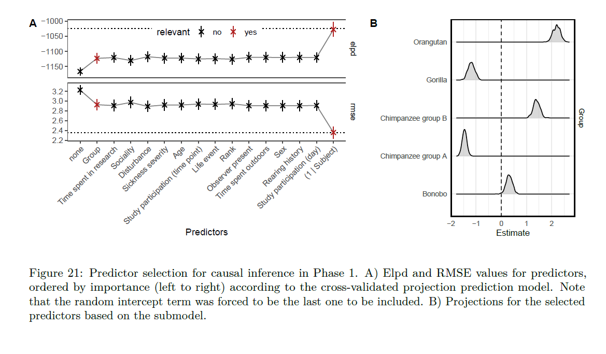
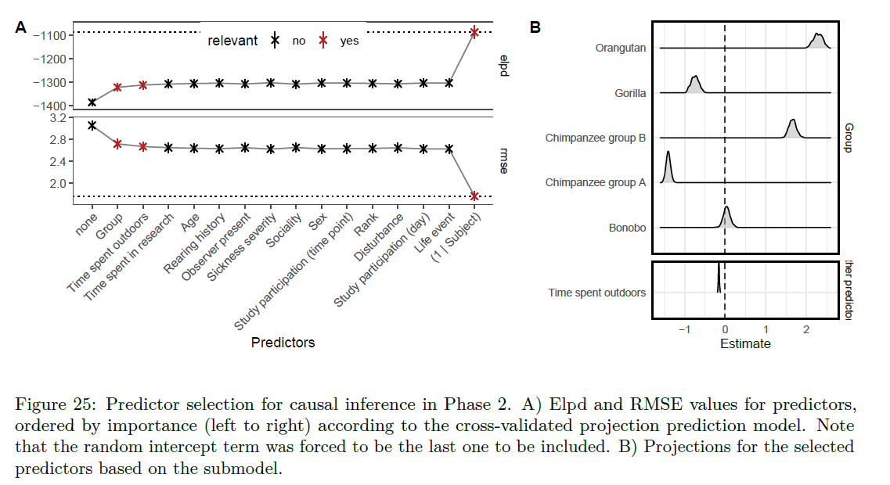
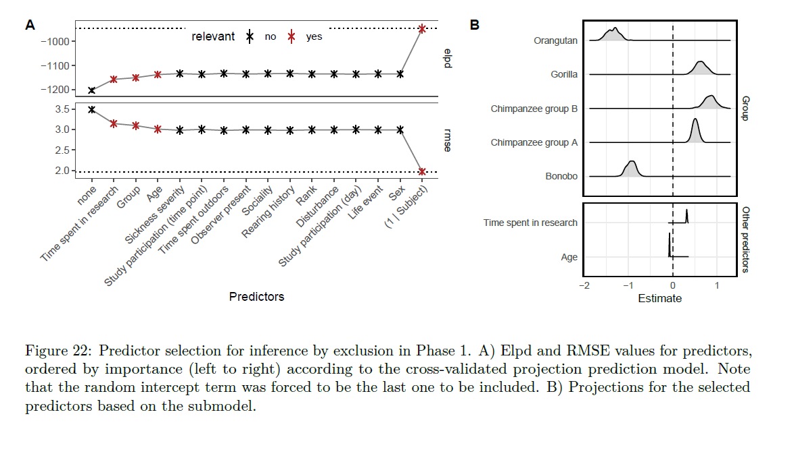
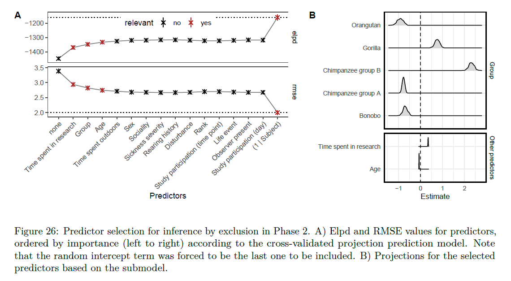
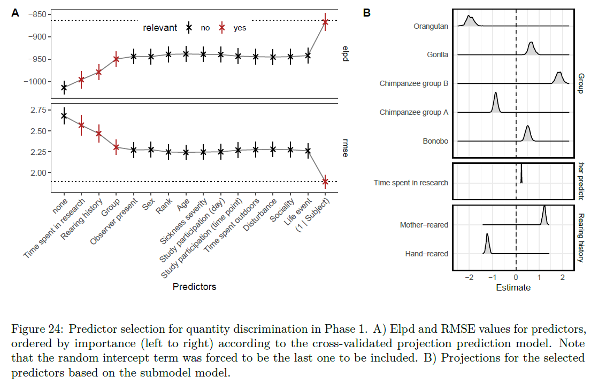
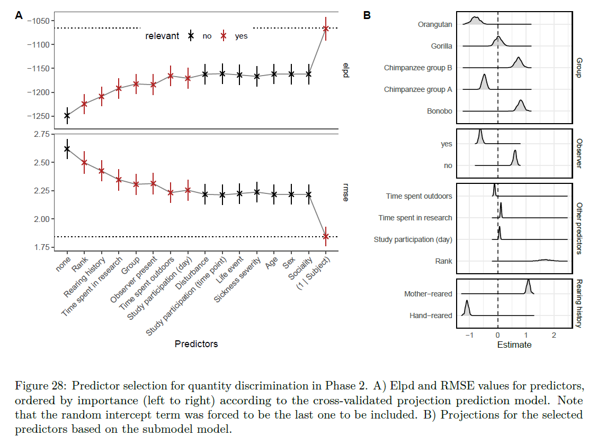
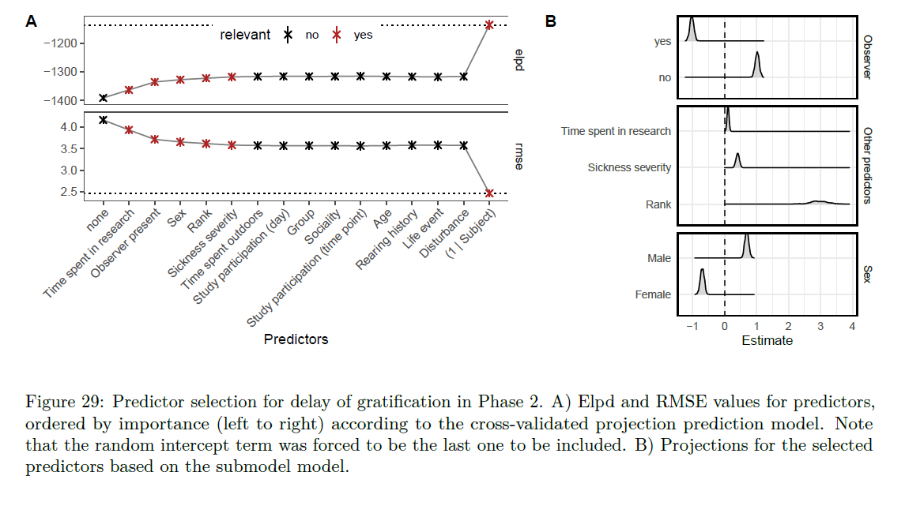
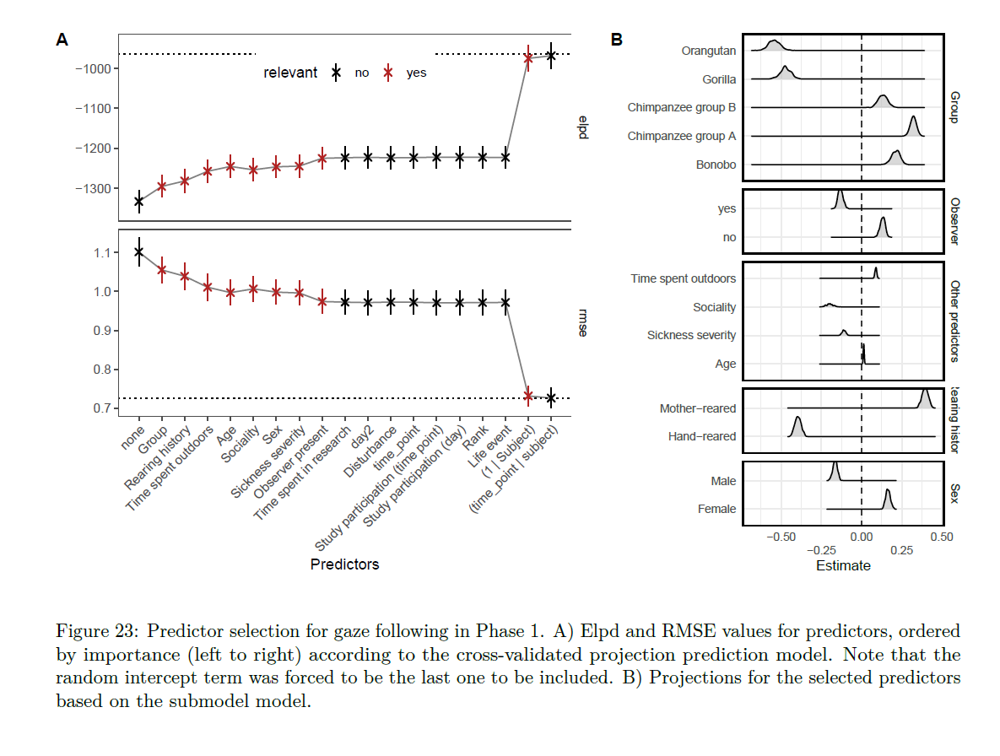
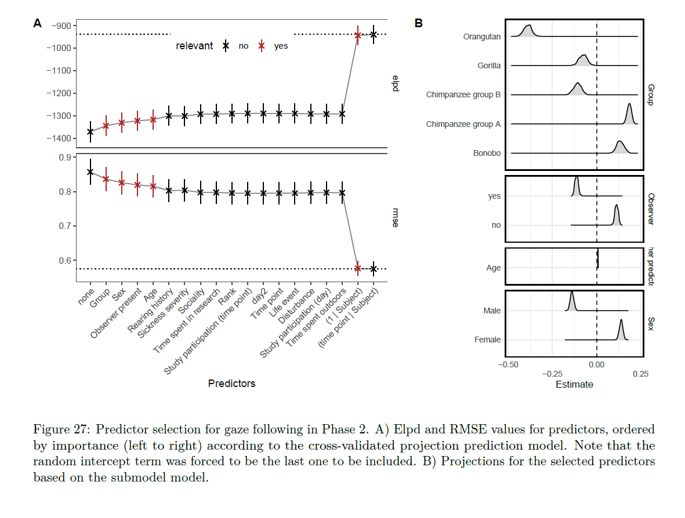

```{r setup, include=FALSE}
knitr::opts_chunk$set(echo = TRUE)
```

```{r}
library(tidyverse)
library(ggridges)
library(ggthemes)
library(ggpubr)

setwd(dirname(rstudioapi::getActiveDocumentContext()$path))
```

## Functions

```{r}
recode_sol_terms <- function(sum_obj) {
  
  out <- mutate(sum_obj,
                solution_terms = recode(solution_terms,
                                        time_in_leipzig = "Time spent in research",
                                        rearing = "Rearing history",
                                        group = "Group",
                                        observer = "Observer present",
                                        observer_mod = "Observer present",
                                        sex = "Sex",
                                        rel_rank = "Rank",
                                        age = "Age",
                                        sick_severity = "Sickness severity",
                                        test_tp = "Study participation (day)",
                                        test_day = "Study participation (time point)",
                                        time_outdoors = "Time spent outdoors",
                                        dist_mean = "Disturbance",
                                        le_mean = "Life event",
                                        sociality = "Sociality",
                                        a_chimp = "Chimpanzee group A",
                                        b_chimp = "Chimpanzee group B",
                                        bonobo = "Bonobo",
                                        orangutan = "Orangutan",
                                        gorilla = "Gorilla",
                                        f = "Female", 
                                        m = "Male",
                                        hand = "Hand-reared",
                                        mother = "Mother-reared",
                                        `(1 | subject)` = "(1 | Subject)"
  ))
  
  return(out)
  
}

recode_pred <- function(prj_obj) {
  
  out <- prj_obj %>%
    mutate(pred = recode(pred,
                         time_in_leipzig = "Time spent in research",
                         rearing = "Rearing history",
                         group = "Group",
                         observer = "Observer present",
                         observer_modyes = "Observer present",
                         sex = "Sex",
                         rank = "Rank",
                         age = "Age",
                         sick_severity = "Sickness severity",
                         test_tp = "Study participation (day)",
                         test_day = "Study participation (time point)",
                         time_outdoors = "Time spent outdoors",
                         dist_mean = "Disturbance",
                         le_mean = "Life event",
                         sociality = "Sociality",
                         a_chimp = "Chimpanzee group A",
                         b_chimp = "Chimpanzee group B",
                         bonobo = "Bonobo",
                         orangutan = "Orangutan",
                         gorilla = "Gorilla",
                         f = "Female", 
                         m = "Male",
                         hand = "Hand-reared",
                         rearingmother = "Mother-reared",
                         `(1 | subject)` = "(1 | Subject)",
                         sd_subject__Intercept = "Random Intercept"
    )) %>%
    mutate(factor = recode(factor,
                           group = "Group",
                           sex = "Sex",
                           rearing = "Rearing history",
                           `other predictors` = "Other predictors"
    ))
  #%>% mutate(factor = case_when(pred == "Random Intercept" ~ "sd_subject",
  #                            TRUE ~ as.character(factor)))
  
  return(out)
  
}

plot_sum <- function(sum_obj, ref_perf) {
  
  p <- sum_obj %>%
    ggplot(aes(x = size, y = value)) +
    geom_hline(data = ref_perf, aes(yintercept = value), lty = 3) +
    geom_line(col = "black", alpha = .5) +
    geom_pointrange(aes(ymin = value - se, ymax = value + se, col = select), size = 0.5, pch = 4) +
    facet_grid(stat ~ ., scale = "free_y") +
    labs(y = "", x = "Predictors") +
    scale_color_manual(name = "relevant", values = c("black", "firebrick")) +
    scale_x_continuous(labels = unique(sum_obj$solution_terms), breaks = unique(sum_obj$size)) +
    theme_few() +
    theme(axis.text.x = element_text(angle = 45, hjust = 1),
          legend.position = c(0.5, 0.9), legend.direction = "horizontal")
  
  return(p)
  
}

plot_post <- function(prj_obj) {
  
  out <- ggplot(prj_obj, aes(x = value, y = pred)) +
    geom_vline(xintercept = 0, lty = 2, alpha = .75) +
    geom_density_ridges(alpha = .5, scale = .7) +
    facet_grid(factor~., scales = "free", space = "free") +
    labs(y = "", x = "Estimate") +
    theme_minimal() +
    theme(panel.border = element_rect(color = "black", fill = NA, size = 1))
  
  return(out)
}
```

## Causality

```{r}
# Phase 1
ref_cau_p1 <- readRDS("cvs_cau_ref.rds") 
cvarselp1 <- readRDS("cvs_cau_summary.rds") %>% 
  recode_sol_terms() 
pcsel <- plot_sum(sum_obj = cvarselp1, ref_perf = ref_cau_p1)

prj_cau <- readRDS("proj_cvs_cau.rds") %>% 
  recode_pred() %>% 
  filter(!pred == "Intercept")
post_cau <- plot_post(prj_cau)

ggarrange(pcsel, post_cau, labels = c("A","B"), widths = c(1.5, 1))

# Phase 2
ref_cau_p2 <- readRDS("cvs_cau_ref_p2.rds") 
cvarselp2 <- readRDS("cvs_cau_summary_p2.rds") %>% 
  recode_sol_terms() 
pcsel2 <- plot_sum(sum_obj = cvarselp2, ref_perf = ref_cau_p2)

prj_cau_p2 <- readRDS("proj_cvs_cau_p2.rds") %>% 
  recode_pred() %>% 
  filter(!pred == "Intercept")
post_cau_p2 <- plot_post(prj_cau_p2)

ggarrange(pcsel2, post_cau_p2, labels = c("A","B"), widths = c(1.5, 1))

prj_cau %>% group_by(pred) %>% summarise(mean = mean(value),
                                         sd = sd(value))
prj_cau_p2 %>% group_by(pred) %>% summarise(mean = mean(value),
                                         sd = sd(value))

prj_cau_old <- readRDS(file = "../saves/proj_cvs_cau.rds") %>% 
  group_by(pred) %>% summarise(mean = mean(value), sd = sd(value)) %>% 
  print()
prj_cau_p2_old <- readRDS(file = "../saves/proj_cvs_cau_p2.rds") %>% 
  group_by(pred) %>% summarise(mean = mean(value), sd = sd(value)) %>% 
  print()
```

```{r}


```

## Inference

```{r}
# Phase 1
ref_inf_p1 <- readRDS("cvs_inf_ref.rds") 
ivarselp1 <- readRDS("cvs_inf_summary.rds") %>% 
  recode_sol_terms() 
icsel <- plot_sum(sum_obj = ivarselp1, ref_perf = ref_inf_p1)

prj_inf <- readRDS("proj_cvs_inf.rds") %>% 
  recode_pred() %>% 
  filter(!pred == "Intercept")
post_inf <- plot_post(prj_inf)

ggarrange(icsel, post_inf, labels = c("A","B"), widths = c(1.5, 1))

# Phase 2
ref_inf_p2 <- readRDS("cvs_inf_ref_p2.rds") 
ivarselp2 <- readRDS("cvs_inf_summary_p2.rds") %>% 
  recode_sol_terms() 
icsel2 <- plot_sum(sum_obj = ivarselp2, ref_perf = ref_inf_p2)

prj_inf_p2 <- readRDS("proj_cvs_inf_p2.rds") %>% 
  recode_pred() %>% 
  filter(!pred == "Intercept")
post_inf_p2 <- plot_post(prj_inf_p2)

ggarrange(icsel2, post_inf_p2, labels = c("A","B"), widths = c(1.5, 1))

prj_inf %>% group_by(pred) %>% summarise(mean = mean(value),
                                         sd = sd(value))
prj_inf_p2 %>% group_by(pred) %>% summarise(mean = mean(value),
                                         sd = sd(value))

prj_inf_old <- readRDS(file = "../saves/proj_cvs_inf.rds") %>% 
  group_by(pred) %>% summarise(mean = mean(value), sd = sd(value)) %>% 
  print()
prj_inf_p2_old <- readRDS(file = "../saves/proj_cvs_inf_p2.rds") %>% 
  group_by(pred) %>% summarise(mean = mean(value), sd = sd(value)) %>% 
  print()
```

```{r}


```

## Quantity

```{r}
# Phase 1
ref_quant_p1 <- readRDS("cvs_quant_ref.rds") 
qvarselp1 <- readRDS("cvs_quant_summary.rds") %>% 
  recode_sol_terms() 
qcsel <- plot_sum(sum_obj = qvarselp1, ref_perf = ref_quant_p1)

prj_quant <- readRDS("proj_cvs_quant.rds") %>% 
  recode_pred() %>% 
  filter(!pred == "Intercept")
post_quant <- plot_post(prj_quant)

ggarrange(qcsel, post_quant, labels = c("A","B"), widths = c(1.5, 1))

# Phase 2
ref_quant_p2 <- readRDS("cvs_quant_ref_p2.rds") 
qvarselp2 <- readRDS("cvs_quant_summary_p2.rds") %>% 
  recode_sol_terms() 
qcsel2 <- plot_sum(sum_obj = qvarselp2, ref_perf = ref_quant_p2)

prj_quant_p2 <- readRDS("proj_cvs_quant_p2.rds") %>% 
  recode_pred() %>% 
  filter(!pred == "Intercept")
post_quant_p2 <- plot_post(prj_quant_p2)

ggarrange(qcsel2, post_quant_p2, labels = c("A","B"), widths = c(1.5, 1))

prj_quant %>% group_by(pred) %>% summarise(mean = mean(value),
                                         sd = sd(value))
prj_quant_p2 %>% group_by(pred) %>% summarise(mean = mean(value),
                                         sd = sd(value))

prj_quant_old <- readRDS(file = "../saves/proj_cvs_quant.rds") %>% 
  group_by(pred) %>% summarise(mean = mean(value), sd = sd(value)) %>% 
  print()
prj_quant_p2_old <- readRDS(file = "../saves/proj_cvs_quant_p2.rds") %>% 
  group_by(pred) %>% summarise(mean = mean(value), sd = sd(value)) %>% 
  print()
```

```{r}


```

## Gratification

```{r}
# Phase 2
ref_grat_p2 <- readRDS("cvs_grat_ref_p2.rds") 
gratvarselp2 <- readRDS("cvs_grat_summary_p2.rds") %>% 
  recode_sol_terms() 
gratcsel2 <- plot_sum(sum_obj = gratvarselp2, ref_perf = ref_grat_p2)

prj_grat_p2 <- readRDS("proj_cvs_grat_p2.rds") %>% 
  recode_pred() %>% 
  filter(!pred == "Intercept")
post_grat_p2 <- plot_post(prj_grat_p2)

ggarrange(gratcsel2, post_grat_p2, labels = c("A","B"), widths = c(1.5, 1))

prj_grat_p2 %>% group_by(pred) %>% summarise(mean = mean(value),
                                         sd = sd(value))
prj_grat_p2_old <- readRDS(file = "../saves/proj_cvs_grat_p2.rds") %>% 
  group_by(pred) %>% summarise(mean = mean(value), sd = sd(value)) %>% 
  print()
```

```{r}

```

## Gaze

```{r}
# Phase 1
ref_gaze_p1 <- readRDS("cvs_gaze_ref.rds")
gvarselp1 <- readRDS("cvs_gaze_summary.rds") %>%
  recode_sol_terms()
gcsel <- plot_sum(sum_obj = gvarselp1, ref_perf = ref_gaze_p1)

prj_gaze <- readRDS("proj_cvs_gaze.rds") %>%
  recode_pred() %>%
  filter(!pred == "Intercept")
post_gaze <- plot_post(prj_gaze)

ggarrange(gcsel, post_gaze, labels = c("A","B"), widths = c(1.5, 1))

# Phase 2
ref_gaze_p2 <- readRDS("cvs_gaze_ref_p2.rds")
gvarselp2 <- readRDS("cvs_gaze_summary_p2.rds") %>%
  recode_sol_terms()
gcsel2 <- plot_sum(sum_obj = gvarselp2, ref_perf = ref_gaze_p2)

prj_gaze_p2 <- readRDS("proj_cvs_gaze_p2.rds") %>%
  recode_pred() %>%
  filter(!pred == "Intercept")
post_gaze_p2 <- plot_post(prj_gaze_p2)

ggarrange(gcsel2, post_gaze_p2, labels = c("A","B"), widths = c(1.5, 1))

prj_gaze %>% group_by(pred) %>% summarise(mean = mean(value),
                                         sd = sd(value))
prj_gaze_p2 %>% group_by(pred) %>% summarise(mean = mean(value),
                                         sd = sd(value))

prj_gaze_old <- readRDS(file = "../saves/proj_cvs_gaze.rds") %>% 
  group_by(pred) %>% summarise(mean = mean(value), sd = sd(value)) %>% 
  print()
prj_gaze_p2_old <- readRDS(file = "../saves/proj_cvs_gaze_p2.rds") %>%
  group_by(pred) %>% summarise(mean = mean(value), sd = sd(value)) %>%
  print()
```

```{r}


```


